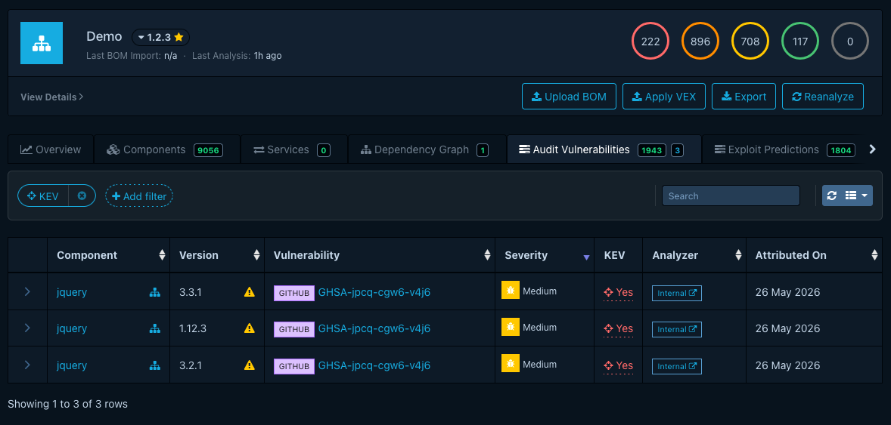
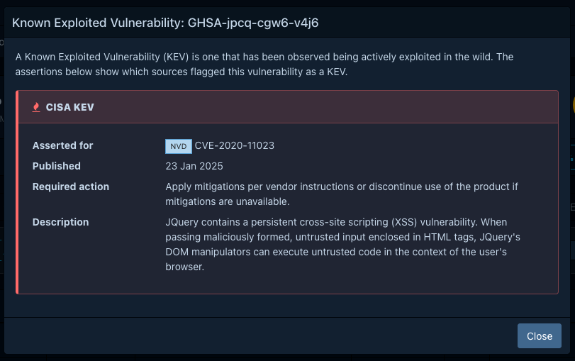

# About KEV data sources

!!! note
    KEV integration requires Dependency-Track **5.1 or newer**.

A KEV data source is an upstream catalog of vulnerabilities confirmed to be actively
exploited in the wild. An ordinary vulnerability data source and a KEV data source send different signals. NVD, GHSA,
and OSV tell you a vulnerability exists and rate its severity. A KEV assertion tells you exploitation is already
happening, a strong signal for remediation priority. Dependency-Track can mirror three KEV catalogs. You don't need
any of them, and turning all three on is rarely the right choice.

This page explains what each source contributes and how mirrored assertions attach to vulnerabilities. For the
procedure to enable sources, see [Configuring KEV sources](../guides/administration/configuring-kev-sources.md).

## Mirrored sources

Dependency-Track can mirror three KEV catalogs into its own database:

- **[CISA KEV](https://www.cisa.gov/known-exploited-vulnerabilities-catalog)** is on by default and identifies
  vulnerabilities by CVE ID.
- **[ENISA EU KEV](https://euvd.enisa.europa.eu/)** is on by default and identifies vulnerabilities by CVE ID.
  Entries the agency publishes without a CVE ID don't produce a KEV assertion.
- **[VulnCheck KEV](https://docs.vulncheck.com/community/vulncheck-kev/introduction)** is a community catalog. It's
  off by default and requires a free community API token. It covers vulnerabilities CISA KEV misses, and often
  records exploitation earlier. Entries it publishes without a CVE ID don't produce a KEV assertion.

### Picking sources

- CISA KEV and ENISA EU KEV are free, government-curated, and on by default, so they need no setup beyond outbound
  network access. Start with these.
- VulnCheck KEV needs an API token but gives you broader and faster coverage. Turn it on when remediation speed
  matters more than staying with government sources alone.

## How Dependency-Track uses the data

Mirroring is a background task. On a configurable schedule, Dependency-Track downloads the current catalog from each
enabled source and writes the assertions into its own database. A new deployment runs the task once shortly after it
starts, so the first mirror doesn't wait for the schedule. Later restarts don't trigger a mirror.

KEV status doesn't wait for a BOM upload or an analysis run. Dependency-Track checks it by the vulnerability's CVE
ID, so a routine mirror run, or turning on a source for the first time, can mark vulnerabilities you already found
as known exploited without you doing anything else.

### Turning a source off

Turning off a source stops further mirroring from it, but Dependency-Track keeps the assertions it already wrote and
does not clean them up. A vulnerability that source flagged as known exploited stays flagged.

## How KEV matching works

Dependency-Track matches KEV catalog entries to vulnerabilities by CVE ID, not by anything on your components. If a
vulnerability in your portfolio has the same CVE ID as an entry in an enabled KEV catalog, Dependency-Track flags it
as known exploited.

This also works across sources that describe the same vulnerability differently. Log4Shell, for example, is
`CVE-2021-44228` in NVD and `GHSA-jfh8-c2jp-5v3q` in GHSA. Dependency-Track tracks that these are the [same
vulnerability](about-vulnerability-data-sources.md#aliases-across-sources), so a CISA KEV assertion against
`CVE-2021-44228` flags both records as known exploited.

Because matching is by CVE ID, not by CPE or PURL, KEV status doesn't depend on what identifiers your components
carry. It only requires Dependency-Track to know the vulnerability's CVE ID, from any [vulnerability data
source](about-vulnerability-data-sources.md).

## Where KEV status appears

Dependency-Track shows a **KEV** column in the portfolio Vulnerabilities list, the project Findings and EPSS views,
and the Vulnerability Audit views. A filter is available to limit the displayed findings.

A flagged vulnerability displays a crosshair icon that opens a modal listing each source's assertion:
the asserting catalog, whether it reports known ransomware use, the date the catalog added the entry,
any required remediation action, and a description.

A component policy condition can match on KEV status, raising a violation when a component carries a known exploited
vulnerability. See the [example condition expression](../reference/policies/condition-expressions.md#known-exploited-vulnerabilities).

Notifications carry KEV status on their vulnerability subject.
A [filter expression](../reference/notifications/filter-expressions.md) can restrict an alert to known exploited
vulnerabilities, and a [notification template](../reference/notifications/templating.md) can render the flag into the
message a publisher sends.
