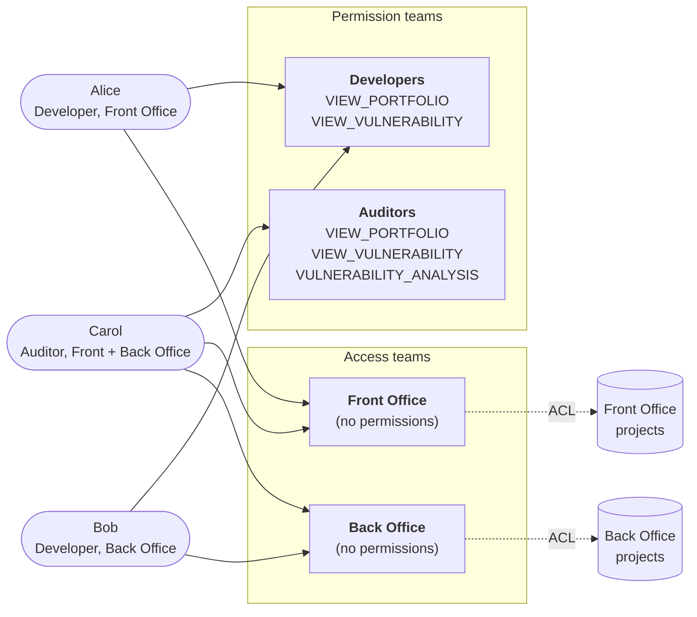

# About access control

Dependency-Track uses a role-based access control model built around **permissions**,
**teams**, and **users**. Permissions can be assigned to teams or directly to users.

!!! note "Effective permissions"

    A user's effective permissions are the **union** of their direct permissions
    and the permissions of every team they belong to. Permissions are never
    intersected or downgraded by team membership.

## Users

Three types of users exist:

| Type          | Description                                                                                       |
|:--------------|:--------------------------------------------------------------------------------------------------|
| Managed User  | A local account created and managed within Dependency-Track.                                      |
| LDAP User     | Authenticated via an external LDAP directory. See [Configuring LDAP](../guides/administration/configuring-ldap.md). |
| OIDC User     | Authenticated via an OpenID Connect identity provider. See [Configuring OIDC](../guides/administration/configuring-oidc.md). |

All user types share the same permission model. The authentication mechanism determines
how the system verifies a user's identity, not what they can access.

## Teams

A team is a named collection of users and API keys. Teams hold permissions, which makes
it straightforward to manage access for groups of people (for example, *Security Engineers*,
*Developers*, *CI/CD Pipelines*) or automated systems.

A user can belong to more than one team and inherits the union of all permissions from
every team they are a member of. Permissions can also be assigned directly to a user.
Those permissions add to whatever the user inherits from their teams.

Prefer team-based assignment as the default. Use direct user permissions sparingly, for
exceptions that don't justify a dedicated team.

API keys belong to a team and carry the same permissions as that team. They authenticate
automated access (CI/CD pipelines, integrations) without associating requests with a
specific human user.

Deleting a team also deletes its API keys and any project access assignments
made through it. Projects and user accounts are unaffected, but users lose the
permissions they had inherited from the deleted team.

## Portfolio access control

By default, every principal with `VIEW_PORTFOLIO` can see every project.
Portfolio Access Control (PAC) restricts that visibility so a team can only act
on the projects explicitly assigned to it. The per-project list of assigned
teams is the project's Access Control List (ACL).

With PAC enabled, ACL membership gates every operation on a project: viewing,
BOM upload, editing, deletion, and vulnerability triage. The portfolio
permissions (`VIEW_PORTFOLIO`, `PORTFOLIO_MANAGEMENT_UPDATE`, and so on) become
*necessary but not sufficient*: a principal must hold the relevant permission
**and** belong to a team on the project's ACL.

Enable PAC in **Administration > Access Management > Portfolio Access Control**.

!!! warning "Enabling PAC affects existing projects"

    Existing projects keep their data but start with no team assignments. Until
    an administrator (or a principal with `PORTFOLIO_ACCESS_CONTROL_BYPASS`)
    assigns at least one team to each project, those projects become invisible
    to all non-administrator users. Plan the assignment rollout before enabling
    PAC on a production instance.

PAC is most useful in multi-tenant scenarios where different teams should not see
each other's projects. For single-team or open environments, PAC adds management
overhead without security benefit.

### How PAC interacts with permissions

Permissions and ACLs are orthogonal:

* **Permissions** define *what a principal can do*, such as uploading BOMs,
  editing projects, or triaging vulnerabilities. They are global to the
  principal. The model has no per-project permissions.
* **ACLs** define *which projects a principal can do it on*. They gate both reads
  and writes, but do not change which capabilities the principal holds.

To act on a project, a principal needs both the relevant permission *and* ACL
access to that project. A user with `PORTFOLIO_MANAGEMENT_UPDATE` can edit every
project they have ACL access to, and none of the ones they don't. Removing a
team from a project's ACL revokes that team's access to the project but leaves
the team's permissions unchanged elsewhere.

### Pattern: separating permission teams from access teams

Because permissions and ACLs compose independently, a useful pattern is to
split teams by role:

* **Permission teams** carry capabilities (`VIEW_PORTFOLIO`,
  `VULNERABILITY_ANALYSIS`, and so on) but are not assigned to any project.
* **Access teams** hold no permissions but are assigned to a subset of
  projects.

A user joins one team of each kind. Their effective rights are the union of
all their teams' permissions, scoped to the union of all their teams' ACL
grants. This emulates per-project permissions without the model having to
support them directly.

For an organization with a *Front Office* and a *Back Office* portfolio:

Resulting effective access:

| User  | Can view                              | Can triage vulnerabilities on |
|:------|:--------------------------------------|:------------------------------|
| Alice | Front Office projects                 | none                          |
| Bob   | Back Office projects                  | none                          |
| Carol | Front Office and Back Office projects | both portfolios               |

Adding a new domain becomes a single new access team and its ACL assignments.
Granting an existing user analyst rights on that domain is a team membership
change, not a per-project edit.

### Inheritance through the project hierarchy

ACL grants are inherited down the project hierarchy. Granting a team access to a
parent project grants access to every descendant, current and future. Assigning
teams at the top of a project tree is usually preferable to assigning them on
every leaf.

### Bypassing PAC

The `PORTFOLIO_ACCESS_CONTROL_BYPASS` permission exempts a principal from PAC
entirely: they see every project as if PAC were disabled. Reserve it for
administrators and trusted automation that legitimately needs to operate across
the full portfolio.

### Project creation under PAC

When an API key creates a project (for example, via BOM upload with
`PROJECT_CREATION_UPLOAD`), the API key's team is added to the new project's
ACL automatically.

When a user creates a project, they must designate an owning team from those
they belong to. The chosen team is added to the new project's ACL. A project
created with no team assignment is invisible to everyone except administrators
and holders of `PORTFOLIO_ACCESS_CONTROL_BYPASS` until one is assigned.

## Further reading

* [Permissions reference](../reference/permissions.md) for the full permissions table
  and default teams.
