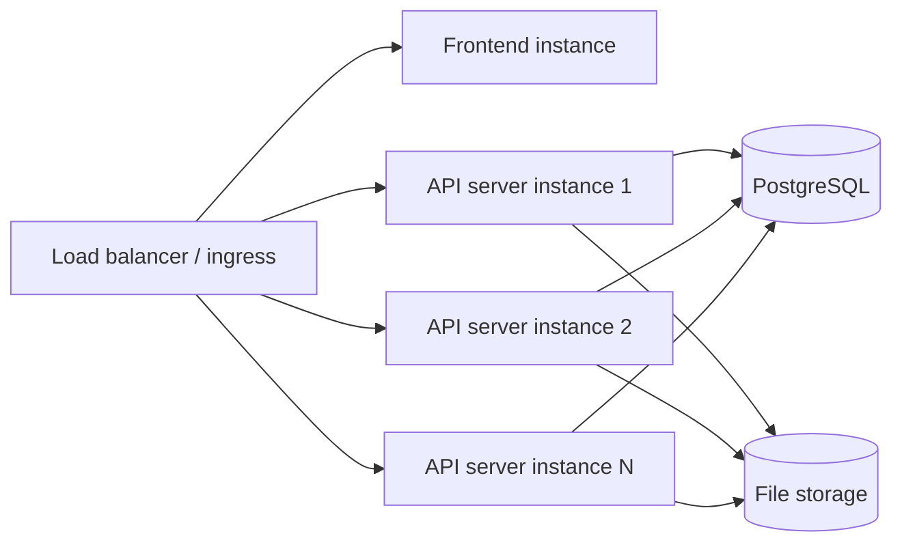

# Deployment topology

This page describes how a Dependency-Track cluster fits together: which components must exist, how
they communicate, and what happens when individual instances fail. It complements
[Deploying to production](../../guides/administration/deploying-to-production.md), which covers the
operational steps.

## Components

A production deployment has four components, typically fronted by the same ingress:

- **API server.** Java service exposing the REST API on port `8080` and running background workers.
  Stateless beyond what it commits to PostgreSQL and file storage. One or more instances run side
  by side (see [Coordination](#coordination)). Each instance also exposes a separate management
  server on port `9000` for health checks and metrics.
- **PostgreSQL.** Single source of truth for product data, the durable execution engine's workflow
  records, and node coordination.
- **File storage.** Shared store for short-lived intermediate files (uploaded BOMs, analysis
  artifacts). Either a shared persistent volume (`local` provider) or an S3-compatible bucket
  (`s3` provider). See [File storage](../../reference/configuration/file-storage.md).
- **Frontend.** Vue.js single-page app distributed as a container image that serves the static
  assets through Nginx. Stateless. One or more instances run behind the ingress alongside the API
  server. The browser then calls the API server's REST API directly, so the frontend container
  does not proxy or aggregate API traffic.

## Coordination

API server instances coordinate only through PostgreSQL. Instances do not need network connectivity
to each other, only to PostgreSQL and to file storage. The cluster runs no peer-to-peer protocol,
no gossip, and no `LISTEN` / `NOTIFY`.

This has direct operational consequences:

- The cluster works across availability zones, network namespaces, or virtual private clouds as long
  as every instance can reach the database and the file store.
- Adding or removing an instance requires no peer reconfiguration.
- A network partition between instances is invisible: each side independently observes whatever it
  can read from the database.

### Leader election

A small set of operations must run on exactly one instance at a time: the durable execution
engine's task schedulers and the maintenance worker. The engine uses lease-based leader election;
on graceful shutdown the leader releases the lease, and on crash the lease expires and another
instance takes over. See [Leader election](design/durable-execution.md#leader-election) for the
mechanism.

### Task distribution

The engine distributes background work across all instances (or all worker-profile instances, when
web/worker separation is in use). Task claiming is concurrency-safe and lock-free across the
cluster.

## Recovery from instance failure

The durable execution engine treats instance loss as a routine event:

- **An instance dies.** Whether it held the leader lease or was running activities, another
  instance takes over: another instance reclaims the lease, and unfinished workflow runs resume
  from their last recorded event in the run history. See
  [Durable execution](design/durable-execution.md#execution-model) for the replay model.
- **All instances die.** When at least one instance comes back, scheduling and execution resume
  from the state PostgreSQL holds. As long as the database survives, no work goes missing.

File storage failure is not symmetric with database failure. Intermediate files are best-effort: if
the store is unavailable or has lost a file, the in-flight workflow fails and the client retries
the upload.

## Single-instance deployments

A single-instance deployment is operationally identical to a multi-instance one: the same code, the
same leader-election machinery, and the same recovery path. The only difference is that there is
nowhere to fail over to during instance restarts, so the cluster is unavailable for the duration of
a deploy or crash.
