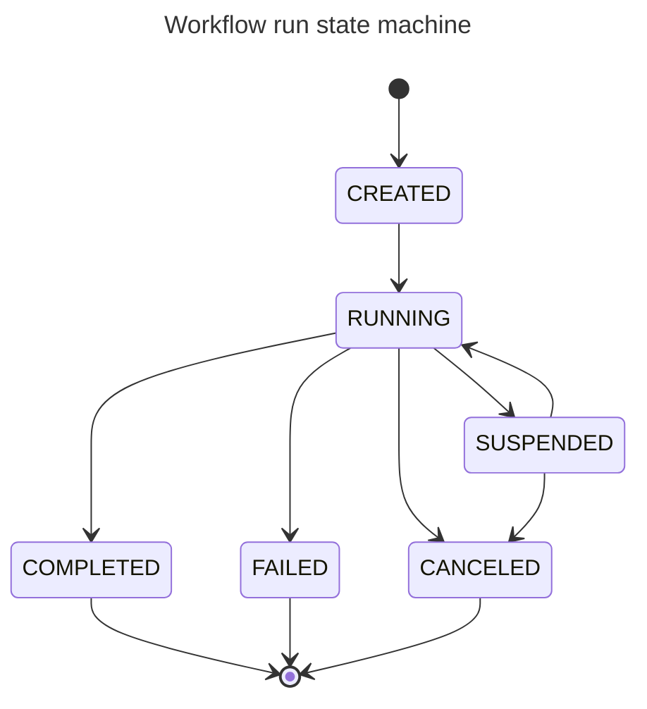
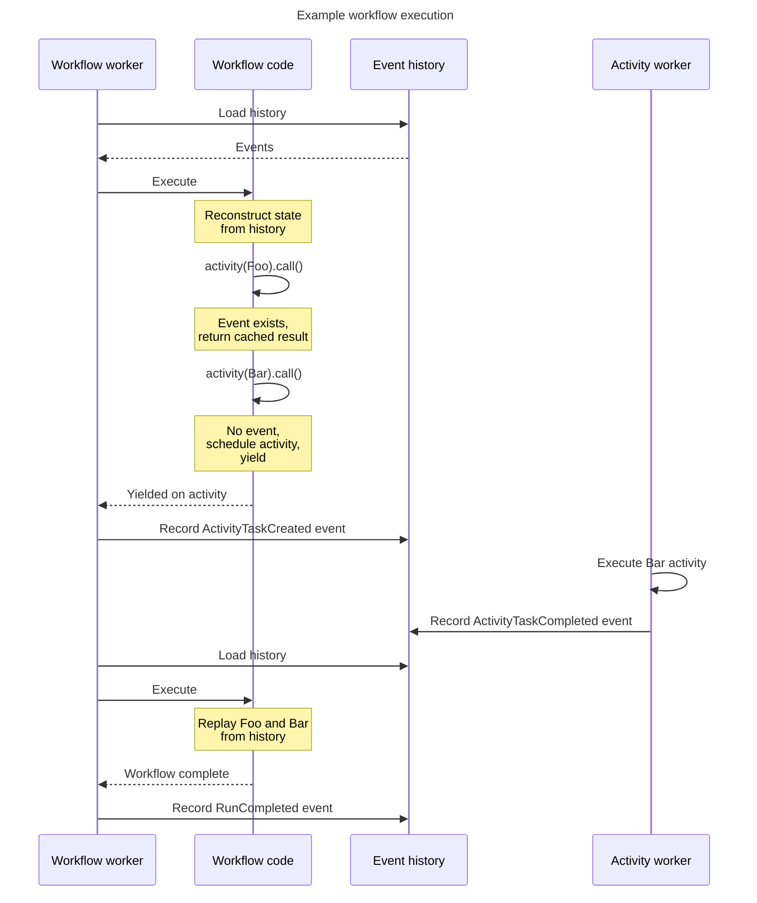
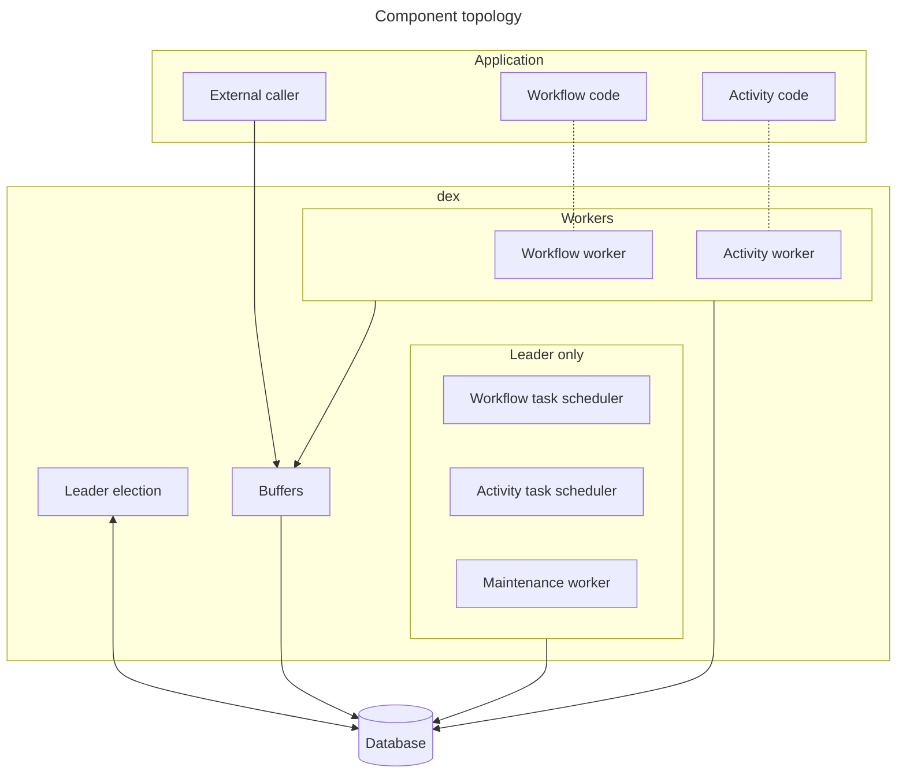
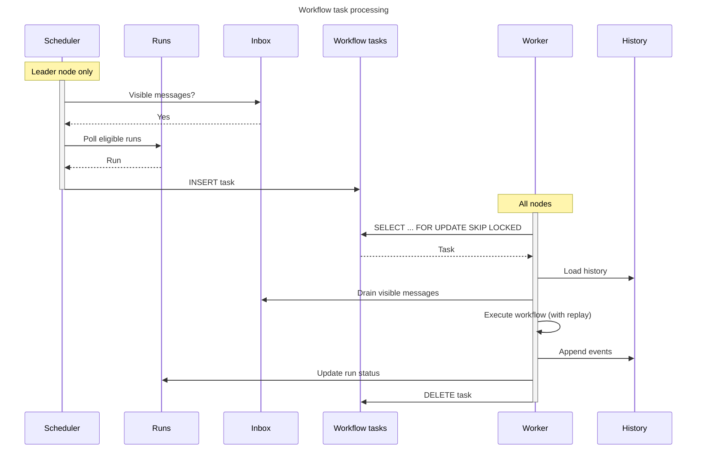
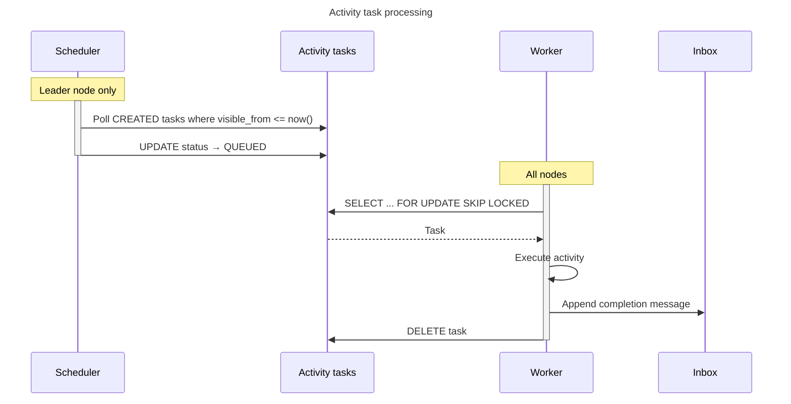
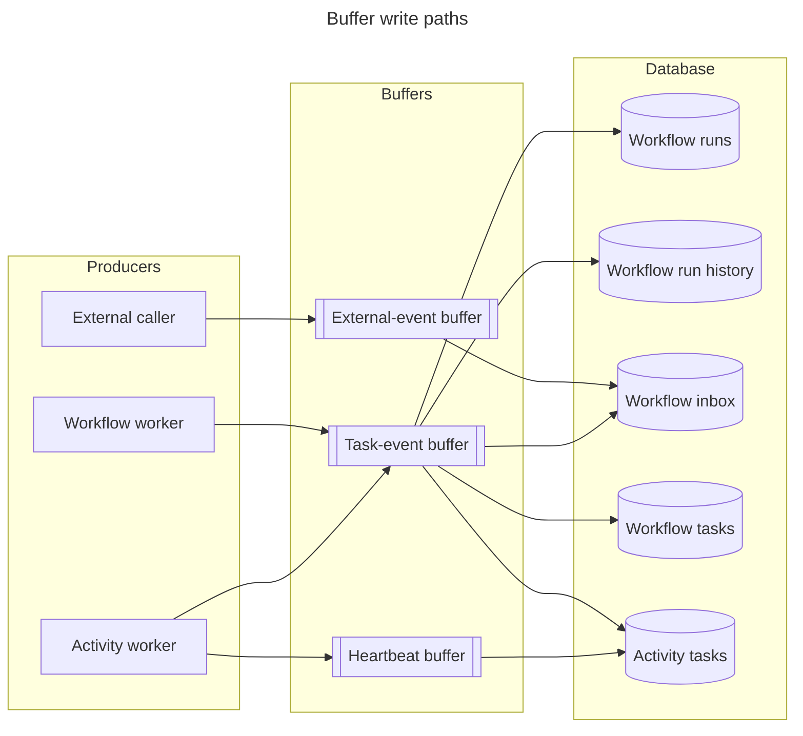

# Durable execution

## Overview

The durable execution engine (abbreviated as `dex` in code and configuration) is an embedded
engine that provides reliable, scalable execution of potentially long-running processes.

The engine draws from [Temporal] and Microsoft's [Durable Task Framework].
Purpose-built for Dependency-Track's requirements, and optimized for PostgreSQL.

## Core concepts

### Durable execution

Durable execution is a programming model where the state and progress of (potentially long-running)
processes is automatically persisted, enabling them to survive failures and restarts.

!!! note
    Because the engine draws heavily from [Temporal], it has adopted most of its concepts and wording.
    Some concepts have different names in other engines. For example, Durable Task uses *orchestration*
    instead of *workflow*.

Like [Temporal], the engine records every completed step of a [workflow](#workflow) as an event in the database.
If a process crashes or restarts, the workflow automatically resumes from where it left off
by replaying its event history. This makes workflows resilient without requiring manual
work to manage state or retry logic.

Durable execution ensures that once a workflow starts, it runs to completion,
even when experiencing repeated transient failures.

### Workflow

A workflow is the formal description of a sequence of steps to execute.
You write workflows as normal Java code, but they must be *deterministic and free of side effects*
to enable reliable history replay. Their sole purpose is orchestration: sequencing and
coordinating work, not performing it directly.

Workflows can invoke [activities](#activity), create [timers](#timer), spawn child workflows,
and wait for [external events](#external-event).

### Workflow instance

A workflow instance is a specific instantiation of a [workflow](#workflow).

Instances can execute more than once, but only a single execution
in non-terminal state can exist at any given moment.

In the engine, each instance has an *instance ID* that clients supply when starting a workflow.

The uniqueness constraint on the instance ID applies only to runs in non-terminal state.
Two callers racing to start a workflow with the same instance ID immediately after a previous run
terminated may both succeed. Instance-ID uniqueness is a soft guarantee scoped to
non-terminal runs, not a global lock across all generations.

### Activity

An activity is the formal description of a non-deterministic operation. This is where interactions with
external systems, and more generally I/O, happen.

Execution of activities happens asynchronously from their "owning" workflow's execution, making it non-blocking.

In practice, activity invocations behave like conventional background jobs.

Activities can fail, and the engine retries them transparently. Retry behavior is
customizable using retry policies, on a per-invocation basis. Activities run **at least once**:
a worker that crashes mid-execution releases its lock by expiry, and another worker picks up the
same task. Activities must be [idempotent].

### Workflow run

A workflow run is a single execution of a workflow. Each run has a unique identifier
and maintains a complete event history. The history enables replay for recovery
and ensures deterministic behavior.

Runs can carry the following metadata:

* **Concurrency key**: Serializes execution of runs sharing the same key. See
  [Concurrency control](#concurrency-control) for ordering and starvation semantics.
* **Priority**: Influences execution order. Higher priority runs execute first.
* **Labels**: Custom key-value metadata.

A run progresses through the following states:

`CREATED`, `RUNNING`, and `SUSPENDED` are *non-terminal*. `COMPLETED`, `FAILED`, and `CANCELED`
are *terminal*: a run never leaves a terminal state.

### Timer

A timer provides durable delays within a workflow execution.

Unlike regular sleeps, the engine records timers in the workflow run's event history,
making them deterministic and replay-safe.

### External event

An external event is a message sent to a workflow run from outside the engine.

External events enable workflows to pause and wait for signals from external systems or users,
such as approval notifications, webhook callbacks, or status updates. Each event has a unique
identifier and can carry optional payload data.

### Task

A task is a unit of work generated by the engine to drive progress of either
a [workflow run](#workflow-run) or an [activity](#activity).

The engine schedules tasks for execution on [task queues](#task-queue),
from where they're picked up by [task workers](#task-worker).

### Task queue

A task queue is a named queue where the engine schedules [tasks](#task) for execution.

Task queues organize and distribute work to [workers](#task-worker). Each queue has a type
(*workflow* or *activity*) and tracks its capacity and current depth (number of pending tasks).
Workflows and activities specify which queue their tasks route to.

Queues enable separation of concerns, allowing different workers to specialize in different
types of work and providing resource isolation between workloads.

!!! note
    In the engine, queues further act as a means to scale: each task queue
    resides in a separate physical table [partition](https://www.postgresql.org/docs/current/ddl-partitioning.html#DDL-PARTITIONING-OVERVIEW).

You can change the capacity of a queue at runtime, providing a global throttle for an entire
cluster. You can also *pause* queues entirely.

### Task worker

A task worker polls tasks from a queue and executes them. Workers process either
workflow tasks or activity tasks, but not both. Each worker polls from *exactly one* queue.

## Data model

The engine's state lives in a small set of PostgreSQL tables, all prefixed `dex_`:

| Table                     | Purpose                                                                                  | Notes                                                                                                |
|:--------------------------|:-----------------------------------------------------------------------------------------|:-----------------------------------------------------------------------------------------------------|
| `dex_lease`               | Holds the leadership lease used by [leader election](#leader-election).                  | `UNLOGGED`. Ephemeral by design.                                                                     |
| `dex_workflow_run`        | Run state: status, concurrency key, priority, labels, stickiness, lifecycle stamps.      | Source of truth for run state.                                                                       |
| `dex_workflow_history`    | Append-only event log per run. Payload is a Protobuf-serialized `WorkflowEvent`.         | Hash-partitioned into 8 partitions on `workflow_run_id` to spread sequential UUIDv7 inserts.         |
| `dex_workflow_inbox`      | Pending messages for a run (external events, activity completions, timer fires).        | `visible_from` enables delayed delivery, used by timers and activity-retry scheduling.               |
| `dex_workflow_task_queue` | Workflow-queue metadata: capacity, status (`ACTIVE` / `PAUSED`).                         | The [workflow task scheduler](#workflow-task-scheduler) enforces capacity.                           |
| `dex_workflow_task`       | Workflow tasks queued for execution. PK `(queue_name, workflow_run_id)`.                | `UNLOGGED`, list-partitioned per queue. Rebuilt on the next scheduler poll after a crash.            |
| `dex_activity_task_queue` | Activity-queue metadata: capacity, status.                                               | Same role as the workflow queue metadata table.                                                      |
| `dex_activity_task`       | Activity invocations awaiting execution. Carries argument, retry policy, attempt count.  | List-partitioned per queue (logged: argument and retry state are not reconstructible from history). |

A `(queue_name, workflow_run_id)` primary key on `dex_workflow_task` guarantees **at most one
queued workflow task per run**. Work that arrives while a task is already queued needs no
coalescing: concurrent inserts collide on the primary key.

`dex_workflow_inbox` is the engine's message-routing fabric. A run is eligible for scheduling
**if and only if** it has at least one inbox row with `visible_from <= now()`. Activity
completions, timer fires, child-run completions, external events, and run-control signals
(cancel / suspend / resume) all flow through the inbox.

## Execution model

The engine uses event sourcing to provide durability. When a workflow executes,
the engine records events for each completed step. If execution stops unexpectedly,
the workflow resumes by replaying the recorded history.

During replay, the workflow code re-executes, but the engine skips side effects.
The engine returns results of completed steps from the history instead.
This requires workflow code to be deterministic. Given the same history,
it must make the same decisions. If the code asks for an activity that disagrees with the
recorded history, the engine fails the run with a determinism error.

!!! note "Further reading"
    For a first-principles treatment of why deterministic *control flow* must hold during replay
    while side effects themselves only need to be idempotent, see Jack Vanlightly's
    [Demystifying determinism in durable execution][jvl-determinism].

### Replay-time blocking

When workflow code awaits the result of an activity, timer, or child run whose completion event
is not yet in history, the engine *yields*: it persists the events the workflow produced this
turn (for example, `ActivityTaskCreated`), unlocks the workflow task, and moves on to other work.
The run becomes eligible for scheduling again the moment a corresponding completion message lands
in `dex_workflow_inbox`.

This model enables high concurrency without dedicating a thread per workflow. It also lets the
workflow body's control flow read like ordinary synchronous code, even though the run pauses
and resumes across machines and process restarts.

### Event types

The full set of `WorkflowEvent` subjects is:

| Category   | Events                                                                                                  |
|:-----------|:--------------------------------------------------------------------------------------------------------|
| Run        | `RunCreated`, `RunStarted`, `RunSuspended`, `RunResumed`, `RunCanceled`, `RunCompleted`                 |
| Task       | `WorkflowTaskStarted`, `WorkflowTaskCompleted`                                                          |
| Activity   | `ActivityTaskCreated`, `ActivityTaskCompleted`, `ActivityTaskFailed`                                    |
| Child run  | `ChildRunCreated`, `ChildRunCompleted`, `ChildRunFailed`                                                |
| Timer      | `TimerCreated`, `TimerElapsed`                                                                          |
| Other      | `SideEffectExecuted`, `ExternalEventReceived`                                                           |

### Side effects and `continueAsNew`

Two primitives provide controlled escape from the strict determinism contract without sacrificing
durability:

* **Side effects.** A side effect runs an arbitrary block of code once, records the result as a
  `SideEffectExecuted` event, and returns the recorded value on every later replay. This is
  how non-deterministic values such as generated identifiers or timestamps enter a workflow
  without breaking replay.
* **Continue-as-new.** Continue-as-new truncates the run's event history, increments a
  `continued_as_new_generation` counter on the run, and starts a fresh execution with the same
  run metadata (workflow name, version, queue, concurrency key, instance ID, priority, labels)
  but a new argument. Because replay cost grows linearly with history length, continue-as-new is
  the mechanism by which long-lived workflows, such as periodic schedulers, keep history bounded.

## Engine architecture

### Overview

The engine consists of the following components:

* **Workflow task scheduler**: Creates workflow tasks from eligible workflow runs (see [Workflow task scheduler](#workflow-task-scheduler)).
* **Activity task scheduler**: Transitions activity tasks to queued status (see [Activity task scheduler](#activity-task-scheduler)).
* **Workflow task worker**: Executes workflow code with history replay (see [Execution model](#execution-model)).
* **Activity task worker**: Executes activity code.
* **Maintenance worker**: Enforces retention by deleting old terminal runs (see [Maintenance](#maintenance)).
* **Leader election**: Coordinates single-instance operations in a cluster (see [Leader election](#leader-election)).
* **Buffers**: Coalesce frequent small writes into batches (see [Buffering](#buffering)).

Schedulers and the maintenance worker run only on the leader. Workers run on every node and host
the workflow and activity code submitted by the app (dotted lines). Reads (task polling,
history load, inbox drain) go directly to the database. Writes flow through buffers, which is
what gives the engine its [backpressure](#buffering) behavior. The
[buffering section](#buffering) expands which producer writes to which buffer and which buffer
writes to which table.

By default, the engine uses the same database as the main Dependency-Track app for simplicity.
For larger deployments, you can configure it to use a separate database instance
to isolate engine load from app concerns via
[`dt.dex-engine.datasource.name`](../../../reference/configuration/properties.md#dtdex-enginedatasourcename).

### Leader election

Certain operations run on a single node in a cluster. For example:

* Maintenance
* Task scheduling

The engine uses a simple lease-based mechanism, backed by the `dex_lease` table, drawing from
Kubernetes controllers. Each row in the table represents one named lease (currently only the
`leadership` lease), with the identity of the current holder and an expiry timestamp.

Every node in the cluster regularly ([`dt.dex-engine.leader-election.lease-check-interval-ms`](../../../reference/configuration/properties.md#dtdex-engineleader-electionlease-check-interval-ms)) attempts to claim the leadership lease for
a fixed duration ([`dt.dex-engine.leader-election.lease-duration-ms`](../../../reference/configuration/properties.md#dtdex-engineleader-electionlease-duration-ms)). A single atomic statement covers all three cases:

* If no lease exists, the node creating the row becomes the leader.
* If this node already holds the lease, the node extends its expiry (renewal).
* If another node holds the lease but the lease has expired, the new node takes it over.

In all other cases, the acquisition attempt is a no-op and the node is not the leader.

Nodes that fail to complete their acquisition attempt, for example due to a database timeout,
assume their lease to be *lost*. This reduces the likelihood of
[split-brain](https://en.wikipedia.org/wiki/Split-brain_(computing)) but does not remove it.
During graceful shutdown, the leader releases the lease explicitly so that another node can
take over without waiting for expiry.

The `dex_lease` table is [`unlogged`][unlogged] and does not cause [WAL] writes. Leases
are ephemeral by design: losing them on a database restart is acceptable, since every node
re-claims on its next attempt.

!!! warning "No fencing token"
    The lease grants leadership but does not produce a fencing token that the database validates
    on every write. A leader that pauses long enough to lose its lease cannot retract work that
    is already in flight, so a brief overlap with the new leader is possible.

    The engine instead relies on unique [partial indexes](https://www.postgresql.org/docs/current/indexes-partial.html) on `dex_workflow_run` as a de-facto
    fencing layer: a duplicate scheduler can never produce two concurrently-executing runs that
    share a concurrency key, because the database rejects the second `RUNNING` transition.

    Observable symptoms during a split-brain window are constraint-violation errors on the losing
    node, brief overruns of queue capacity (each leader sees its own snapshot of queue depth),
    and repeated work in maintenance batches (idempotent and harmless). Correctness of run
    execution is preserved. Throttling and observability are eventually consistent.

### Task scheduling

The engine has two separate schedulers, both running on the leader node.

#### Workflow task scheduler

Creates tasks from workflow runs. For each known queue, it inserts up to `capacity - depth` rows
into `dex_workflow_task`, picking workflow runs that meet these conditions:

* Are in a non-terminal state (`CREATED`, `RUNNING`, or `SUSPENDED`).
* Have at least one row in `dex_workflow_inbox` with `visible_from <= now()`.
* Do not already have a row in `dex_workflow_task` for this queue.
* Respect concurrency-key serialization: if the run is in `CREATED` state and has a
  `concurrency_key`, it must be the highest-priority `CREATED` run for that key, no other run with
  that key is `RUNNING` or `SUSPENDED`, and no task for that key is already queued.
* Do not push the queue past its `capacity`.

When the scheduler finds no eligible runs, it sleeps between polls with exponential backoff.
Workers wake the scheduler immediately after they finish a task, so idle latency stays low
without `LISTEN`/`NOTIFY`. These wake-ups are intra-node only: a worker on node B cannot wake a
scheduler on node A.

#### Activity task scheduler

Workflow execution creates activity tasks (when a workflow calls an activity), not the
scheduler. The scheduler transitions tasks from `CREATED` to `QUEUED` status,
making them visible to workers.

This two-phase design exists because activity tasks have a `visible_from` timestamp
used for retry delays. A task in `CREATED` status with a future `visible_from` is
not yet eligible for execution. The scheduler polls for tasks where `visible_from <= now()`
and transitions them to `QUEUED`.

Because scheduler invocations and worker invocations may all access `dex_activity_task`
concurrently, the scheduler uses [`FOR NO KEY UPDATE SKIP LOCKED`][skip-locked] to avoid lock
contention and deadlocks across queues.

#### Queue

The engine stores each task queue in a separate PostgreSQL table partition, created dynamically
when a new queue registers. This provides isolation between workloads and allows
the database to manage each queue's data independently.

Queues have two properties that you can change at runtime:

* **Capacity**: The limit on pending tasks. The scheduler stops creating tasks
  when a queue reaches capacity, providing backpressure.
* **Status**: You can pause queues, preventing the scheduler from adding new tasks.

The scheduler assigns each task a priority (0-100), inherited from its workflow run.
Workers pick higher-priority tasks first. Within the same priority, workers pick tasks
in creation order.

### Task processing

#### Workflow tasks

The scheduler polls for eligible workflow runs and inserts tasks into the `dex_workflow_task` table.
Workers poll from this table, execute the workflow, and update run state and history.

Each workflow task carries a lock held by its worker for a bounded duration, configured per workflow at
registration. The worker sets `locked_until = now() + lockTimeout` when it claims the task. If
the worker crashes, the task becomes available to other workers after `locked_until` elapses.
Workflow tasks do not support heartbeats, so the lock timeout must be long enough to cover the
workflow body's wall-clock budget. Values too short cause spurious re-execution. Values too long
leave crashed work stuck.

After a crash, `dex_workflow_task` partitions lose their data (they are `UNLOGGED`). No explicit
recovery routine runs: the scheduler's next poll cycle re-creates task rows for every run that
still has visible inbox messages.

#### Activity tasks

Workflow execution creates activity tasks, not the scheduler.
The scheduler transitions tasks from `CREATED` to `QUEUED` when their
`visible_from` timestamp has passed, making them visible to workers.

Long-running activities can heartbeat to extend their lock. Heartbeats flow through the
[heartbeat buffer](#buffering) and update `locked_until` in batches. If a worker crashes or stops
heartbeating, the lock expires and another worker re-claims the task. This is the at-least-once
contract: an activity may execute more than once for a single workflow invocation, which is why
activities must be idempotent.

### Concurrency control

The engine controls task execution concurrency through several mechanisms.

#### Local

Each worker caps how many tasks it executes concurrently. The worker polls for only as many
tasks as it has free capacity for, preventing it from claiming more work than it can handle.

This controls the parallelism of task execution on a single node. A lower value
reduces resource consumption but may increase latency. A higher value
allows more throughput but increases memory and CPU usage.

#### Global

Task queue capacity limits how many tasks can be pending across the entire cluster.
When a queue reaches capacity, the scheduler stops creating new tasks for that queue,
providing backpressure to the system.

This prevents unbounded queue growth during load spikes. Workflow runs remain in
their current state until capacity becomes available, at which point the scheduler
resumes creating tasks for them.

#### Per concurrency key

The scheduler serializes runs sharing a `concurrency_key`: it does not start a second
`RUNNING`/`SUSPENDED` run for a key while one is already in flight, and a unique partial
index enforces this invariant at the database layer.

Among `CREATED` runs with the same key, the scheduler dispatches in order of
`(priority DESC, id ASC)`. A continuous stream of higher-priority runs for the same key can
permanently starve lower-priority ones. Concurrency keys serialize execution. They do not provide
fairness.

#### Per workflow instance

Where concurrency keys serialize execution of runs, [workflow instance IDs](#workflow-instance)
*deduplicate* it. A unique partial index on `workflow_instance_id` enforces, at the database
layer, that no two non-terminal runs share the same instance ID across the entire cluster. The
engine rejects any attempt to start a second run for an instance ID that already has a
non-terminal run before scheduling any task.

Whoever creates runs (a UI action, an API client, an internal scheduler) thus has a natural
idempotency primitive: choosing a meaningful instance ID (for example, a project identifier)
collapses repeated triggers into a single in-flight run. This makes the engine resilient to
common sources of duplicate work, such as a user repeatedly clicking the same button or an HTTP
client retrying a request that never received a response.

#### Stickiness

The engine also tracks per-task `sticky_to` / `sticky_until` hints. After a worker finishes a task,
it prefers the next task for the same run on the same node, preserving in-process caches such as
the [history cache](#history-cache). Stickiness is best-effort and expires (a hint, not an
affinity guarantee).

### Buffering

In contrast to most other durable execution and workflow engines, the engine buffers certain write
operations and flushes them to the database in batches. This reduces network round-trips
between the engine and its database, and amortizes transaction overhead.

A property all durable execution engines share is that there is always a time window
between an action (for example, issuing an HTTP request) having been *performed* and its outcome having
been *recorded* (for example, by writing it to a database). If recording the outcome fails,
the engine has to assume that the action itself has never happened. No mechanism exists to make this atomic.
This is one reason actions should be [idempotent], so they remain safe to execute more than once.
The engine takes advantage of this inherent risk and uses buffering inside exactly that time window.

When flushing buffers, the engine applies
[Postgres-specific optimizations](https://www.tigerdata.com/blog/boosting-postgres-insert-performance)
to further reduce the amount of time spent *in the database*.

!!! note
    This is a trade-off that values throughput over latency, and efficiency over correctness:

      * Throughput improves, but end-to-end latency increases by up to one flush interval.
      * Flushing writes in batches comes with the risk of an increased blast radius on failure.

Dependency-Track is not a latency-sensitive system. Waiting a few seconds for a workflow to
complete is acceptable. Avoiding many small transactions that spike CPU and I/O on the database
matters more.

PostgreSQL is not infinitely scalable, but by designing a system optimized for throughput
and efficiency, the scaling ceiling stays high.

The engine buffers three operations independently:

* **Activity task heartbeats**: Heartbeats from long-running activity tasks.
* **External events**: Messages sent to workflow runs from outside the engine.
* **Task events**: Results of workflow and activity task execution.

The task-event buffer is the engine's main commit path: it carries workflow-task completions
(history append, run status update, task delete, outbound inbox messages, activity-task
creation) and activity-task completions (inbox messages, task delete or retry update). The
heartbeat buffer carries only lock-extension updates. The external-event buffer carries inbox
inserts from callers outside the engine.

A circuit breaker protects each buffer. When a buffer's flushes start failing or slowing
down beyond configured thresholds, the breaker opens. Two things follow:

* Newly submitted items fail fast instead of queuing indefinitely. Delivery is best-effort while
  the breaker is open. The engine surfaces the failure rather than absorbing it silently.
* Task workers whose completions or heartbeats flow through the affected buffer stop polling
  the database for new work. Workflow workers gate on the task-event buffer. Activity workers
  gate on both the task-event and heartbeat buffers. This propagates backpressure all the way up
  to the task tables: an unhealthy database stops handing out more work until the
  breaker recovers.

!!! tip
    Flush intervals and batch sizes of buffers are configurable:

      * [`dt.dex-engine.activity-task-heartbeat-buffer.flush-interval-ms`](../../../reference/configuration/properties.md#dtdex-engineactivity-task-heartbeat-bufferflush-interval-ms)
      * [`dt.dex-engine.activity-task-heartbeat-buffer.max-batch-size`](../../../reference/configuration/properties.md#dtdex-engineactivity-task-heartbeat-buffermax-batch-size)
      * [`dt.dex-engine.external-event-buffer.flush-interval-ms`](../../../reference/configuration/properties.md#dtdex-engineexternal-event-bufferflush-interval-ms)
      * [`dt.dex-engine.external-event-buffer.max-batch-size`](../../../reference/configuration/properties.md#dtdex-engineexternal-event-buffermax-batch-size)
      * [`dt.dex-engine.task-event-buffer.flush-interval-ms`](../../../reference/configuration/properties.md#dtdex-enginetask-event-bufferflush-interval-ms)
      * [`dt.dex-engine.task-event-buffer.max-batch-size`](../../../reference/configuration/properties.md#dtdex-enginetask-event-buffermax-batch-size)
    
    Shorter intervals reduce end-to-end latency at the cost of higher database utilization.

### History cache

To avoid re-reading history on every workflow task, each node maintains an in-process cache keyed
by `(workflow_run_id, continued_as_new_generation)`. The node invalidates its local cache entry when it
completes a run. Cross-node coherence is not maintained: a node that picks up a task always
reloads history under the task's optimistic lock, and the lock-version check is what guarantees
correctness, not cache freshness. The cache is a latency optimization, not a consistency
mechanism.

### Maintenance

A leader-only maintenance worker periodically deletes terminal workflow runs older than
[`dt.dex-engine.maintenance.run-retention-duration`](../../../reference/configuration/properties.md#dtdex-enginemaintenancerun-retention-duration).
Deletion happens in batches of [`dt.dex-engine.maintenance.run-deletion-batch-size`](../../../reference/configuration/properties.md#dtdex-enginemaintenancerun-deletion-batch-size)
rows using `FOR NO KEY UPDATE SKIP LOCKED` to coexist with active workloads.
Cascade foreign keys remove the associated history, inbox, and task rows in the same transaction.

Without retention, history grows monotonically. For long-lived workflows, use
[`continueAsNew`](#side-effects-and-continueasnew) to truncate history within a run as well.

## Retry and failure handling

The engine groups `dex` failures into two layers: per-activity retries and per-run terminal
outcomes.

### Activity retries

The engine automatically retries activities on failure. A per-invocation retry policy governs
retry behavior:

| Parameter            | Description                       |
|:---------------------|:----------------------------------|
| Initial delay        | Delay before first retry          |
| Delay multiplier     | Exponential backoff factor        |
| Randomization factor | Jitter to prevent thundering herd |
| Max delay            | Upper bound on retry delay        |
| Max attempts         | Attempt limit                     |

The scheduler queues retries by updating the task's `visible_from` timestamp. The task is invisible to
workers until the retry delay elapses, at which point the activity task scheduler transitions it
back to `QUEUED`.

The engine puts failures into two categories:

* **Terminal failures** stop retries immediately.
* **Retryable failures** trigger the retry mechanism until the attempt count exhausts the limit,
  at which point the engine emits an `ActivityTaskFailed` event into the workflow's inbox. The
  workflow observes the failure where it awaited the activity result.

### Workflow failures

If workflow code raises an unhandled exception, the run transitions to `FAILED` and a
`RunCompleted` event records the failure. Parent runs observe child failures where they await
the child handle.

If workflow code violates determinism (for example, by issuing a different activity call on
replay than what the history holds), the engine fails the run with a determinism error.

### Cancellation, suspension, and resumption

Cancel, suspend, and resume operations enqueue control messages in `dex_workflow_inbox`. The
run's next workflow task applies the corresponding effect (`RunCanceled`, `RunSuspended`, `RunResumed`). These operations are **eventually consistent**: an in-flight task may complete
before the cancellation takes effect.

## Noteworthy design decisions

The engine combines Postgres-shaped techniques common to durable execution engines today
with a few choices that are specifically Dependency-Track's.

### Distinguishing choices

Each row below names a deliberate design choice that sets the engine apart from comparable
durable execution engines, alongside the concrete trade-off the choice imposes.

| Decision                                          | Benefits                                                                                                                      | Trade-offs                                                                                                                  |
|:--------------------------------------------------|:------------------------------------------------------------------------------------------------------------------------------|:----------------------------------------------------------------------------------------------------------------------------|
| Embedded in the app JVM                           | No second service to deploy, manage, or upgrade. Workers poll the database directly, avoiding network and serialization hops. | Tied to the JVM and to PostgreSQL. No language-agnostic SDK.                                                                |
| Workflows-as-code with deterministic replay       | Fault-tolerant control flow indistinguishable from synchronous Java. No DSL, no message-shape design, no orchestration service.| Workflow authors must understand determinism. Backward-compatible workflow evolution is non-trivial.                        |
| Single transactional boundary in PostgreSQL       | Appending history, transitioning run state, draining inbox, and emitting outbound messages all commit together. No outbox.    | Tied to PostgreSQL. Cross-database transactions are not available.                                                          |
| Buffered, circuit-breaker-guarded write path      | Coalesces small writes, amortizes commit cost, provides backpressure under DB stress.                                          | Buffer flush failures fail many futures at once. Latency increases by up to one flush interval.                             |
| Cluster-wide queue capacity as a first-class primitive | Hard cap on pending tasks per queue, enforced by the scheduler insert. Predictable backpressure regardless of worker count.    | Producers can stall when queues are full. Runs in `CREATED` state may wait before progressing.                              |
| Concurrency-key serialization as a first-class primitive | Per-key in-order execution as an engine primitive, enforced at the database via a unique partial index. Application code doesn't reinvent it. | No fairness across keys. Skewed priority can starve lower-priority runs sharing a key.                                      |

### Implementation techniques

The following are common to the modern crop of Postgres-backed durable execution engines, but
worth knowing as you reason about scaling:

* [`UNLOGGED`][unlogged] partitions for `dex_workflow_task` and `dex_lease`. Cuts [WAL] cost on
  the highest-churn objects. The scheduler rebuilds workflow tasks from durable state
  after a crash.
* Hash-partitioned `dex_workflow_history` (8 partitions). Spreads sequential UUIDv7 inserts and
  avoids contention on the right-edge [B-tree] page.
* List-partitioned task tables per queue. Workers scan small partitions. Queue capacity and pause
  are per-partition concerns.
* `FOR NO KEY UPDATE SKIP LOCKED` everywhere a scheduler or worker selects rows to claim.
* `Polling + intra-node nudge` instead of `LISTEN`/`NOTIFY`. Compatible with connection poolers;
  no global commit serialization.
* Task execution on [virtual threads]. Workers can hold many in-flight tasks concurrently while
  keeping a slim resource footprint.
* Protobuf serialization of events, arguments, and results. Compact and schema-evolvable.
  Trade-off: events are not human-readable when inspecting tables.

### Why not `LISTEN`/`NOTIFY`

The engine evaluated and rejected [`LISTEN`][pg-listen] / [`NOTIFY`][pg-notify] because:

* `LISTEN` requires a persistent, direct connection to the database, which does not play well
  with connection poolers.
<!-- vale write-good.Passive = NO -->
* > When a NOTIFY query is issued during a transaction, it acquires a global lock on the entire
  > database […] during the commit phase of the transaction, effectively serializing all commits.
  > ([Source](https://www.recall.ai/blog/postgres-listen-notify-does-not-scale))
<!-- vale write-good.Passive = YES -->

Instead, the engine polls and uses in-process nudges between schedulers and workers to keep
idle latency low.

## References

* ADR-002: Workflow Orchestration
* [Temporal]
* [Durable Task Framework]

### Further reading

Vendor-authored introductions to the durable execution model:

* [What is durable execution?][temporal-de] (Temporal)
* [What is durable execution?][restate-de] (Restate)

Jack Vanlightly's "Theory of Durable Execution" series treats the model from first principles
and is useful background for the design choices on this page:

* [Demystifying determinism in durable execution][jvl-determinism]: why deterministic control
  flow must hold during replay, while side effects only need to be idempotent.
* [The durable function tree, part 1][jvl-tree-1] and [part 2][jvl-tree-2]: function
  composition through hierarchies of durable functions with suspension points on remote
  operations.

[B-tree]: https://www.postgresql.org/docs/current/btree.html
[Durable Task Framework]: https://github.com/Azure/durabletask
[Temporal]: https://temporal.io/
[WAL]: https://www.postgresql.org/docs/current/wal-intro.html
[idempotent]: https://en.wikipedia.org/wiki/Idempotence#Computer_science_meaning
[jvl-determinism]: https://jack-vanlightly.com/blog/2025/11/24/demystifying-determinism-in-durable-execution
[jvl-tree-1]: https://jack-vanlightly.com/blog/2025/12/4/the-durable-function-tree-part-1
[jvl-tree-2]: https://jack-vanlightly.com/blog/2025/12/4/the-durable-function-tree-part-2
[pg-listen]: https://www.postgresql.org/docs/current/sql-listen.html
[pg-notify]: https://www.postgresql.org/docs/current/sql-notify.html
[restate-de]: https://www.restate.dev/what-is-durable-execution
[skip-locked]: https://www.postgresql.org/docs/current/sql-select.html#SQL-FOR-UPDATE-SHARE
[temporal-de]: https://temporal.io/blog/what-is-durable-execution
[unlogged]: https://www.postgresql.org/docs/current/sql-createtable.html#SQL-CREATETABLE-UNLOGGED
[virtual threads]: https://docs.oracle.com/en/java/javase/25/core/virtual-threads.html
