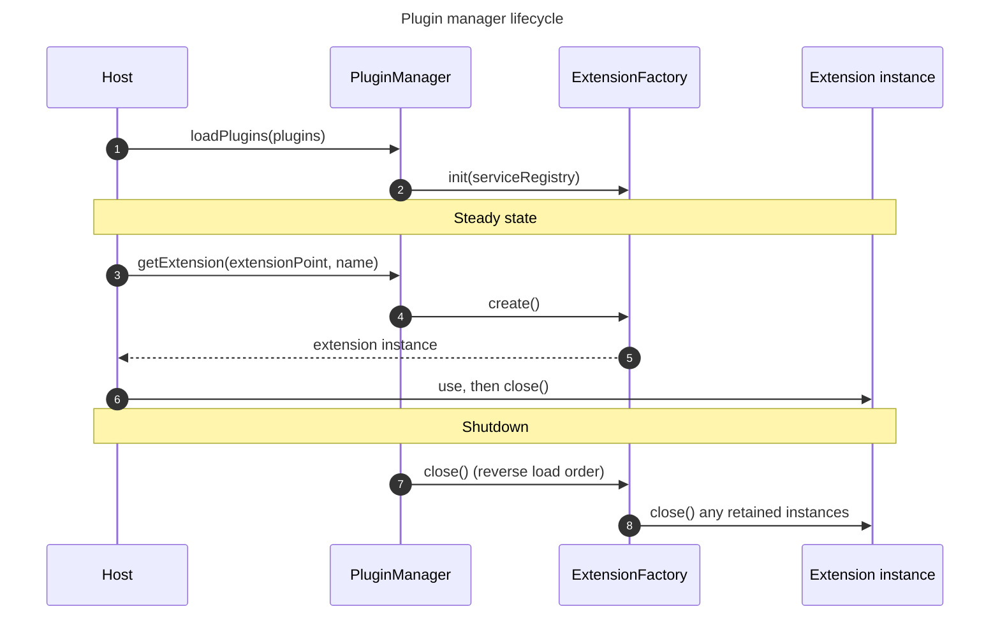

# Extensibility

!!! warning "Internal API today"
    The plugin system on this page is **internal** to the platform. Only the platform's own modules use it, and the
    API can change at any time between releases. A public API for community extensions is on the roadmap, but the
    team hasn't set a date. See [Toward third-party plugins](#toward-third-party-plugins) for what must be ready
    first. This page describes the current design, not a stable contract.

## Overview

The platform has a plugin system. It lets some parts of the platform accept plug-in code. The platform decides which
parts are open: only components that the platform marks as *extension points* accept extensions. Extension code can't
reach anything else through an official API.

The design takes ideas from
[Trino plugins](https://trino.io/docs/current/installation/plugins.html) and
[Keycloak SPIs](https://www.keycloak.org/docs/latest/server_development/index.html#_providers). The structure is the
same: a small set of extension points that the platform defines, loaded with `ServiceLoader`, and a fixed set of
platform services that extensions can use.

The plugin system doesn't use [Java's module system](https://dev.java/learn/modules/intro/) or
[OSGi](https://www.osgi.org/). Both add lifecycle, resolver, and descriptor features that the platform doesn't need,
and a per-plugin classloader (see [Classloader isolation](#classloader-isolation)) gives the same isolation without
the rest of the framework.

The plugin system runs in the same process as the platform. It doesn't use HTTP or gRPC, as
[hashicorp/go-plugin](https://github.com/hashicorp/go-plugin) does. Out-of-process calls would add serialization cost,
network latency, timeouts, and extra work for connection management, observability, and securing the channel (TLS,
authentication).

## Core concepts

### Plugin

A plugin is a packaging unit. It implements the `Plugin` interface and provides one or more extension factories. The
platform finds it at startup with Java's
[`ServiceLoader`](https://docs.oracle.com/en/java/javase/21/docs/api/java.base/java/util/ServiceLoader.html).

All API types referenced on this page live in `org.dependencytrack.plugin.api` and its `config` and `storage` child
packages. `ExtensionPoint` and `ExtensionFactory` both extend `java.io.Closeable`, so extension instances work
with try-with-resources by default.

### Extension point

An extension point is a feature that the platform makes pluggable. It's a Java interface that extends `ExtensionPoint`
and has the `@ExtensionPointSpec` annotation. The annotation gives it a stable name. An extension point can have zero,
one, or many extensions.

### Extension

An extension is a class that implements an extension point. A factory creates and sets it up. The host code never
creates it directly.

### Extension factory

A factory implements `ExtensionFactory`. It creates and sets up extensions for one extension point. The factory
declares:

- The extension's name (kebab-case).
- The extension class it creates.
- A priority. Lower numeric value wins. Callers that go through all factories of an extension point see them in this order.

The factory chooses what `create()` returns. It can return a new instance every time, or always the same one. A new
instance per call works well for extensions that hold resources for one call and release them at the end. A factory
that returns a shared instance must make `close()` on that instance idempotent and safe, because the caller always
closes whatever `create()` returns.

A factory can also turn on more features. See [Optional capabilities](#optional-capabilities).

### Extension identity

Every extension has an identity. The identity is the extension-point class plus the extension name. The platform turns
this into the string pair `(extension-point-name, extension-name)`. The platform uses that pair as the namespace key
for every per-extension store: configuration keys, key-value storage, cache entries, and metric tags. Two extensions
can share the same extension name only if they belong to different extension points.

## Component model

```mermaid
---
title: Plugin, factory, extension
---
graph LR
    SL["ServiceLoader<br/>(META-INF/services)"] --> P["Plugin"]
    P -->|provides| F1["ExtensionFactory&lt;T&gt;"]
    P -->|provides| F2["ExtensionFactory&lt;U&gt;"]
    F1 -->|create&#40;&#41;| E1["Extension : T"]
    F2 -->|create&#40;&#41;| E2["Extension : U"]
    EPS1["@ExtensionPointSpec"] -.declares.-> T["ExtensionPoint T"]
    EPS2["@ExtensionPointSpec"] -.declares.-> U["ExtensionPoint U"]
    T -.implemented by.-> E1
    U -.implemented by.-> E2
```



## Minimal example

A complete plugin is three Java types plus one `ServiceLoader` registration file. The example below defines a fictional
`Greeter` extension point, one extension, its factory, and the plugin that exposes the factory.

```java linenums="1"
@ExtensionPointSpec(name = "greeter")
public interface Greeter extends ExtensionPoint {
    
    String greet(String name);
    
}
```

```java linenums="1"
class FriendlyGreeter implements Greeter {
    
    @Override
    public String greet(String name) {
        return "Hello, %s!".formatted(name);
    }
    
}
```

```java linenums="1"
class FriendlyGreeterFactory implements ExtensionFactory<Greeter> {
    
    @Override
    public String extensionName() { 
        return "friendly"; 
    }
    
    @Override
    public Class<? extends Greeter> extensionClass() {
        return FriendlyGreeter.class; 
    }
    
    @Override
    public int priority() { 
        return PRIORITY_HIGHEST; 
    }

    @Override
    public void init(ServiceRegistry serviceRegistry) {
        // Resolve platform services once at startup. Nothing to do here.
    }

    @Override
    public Greeter create() {
        return new FriendlyGreeter();
    }
    
}
```

```java linenums="1"
public class GreeterPlugin implements Plugin {
    
    @Override
    public Collection<? extends ExtensionFactory<? extends ExtensionPoint>> extensionFactories() {
        return List.of(new FriendlyGreeterFactory());
    }
    
}
```

The `ServiceLoader` registration is a single line in `META-INF/services/org.dependencytrack.plugin.api.Plugin`:

```text linenums="1"
com.example.greeter.GreeterPlugin
```

## Loading and lifecycle

The host creates a `PluginManager` and gives it the list of supported extension-point classes. Then it loads plugins
with `ServiceLoader` and passes them to the manager. The manager checks each factory (name pattern, class is concrete,
manager knows the target extension point, identity is unique), builds a `ServiceRegistry` for the extension, and calls
the factory's `init`. `init` runs **once per factory** at startup. If it throws, the platform stops plugin loading
instead of skipping the extension. `create()` runs every time the host asks for an instance.



The host gets an extension from the `PluginManager` by name and uses it within a try-with-resources block. The caller
owns the instance returned by `create()` and closes it when done. Instances that a factory keeps stay open until the
factory's own `close()` runs at shutdown.

```java linenums="1"
try (var greeter = pluginManager.getExtension(Greeter.class, "friendly")) {
    String message = greeter.greet("world");
    System.out.println(message);
}
```

At shutdown, the platform calls `close()` on each factory in reverse load order. The factory then closes any
extension instances it kept.

The platform assumes extension instances are stateful and **not thread-safe**. An extension point can state otherwise.
A factory that returns a new instance per call already meets the assumption. A factory that reuses one long-lived
instance must make that instance thread-safe itself.

Errors from an extension go to the caller. The `PluginManager` doesn't catch them, and one failing extension doesn't
bring down the host.

## What extensions can see

Extensions only talk to the platform through a small, fixed set of services. During `init`, the factory gets a
read-only `ServiceRegistry`. The registry holds a fixed set of platform services and nothing more. Extensions can't
add their own services. They also can't reach the platform's framework context, database connections, or domain
repositories.

| Service          | Scope                       | Purpose                                                                                   |
|------------------|-----------------------------|-------------------------------------------------------------------------------------------|
| `ConfigRegistry` | Per-extension               | Access to deployment and runtime configuration                                            |
| `KeyValueStore`  | Per-extension               | Persistent state with optimistic concurrency                                              |
| `CacheManager`   | Per-extension (namespaced)  | Cache provided by the configured `CacheProvider` (default: database, `CACHE_ENTRY` table) |
| `HttpClient`     | Shared                      | Outbound HTTP, set to platform defaults                                                   |

### Configuration

Extensions have two kinds of configuration. Both come from the per-extension `ConfigRegistry`.

**Deployment configuration** doesn't change while the process runs. The process reads it at startup. It uses the
platform's process-level configuration (see the [configuration
reference](../../../reference/configuration/application.md) for sources, formats, and the full property catalog). The
keys live under a namespace based on the extension's identity, in the form `dt.<extension-point>.<extension>.<key>`.
For the `friendly` extension of the `greeter` extension point, a property named `endpoint` maps to
`dt.greeter.friendly.endpoint`. The per-extension `DeploymentConfig` blocks access to keys outside that namespace,
so one extension can't read another extension's configuration through the official API.

**Runtime configuration** lives in the database. It can change while the process runs, and the platform validates it
on every read. A factory turns this on by implementing `RuntimeConfigurable` and returning a `RuntimeConfigSpec`. The
spec contains a default config instance, a [JSON Schema](https://json-schema.org/) document for the config class
(written against the [2020-12 draft](https://json-schema.org/specification-links#2020-12)), and an optional validator
for checks that the schema can't express. The platform writes the default into the database at load time if no value
is there yet.

#### Schema extensions

The platform reserves custom JSON Schema keywords. They don't affect validation, but they have meaning for the
frontend and for the configuration mapper:

- `x-secret-ref` (Boolean). It marks a field whose value is the **name** of a managed secret, not the secret value
  itself. Configuration never stores raw secrets. At read time, the `ConfigRegistry` uses a secret resolver from the
  platform to turn the name into the plaintext value. The `ConfigRegistry` does this before it passes the config to
  the extension. The naming and storage rules for secrets belong to the
  [secret management subsystem](../../../guides/administration/configuring-secret-management.md).
- `x-ui-hint` (object). A hint for how to render the configuration form. For example, it can ask for a multi-line
  input field instead of a single-line one.

The frontend uses these schemas to build configuration forms at runtime: `title` and `description` give labels and
help text, `x-secret-ref` brings up a secret-input field, and `x-ui-hint` picks the input type. The schema is part of
the extension's UI contract, not only a way to check input.

## Optional capabilities

### Runtime-configurable

A factory that implements `RuntimeConfigurable` declares a `RuntimeConfigSpec`. It then gets its typed `RuntimeConfig`
from the `ConfigRegistry`. This is how an administrator can change extension behavior without restarting the platform.

### Testable

A factory that implements `Testable` has a `test` method. The platform calls it so operators can check that an
extension's configuration works before they turn it on. The result has one or more named checks with the status
`PASSED`, `FAILED`, or `SKIPPED`. For example, the email publisher has one `connection` check that opens an SMTP
session.

## Examples

Extension points used in the platform today:

- `NotificationPublisher`: sends notifications to channels like email, Jira, Slack, and webhooks.
- `PackageMetadataResolver`: looks up package metadata for an ecosystem (latest versions, publish dates, hashes).
- `VulnAnalyzer`: analyzes a CycloneDX BOM and returns a vulnerability disclosure report.
- `VulnDataSource`: mirrors vulnerability data from sources like OSV, NVD, and GitHub Advisories.

## Boundaries and rationale

Extensibility has clear limits by design. The platform picks what to open and what to keep closed. The set of services
stays small, so the team can keep it stable and reason about it. Extensions get the services they need without
getting access to the rest of the platform. Two more properties matter on top of the services from
[What extensions can see](#what-extensions-can-see):

- **Per-extension namespacing.** Configuration keys, key-value storage, and cache are all scoped by extension
  identity. An extension can't read another extension's data through the official APIs.
- **Secrets never live in config.** Sensitive fields hold only secret names. The platform's secret resolver turns them
  **into values at read time.**

These limits are at the **API level**, not at the execution level. Plugins share the platform's classloader and Java
Virtual Machine (JVM). The platform doesn't run a sandbox, and nothing stops reflection from breaking the namespacing
rules.
This is fine for now because every plugin the platform loads ships in the same repository as the platform. Opening
the system to third-party plugins needs more. See [Toward third-party plugins](#toward-third-party-plugins).

## Toward third-party plugins

The team designed the plugin system with community extensions in mind, but the platform doesn't load any today, and
the public API isn't a contract yet. The platform needs the items below first. None of them have a date.

### API stability

The current internal API would become a public contract. That brings the usual rules: a deprecation policy, semantic
versioning, and backwards compatibility across platform releases. Until then, anything on this page can change
between releases.

### API artifact publication

The plugin API modules need to ship to [Maven Central](https://central.sonatype.com/). Authors can then depend on
them with normal build tools, instead of copying sources or pulling the whole platform repository.

### Classloader isolation

Today, plugins share the platform's classloader. That's fine for first-party plugins, which ship in the same
repository as the platform and pick their dependencies against the same versions: no third-party code to
isolate from, and the build resolves any dependency conflicts.

Third-party plugins break those assumptions. Sharing one classloader then causes three problems: a plugin's transitive
dependencies can clash with the platform's, a plugin can load classes from other plugins, and reflection can reach any
platform internal. Each plugin then needs its own classloader, separate from the platform's and from other plugins'.

A per-plugin [`URLClassLoader`](https://docs.oracle.com/en/java/javase/21/docs/api/java.base/java/net/URLClassLoader.html),
with the platform classloader as a filtered parent that only exposes the API module, gives this isolation without a
full module or bundle framework. The result limits a plugin to the API module and its own dependencies, removes
dependency clashes, and makes the API the only way in.

### Integrity verification

Plugin artifacts need a way to verify their origin. Operators must be able to trust that a plugin is what its author
published. The platform doesn't commit to a specific mechanism yet. Options include:

- [`jarsigner`](https://docs.oracle.com/en/java/javase/21/docs/specs/man/jarsigner.html), the JDK's built-in JAR
  signing tool. It's stable and standalone, but the operator has to manage an X.509 trust store.
- [Sigstore](https://www.sigstore.dev/) (`cosign`). It signs artifacts with short-lived keys tied to an OIDC identity
  and records the signature in a public transparency log. It needs less operator effort, but it adds a runtime
  dependency on Sigstore infrastructure (or a self-hosted version).

Whatever the platform picks, it needs to check signatures before it loads a plugin, and the operator needs a way to
say which signers they trust.

### Other open questions

- **Distribution and discovery.** How operators find, install, and update plugins. The current `ServiceLoader`
  mechanism assumes the JARs are already on the classpath at startup.
