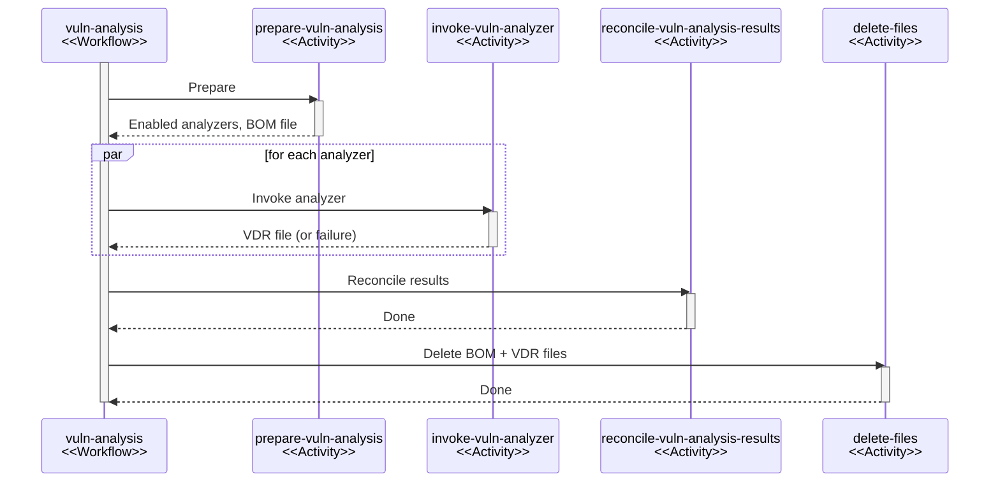

# Vulnerability analysis

## Overview

The vulnerability analysis system identifies known vulnerabilities in a project's components
by coordinating a fleet of vulnerability analyzers via a [durable workflow](durable-execution.md).

## Granularity

Vulnerability analysis happens at the project level. Analysis of individual
components is not supported.

The reason for this design choice is that analysis can be contextual. Some scanners,
such as [Trivy], may only flag certain vulnerabilities for a component if specific
other components are also present. Analysis of individual components can not offer
this context.

The unit-of-work being a project further has the following, non-functional benefits:

* Fewer asynchronous tasks / events to send and process.
* More opportunities for batching.
* Simpler orchestration.

## Triggers

Three triggers can start vulnerability analysis. Each trigger creates a run
of the outer `analyze-project` workflow, which calls the `vuln-analysis` workflow
described in this document, followed by project policy evaluation and metrics update.

| Trigger    | Workflow instance ID                              | Concurrency key                 | Priority    |
|:-----------|:--------------------------------------------------|:--------------------------------|:------------|
| Scheduled  | `analyze-project-scheduled:<projectUuid>`         | `analyze-project:<projectUuid>` | 0 (default) |
| BOM upload | `analyze-project:bom-upload:<bomUploadToken>`     | `analyze-project:<projectUuid>` | 50          |
| Manual     | `analyze-project-manual:<projectUuid>`            | `analyze-project:<projectUuid>` | 75          |

All triggers share the same concurrency key pattern, which serializes analysis runs per project
regardless of the trigger. Only one run per project can be active at a time.
This prevents data races and excessive resource use.

BOM upload instance IDs include the per-upload token, so every upload results in a
separate run even when uploads arrive in quick succession for the same project.
Scheduled and manual triggers use project-scoped instance IDs to deduplicate concurrent
requests for the same project.

The engine processes higher priority values first, so manual triggers (75) take precedence
over BOM uploads (50), which take precedence over scheduled runs (0).

When `analyze-project` invokes `vuln-analysis`, it sets the nested workflow's concurrency
key to `vuln-analysis:<projectUuid>`. This isolates the vulnerability analysis stage from
the surrounding policy and metrics stages.

Refer to the [durable execution](durable-execution.md) documentation for details
on how the engine enforces concurrency keys, instance IDs, and priorities.

## Workflow execution

The `vuln-analysis` workflow orchestrates the full analysis lifecycle:

### Preparation

| Activity                | Task queue |
|:------------------------|:-----------|
| `prepare-vuln-analysis` | `default`  |

1. Determines which analyzers are applicable for the project by querying all active
   analyzer instances for their requirements.
2. Aggregates requirements across all analyzers and assembles a CycloneDX BOM containing
   the project's components with the necessary data (CPEs, PURLs, etc.).
3. Stores the BOM to file storage.

If no analyzers are active, or the project has no analyzable components,
the workflow terminates early.

### Analyzer invocation

| Activity               | Task queue      |
|:-----------------------|:----------------|
| `invoke-vuln-analyzer` | `vuln-analyses` |

1. Retrieves the BOM from file storage.
2. Invokes an analyzer, which yields a VDR.
3. Stores the resulting VDR back to file storage.
4. Runs on the dedicated `vuln-analyses` task queue, isolating analyzer workload
   from other activity processing.

Each analyzer invocation is a separate activity, enabling independent retries
and concurrent execution across analyzers.

### Analyzer result reconciliation

| Activity                          | Task queue                      |
|:----------------------------------|:--------------------------------|
| `reconcile-vuln-analysis-results` | `vuln-analysis-reconciliations` |

* Loads VDR files from all successful analyzers from file storage.
* Reconciles the reported vulnerabilities and findings with the database.

Reconciliation performs the following operations, in order:

1. Merging duplicate vulnerability reports across VDRs.
2. Synchronizing vulnerabilities to the database (that is, creating or updating them).
3. Synchronizing vulnerability alias assertions (see [Alias synchronization](#alias-synchronization)).
4. Creating and soft-deleting finding attributions (see [ADR-013][adr-013]).
5. Evaluating vulnerability policies for active findings.
6. Emitting notifications (see [Notifications](#notifications)).

The activity batches all database changes and commits them in a single transaction.
This ensures that changes are atomic, and the activity is idempotent.

### File deletion

| Activity       | Task queue |
|:---------------|:-----------|
| `delete-files` | `default`  |

Deletes the BOM file, all VDR files, and the context file (if present) from file storage.

## Analyzer extension point

Analyzers are pluggable via the [extensibility](extensibility.md) system. The API surface consists of two interfaces:

* **`VulnAnalyzerFactory`**: Creates analyzer instances. Reports whether the analyzer is active,
  and declares the component data the analyzer needs via a `VulnAnalyzerRequirement` set
  (for example, `COMPONENT_CPE`, `COMPONENT_PURL`).
* **`VulnAnalyzer`**: Receives a CycloneDX BOM representing a project's components,
  and returns a CycloneDX VDR describing the vulnerabilities found.

The preparation step aggregates requirements across all active analyzers, so the BOM
each analyzer receives may carry more data than that analyzer requested. Requirements are
best-effort and components may lack the requested fields. Group, name, and version are always
present. Each analyzer decides which components it can work with and ignores the rest.

In the returned VDR, `vulnerabilities[].affects[].ref` entries reference affected components
by their `bomRef`. Analyzers must treat `bomRef` values as opaque strings.

### Internal components

Components may carry a `dependencytrack:internal:is-internal-component` property. When present,
the component is internal and analyzers must not send its data to external services. The presence of
the property is enough. Its value is irrelevant.

### Advisory reference URLs

Vulnerabilities in the VDR may include a `dependency-track:vuln:reference-url` property pointing
to the analyzer-specific advisory or issue page for that vulnerability.

## File storage

The BOM and VDR files produced during analysis go through the `FileStorage` mechanism,
which abstracts over an underlying storage backend.

The system uses file storage because:

* In-memory storage is not an option, as workflow execution may span more than one node.
* The respective artifacts are arbitrarily large.
* Passing them directly via workflow and activity arguments would bloat workflow history.
* Storing them as blobs in the database would strain the database with excessive I/O.

The `FileMetadata` returned by the storage provider flows between activities,
decoupling the workflow from storage specifics.

### File naming

Files follow a deterministic naming scheme scoped to the workflow run:

| File    | Name pattern                                             |
|:--------|:---------------------------------------------------------|
| BOM     | `vuln-analysis/<workflowRunId>/bom.proto`                |
| VDR     | `vuln-analysis/<workflowRunId>/vdr_<analyzerName>.proto` |
| Context | `vuln-analysis/context/<bomUploadToken>.proto`           |

## Resiliency

### Activity retries

Analyzer invocations use the following retry policy:

| Parameter            | Value      |
|:---------------------|:-----------|
| Initial delay        | 5&nbsp;s   |
| Delay multiplier     | 2x         |
| Randomization factor | 0.3        |
| Max delay            | 1&nbsp;min |
| Max attempts         | 5          |

This yields a retry window of roughly 2-3 minutes before an analyzer
invocation counts as permanently failed.

### Graceful failure handling

When an analyzer fails (even after exhausting retries), the workflow catches the
`ActivityFailureException` and records the analyzer as failed. The workflow continues
with results from successful analyzers. During reconciliation, the activity keeps
findings attributed to failed analyzers and does not delete their attributions, since
the absence of a result does not imply the absence of a vulnerability.

The workflow emits an `ANALYZER_ERROR` notification for each failed analyzer.

### File cleanup

The `deleteFiles` step runs in both the success path and the error path (via catch + rethrow),
which cleans up BOM and VDR files regardless of outcome.

## Reconciliation

During reconciliation, the activity processes VDRs from all successful analyzers and
synchronizes findings with the database.

### Vulnerability merge

When more than one analyzer reports the same vulnerability (identified by source and vulnerability ID),
the activity uses only one report for synchronization. It processes VDRs in alphabetical
analyzer name order, and the first report wins. The exception is when a later report carries
a pre-populated database ID (only set by the internal analyzer), in which case it takes precedence,
since the ID allows skipping database lookups during synchronization.

### Vulnerability synchronization

The activity synchronizes reported vulnerabilities to the database using a three-tier strategy:

1. Pre-populated IDs: Vulnerabilities whose database ID is already known (from the internal
   analyzer) return directly without any database query.
2. Read-only resolution: Vulnerabilities that analyzers can not update (see
   [Vulnerability updates](#vulnerability-updates)) resolve via a `SELECT` query, which avoids
   the exclusive row locks that an upsert would take.
3. Upsert: Remaining vulnerabilities go through `INSERT ... ON CONFLICT DO UPDATE`.

The activity processes vulnerabilities in batches of 100.

### Vulnerability updates

An analyzer can update a vulnerability's data if:

* It serves as the authoritative source for that vulnerability type
  (for example, `oss-index` for `OSSINDEX`, `snyk` for `SNYK`), or
* The vulnerability source supports mirroring (for example, `NVD`, `GITHUB`, `OSV`),
  and an operator turned off mirroring for that source.

Analyzers never change vulnerabilities from the `INTERNAL` source.

Beyond the source-level checks, the upsert enforces two row-level guards:

* Temporal: the incoming `UPDATED` timestamp must be strictly newer than the existing one.
  This prevents older data from overwriting newer data.
* Idempotency: the upsert compares all mutable fields via `IS DISTINCT FROM`.
  If the incoming data matches what's already stored, the row is not written.

### Alias synchronization

After vulnerability synchronization, the activity synchronizes alias assertions reported
by each analyzer to the database.

Refer to [ADR-014][adr-014] for details on the alias schema and synchronization algorithm.

### Finding attributions

Each finding (component and vulnerability pair) tracks which analyzers reported it
via attributions. During reconciliation:

1. The activity creates new attributions for newly reported findings.
2. The activity soft-deletes stale attributions when an analyzer that prior reported
   a finding no longer does. Attributions from *failed* analyzers stay intact.
3. A finding counts as active as long as it has at least one non-deleted attribution.

Refer to [ADR-013][adr-013] for further details on the attribution mechanism.

### Policy evaluation

After the activity reconciles findings, it evaluates vulnerability policies against
all active findings. Policy results can automatically set analysis states
(for example, suppression), and any resulting audit changes emit notifications.

When a policy that prior matched a finding no longer does, the automatically
applied analysis state resets to defaults.

!!! tip
    The activity applies policy analyses atomically with finding reconciliation.
    A newly identified finding can thus get suppressed immediately,
    without ever showing up in time series metrics, or triggering a `NEW_VULNERABILITY` notification.

### Notifications

Reconciliation can emit the following notifications:

* `NEW_VULNERABILITY`: For each newly created finding, and for findings that become
  active again after going inactive (see [Finding attributions](#finding-attributions)).
* `VULNERABILITY_RETRACTED`: When a finding becomes inactive, that's, all its attributions
  have gone soft-deleted and no analyzer reports it anymore.
* `NEW_VULNERABLE_DEPENDENCY`: When a BOM upload introduces new components that have
  existing vulnerabilities. The BOM upload trigger stores a context file containing the IDs
  of newly added components. During reconciliation, if the context file is present,
  components from that list that ended up with findings trigger this notification.
* `PROJECT_AUDIT_CHANGE`: When a policy evaluation changes the analysis state or
  suppression of an existing finding.
* `ANALYZER_ERROR`: For each analyzer that failed during invocation.

The activity emits all notifications within the same transaction that persists findings,
following the [transactional outbox](notifications.md) pattern.

## Post-workflow event listeners

A backward-compatibility event listener reacts to completed workflow runs. The team plans to remove it:

* **Delayed BOM processed notification**: When [`dt.tmp.delay-bom-processed-notification`](../../../reference/configuration/properties.md#dttmpdelay-bom-processed-notification)
  is on, defers the `BOM_PROCESSED` notification until after vulnerability analysis
  completes. Only applies to analyses initiated by a BOM upload.

[Trivy]: https://trivy.dev/
[adr-013]: https://github.com/DependencyTrack/dependency-track/tree/main/docs/adr/013-finding-status.md
[adr-014]: https://github.com/DependencyTrack/dependency-track/tree/main/docs/adr/014-new-alias-schema.md
