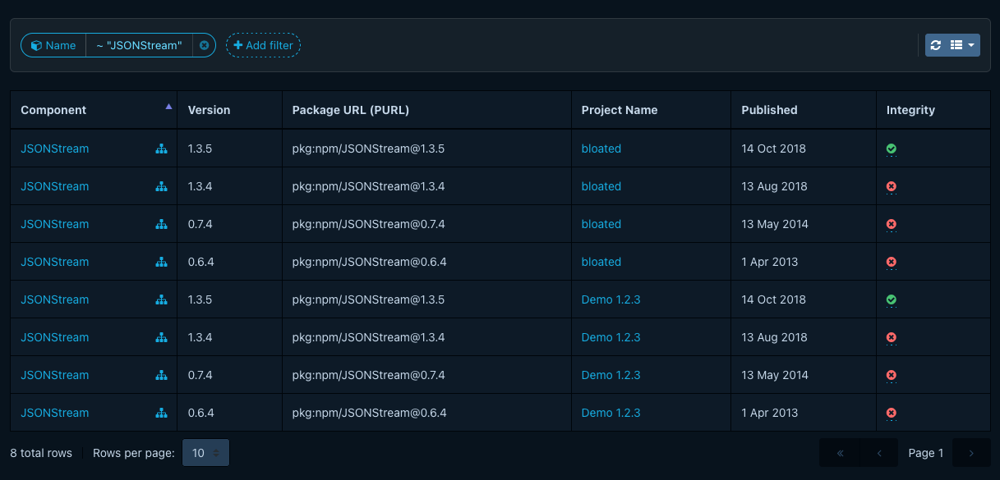
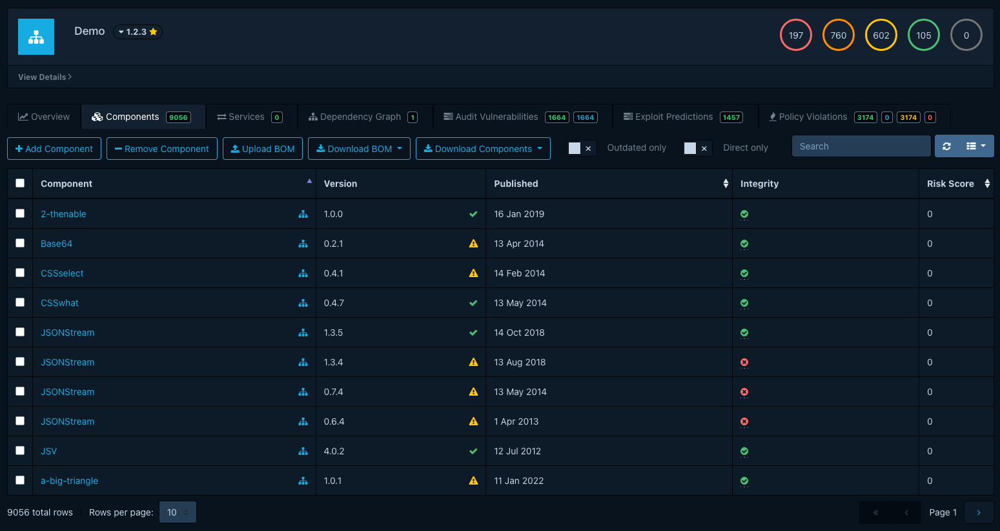
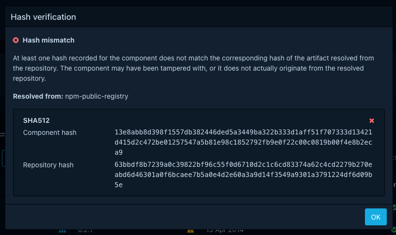

# About component integrity verification

Dependency-Track compares the hashes a BOM declares for each component against the hashes the component's upstream
package repository publishes. A divergence is a signal that the artifact in your build is not the artifact the registry
serves, which catches typosquatting, registry-side tampering, and accidental substitution of look-alike packages.

## How verification works

Upstream hashes are not part of the BOM. The
[package metadata resolution](architecture/design/package-metadata-resolution.md) system fetches them from package
repositories on a scheduled background workflow, and persists the results alongside the resolved artifact.

When Dependency-Track has both sides for a component, it compares them per algorithm. The comparison is
case-insensitive. A match on any shared algorithm marks the component as verified. A difference on any shared algorithm
marks it as failed.

Verification covers four hash algorithms: `MD5`, `SHA-1`, `SHA-256`, and `SHA-512`. BOMs can carry hashes in other
algorithms such as SHA-384, SHA3, BLAKE2b, and BLAKE3. Dependency-Track keeps those values on the component and exposes
them through the API, but they do not factor into verification, because the supported package repositories do not
publish counterparts.

## Supported ecosystems

Verification runs only for components whose upstream repository publishes hashes and whose ecosystem has a resolver
that reads them.

| Ecosystem | Hashes available from upstream |
|:----------|:-------------------------------|
| Maven     | SHA-1 |
| npm       | SHA-1, SHA-512 |
| PyPI      | MD5, SHA-256 |

For PyPI components, the PURL must carry a `file_name` qualifier so the resolver can pick the correct file from the
release. PyPI publishes one source distribution and a fan of wheels per release, each with its own hash, and the
qualifier tells Dependency-Track which one to compare against. PyPI components without the `file_name` qualifier
appear as having no repository hash.

Other ecosystems that Dependency-Track resolves package metadata for, including Cargo, Go modules, Composer, Hex, CPAN,
and Nixpkgs, do not currently return artifact hashes. Components from those ecosystems are never flagged as mismatched.
They appear in the UI as having no repository hash.

Verification also depends on each repository being reachable from Dependency-Track and not rate-limited at the time the
resolver runs. A repository that is unreachable, or that returns HTTP 429, contributes no hashes for the affected
components until the next successful resolution.

## Asynchronous resolution

Dependency-Track resolves upstream hashes asynchronously. A BOM upload schedules resolution, but the workflow processes
components in controlled batches to stay within public registry rate limits. The
[package metadata resolution](architecture/design/package-metadata-resolution.md) page describes the mechanism in detail.

Two consequences follow:

- A freshly imported component shows no repository hash until the resolver catches up. The wait can be minutes on small
  portfolios and longer on large ones.
- While an upstream repository is unreachable or rate-limiting Dependency-Track, components sourced from it show no
  integrity status. A mismatch that would normally show as Failed stays invisible until the next successful refresh.

Verification status reflects the most recent successful resolution, not the state of the BOM at upload time.

## Where verification surfaces

The integrity status appears as a column called **Integrity** in two places:

- The **Components** tab in a project.
- The **Component Search** view.

Both views hide the column by default. Enable it from the column visibility toggle of the table.

Each row shows one of five states:

<!-- vale Google.Units = NO -->

| State | Icon | Meaning |
|:------|:-----|:--------|
| Passed | :fontawesome-solid-circle-check:{ style="color: #4dbd74" } | At least one shared algorithm matches and none differ. |
| Failed | :fontawesome-solid-circle-xmark:{ style="color: #f86c6b" } | At least one shared algorithm differs. |
| Unknown | :fontawesome-solid-circle-question:{ style="color: #ffc107" } | Both sides declare hashes, but none of the algorithms overlap. |
| No component hash | :fontawesome-solid-circle-minus:{ style="color: #9e9e9e" } | The BOM did not declare any hashes for this component. |
| No repository hash | :fontawesome-regular-circle-question:{ style="color: #9e9e9e" } | No upstream hashes are available yet, or the ecosystem is not supported. |

<!-- vale Google.Units = YES -->

The icons in this table approximate what the UI renders. Refer to the screenshots for the exact appearance.

The Passed and Failed icons are clickable. Selecting one opens a modal that lists each algorithm side by side, with the
component-declared value next to the repository value, and indicates which algorithms matched. The modal also names
the repository that supplied the upstream hashes.

## Using verification in policies

A component policy can flag mismatched components with the `component.has_package_artifact_hash_mismatch()` condition
expression. The function matches the Failed state from the UI table. See
[Condition expressions](../reference/policies/condition-expressions.md#has_package_artifact_hash_mismatch) for its
semantics and a worked policy example.

Failed is only one of the states the integrity check can produce. The function fires on confirmed mismatches alone,
so a policy built on it does not flag components that have no repository hash yet, or whose hash algorithms do not
overlap with the upstream repository. Combine it with other conditions if a policy needs to react to those cases
as well.

## What is not yet covered

Integrity verification has the following limits:

- The status is not exported via [time series metrics](./time-series-metrics.md).
- The **Project Components** and **Component Search** views do not expose integrity as a sort or filter parameter.
- Verification depends on resolver coverage and on upstream repositories being reachable, so a component with no
  repository hash is not necessarily a verified one.
