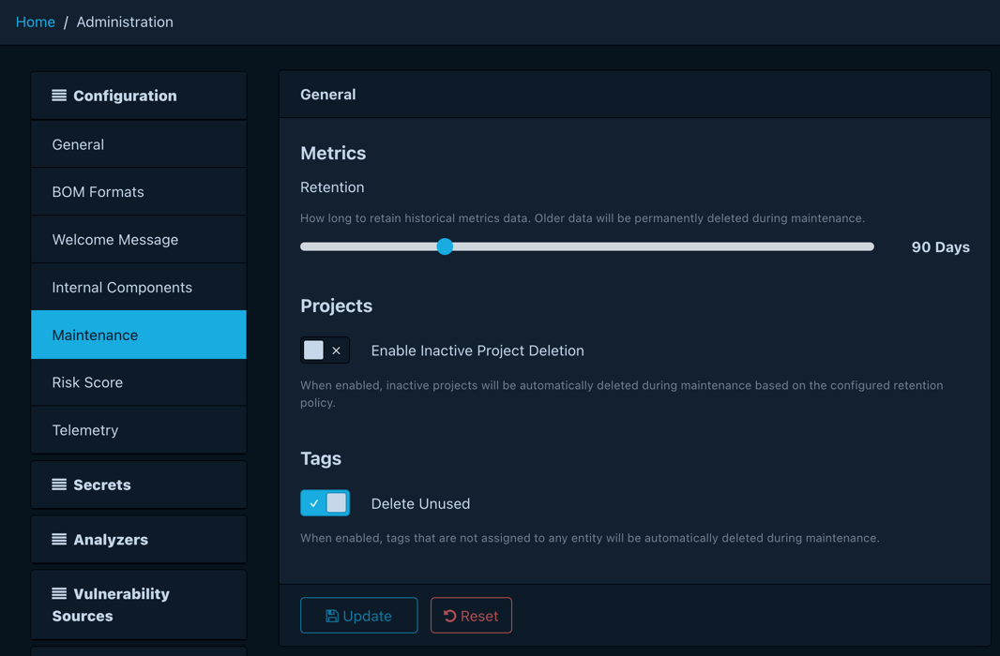

# About time series metrics

A current-state view of risk answers what's broken right now. It cannot
answer whether the team is getting better, and how fast. Dependency-Track
records time series metrics so that the second question has an answer:
every project, component, and the portfolio as a whole leave a trail of
measurements that surface remediation progress, audit throughput, and posture
drift across days, weeks, and quarters.

## Snapshots, not deltas

A metrics record is a *snapshot*: a complete count of vulnerabilities,
findings, suppressions, audit progress, and policy violations at a single
moment, scoped to one component, project, or the portfolio. Reconstructing
trends from deltas is fragile (a missed event corrupts the rest of the
series), so Dependency-Track stores the absolute numbers and lets readers
diff them.

Snapshots also explain a few behaviours users meet later:

* A suppression drops a finding from every
  snapshot taken after it lands. The historical series keeps the old,
  pre-suppression counts, which is exactly what a posture chart should
  show.
* The audit state of a finding (under triage, not affected, exploitable)
  feeds the audited/unaudited counters in the next snapshot, so charts
  reflect human progress, not just scanner output.
* A project's inherited risk score derives from the risk of its
  components, recorded in each project snapshot. Portfolio totals sum
  those project-level scores; the figure is never recomputed from
  child projects at read time for portfolio metrics.

The exact field set per scope lives in the
[REST API reference](../reference/api/v1.md), under the operations tagged
`metrics`.

## When snapshots get written

Two things produce snapshots for a project and its components:

* **Project-changing activity.** A BOM upload, a vulnerability analysis
  run, or a manual reanalysis writes a fresh snapshot as the final step of
  that work. Active projects produce many snapshots per day; the series
  has higher resolution where the project sees more activity.
* **A scheduled sweep.** A platform-wide job runs every active project on
  a fixed schedule (hourly by default), so even an idle project lands at
  least one snapshot per day. This guarantees the series stays continuous
  and that retention windows behave predictably.

Portfolio snapshots are different, and the next two sections explain why.

## Daily partitions and bounded retention

Component and project snapshots accumulate forever if nothing prunes them.
Dependency-Track partitions both tables by day so retention is always a
single partition drop, never a row scan. The cost of "delete a day of
metrics" stays the same whether the table holds a million rows or a
billion. That choice fixes the granularity ceiling (sub-day retention is
not possible), which suits the analytical questions metrics aim to answer
(week-over-week, quarter-over-quarter trends) operating at much coarser
resolution.

Retention is a configurable duration, 90 days by default. An hourly
maintenance task drops out-of-window partitions and pre-creates the
partitions for upcoming days. Administrators change the value at runtime,
through the frontend or the REST API, rather than via a static startup
property.

Two consequences fall out of the design: shrinking retention reclaims disk
on the next maintenance cycle, and extending retention only affects data
recorded from that point onward, because days that already aged out no
longer exist.

## Why portfolio metrics take two paths

Aggregating risk across an entire portfolio on every dashboard load
degrades badly past a few thousand projects. Dependency-Track avoids that
cost with a precomputed snapshot, then falls back to ad-hoc aggregation
for the cases the snapshot cannot serve:

* **Unrestricted callers** (the default, with no [portfolio access
  control](access-control.md#portfolio-access-control), or a principal
  who bypasses it) read from a precomputed snapshot that refreshes after
  each portfolio metrics run. The work already happened in the background,
  so the read is cheap regardless of portfolio size.
* **Restricted callers** (those whom portfolio access control limits to a
  subset of projects) hit an ad-hoc aggregation instead. The query sums
  per-day project snapshots across the projects that caller can access.
  This stays cheap because the visible set is, by construction, smaller
  than the whole portfolio; the snapshot cannot serve them because it
  carries portfolio-wide totals, not per-caller filtered ones.

Collection projects sit outside the precomputed snapshot for the same
reason inherited risk resolves at read time: their numbers sum the
children's, so folding them into the portfolio total would double-count.

The unavoidable trade-off: the precomputed path lags live data by up to
one refresh cycle, where the ad-hoc path is always current. For a posture
trend chart this stays invisible; for a "did the last scan land yet" check
it occasionally surprises.

## Further reading

* [About access control](access-control.md): the model that decides which
  portfolio path a caller takes.
* [REST API reference](../reference/api/v1.md): operations tagged `metrics`
  describe the exact fields, request parameters, and response shapes.
