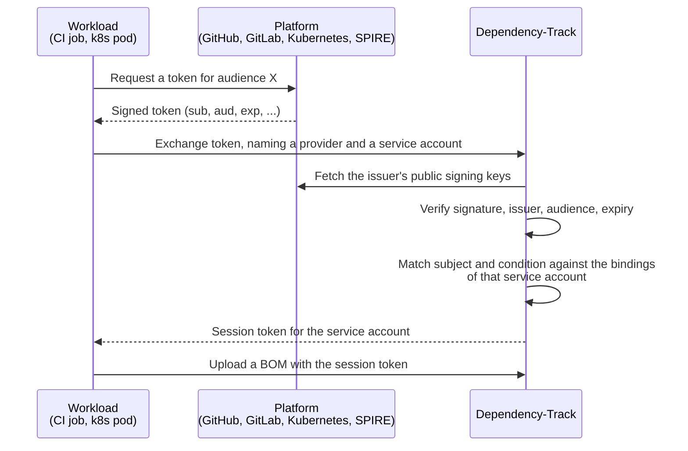

# About workload identity federation

!!! note "Available in 5.2.0 and later"

    Earlier versions authenticate automation with team API keys only.

Workload identity federation lets a workload authenticate to Dependency-Track with a token
that its own platform issued, instead of an API key that someone created and stored.
A GitHub Actions job, a GitLab CI job, a Kubernetes pod, or a SPIFFE workload already holds a short-lived,
signed token that states its identity. Dependency-Track verifies that token and,
if it matches a rule an administrator configured, hands back a session for a [service account](access-control.md#service-accounts).

The workload stores no Dependency-Track credential.

## Why it exists

An API key is a static secret with a long life. Someone creates it, copies it into a CI system,
and has to remember to delete it when it leaks and to rotate it before it expires.
Nothing about the key says which pipeline uses it, and a key that escapes the pipeline keeps
working from anywhere until a human notices.

A platform token has none of those properties. It exists for minutes, it names the exact repository,
branch, namespace, or workload that received it, and nobody can mint one outside that context.

Service accounts and workload identity federation together are the intended replacement for
automation that runs on team API keys:

* The **service account** gives the automation an identity of its own, with its own permissions and its own audit trail.
* **Workload identity federation** gives that identity a credential nobody has to store.

## How an exchange works

The workload names both the provider and the service account it wants to act as.

## Providers and bindings

A **workload identity provider** says which issuer to trust. It holds the issuer,
the audience that tokens must carry, where the issuer's public signing keys come from,
and how long the sessions it creates last. Providers are instance-wide and only administrators manage them.

A **workload identity binding** says which subject of that provider may act as which service account.
It belongs to a service account, names a provider, and matches a subject, either exactly or by prefix.
An optional condition, written in [CEL](../reference/cel-expressions.md),
narrows the match further by looking at any claim in the token.

Bindings can't point at a human user.

### Subjects and conditions

A binding needs a subject even when it carries a condition, and the reason is the shape of shared issuers.
GitHub and GitLab.com issue tokens to anyone with an account, and let the requester choose the audience.
The audience isolates nothing there. Only the subject names the organization,
so a binding that matched on the condition alone would be open to every other tenant of that platform.

Conditions exist because platforms don't put everything into the subject.
[GitLab CI](https://docs.gitlab.com/ci/secrets/id_token_authentication/), for example,
keeps the deployment environment in a separate claim, out of reach of a subject prefix.

A condition is part of the security boundary, in that one that matches more tokens than intended
lets more workloads act as the service account.

## The resulting session

The exchange returns the same kind of opaque session token that the login endpoints issue,
carrying all permissions of the service account.

The session lasts for the provider's configured lifetime, which can't exceed 24 hours.
The subject token proves the workload's identity at the moment of the exchange,
and short platform tokens make that gap deliberate.

[GitLab CI](https://docs.gitlab.com/ci/secrets/id_token_authentication/) and
[SPIRE](https://spiffe.io/docs/latest/deploying/spire_server/) issue tokens that expire after five minutes by default,
and a CI job that uploads a BOM and waits for its analysis takes longer than that.

A session outlives the token it came from, so deleting a binding or a provider doesn't end
sessions already created. Suspending the service account does, at once.

## Further reading

* [Configuring workload identity federation](../guides/administration/configuring-workload-identity-federation.md)
  for the procedure and per-platform configuration.
* [Workload identity reference](../reference/workload-identity.md) for subject matching
  rules, the condition environment, and token requirements.
* [About access control](access-control.md#service-accounts) for how service accounts relate
  to users, teams, and permissions.
