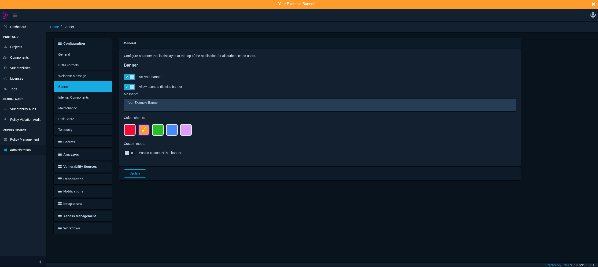
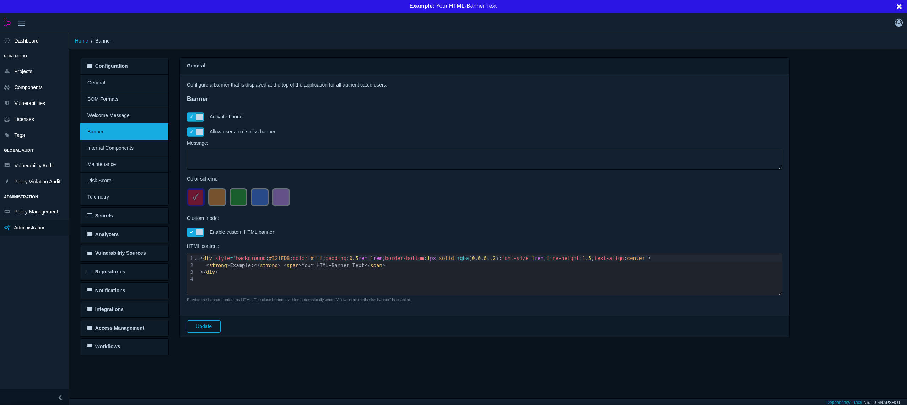

# Configuring the banner

Dependency-Track supports a configurable, application-wide banner that is
displayed at the top of the application for all authenticated users.
This guide covers how administrators enable, style, and manage the banner.

## Overview

The banner is intended for short, system-wide announcements, for example
planned maintenance windows or important notices. It is shown to authenticated
users only and does not appear on the login or change-password pages.

The banner is configured entirely from the administration UI under
**Administration → Configuration → Banner** (route `/admin/configuration/banner`).

!!! note
    Access to the banner configuration requires the `SYSTEM_CONFIGURATION`
    permission.

## Settings

The configuration screen exposes the following controls:

| Setting | Description |
| --- | --- |
| **Activate banner** | Master on/off switch. When disabled, no banner is shown. |
| **Allow users to dismiss banner** | Adds a close (×) button so users can hide the banner. See [Dismissing the banner](#dismissing-the-banner). |
| **Message** | Plain-text content of the banner ([default mode](#default-mode)). |
| **Color scheme** | Preset color of the banner ([default mode](#default-mode)). |
| **Custom mode** | Switches to an HTML editor instead of message + color scheme. |
| **HTML content** | Raw HTML rendered as the banner ([custom mode](#custom-mode)). |

The banner content can be defined in one of two modes: the [default](#default-mode)
text-and-color mode, or the [custom](#custom-mode) HTML mode.

## Modes

### Default mode

The default mode renders a plain-text **Message** using one of the preset
**Color schemes**. This is the recommended option for most announcements.

The following color schemes are available:

* `red`
* `orange`
* `green`
* `blue`
* `lilac`

To configure a banner in default mode:

1. Enable **Activate banner**.
2. Enable **Allow users to dismiss banner** if users should be able to close it.
3. Enter the banner text in the **Message** field.
4. Select a **Color scheme**.
5. Leave **Custom mode** disabled.
6. Select **Update** to save.

!!! note
    The **Update** button remains disabled while the banner is active and the
    **Message** field is empty.

The screenshot below shows a banner configured in **default mode** with
**Allow users to dismiss banner** enabled:



### Custom mode

Custom mode replaces the message and color scheme with a full HTML editor,
giving complete control over the banner's styling, layout, and links.
Use this mode when the preset color schemes or plain text are not sufficient,
for example to embed a link.

To configure a banner in custom mode:

1. Enable **Activate banner**.
2. Enable **Allow users to dismiss banner** if users should be able to close it.
3. Enable **Custom mode**. This clears the message and color settings and seeds
   the editor with an example template.
4. Edit the **HTML content** in the editor.
5. Select **Update** to save.

!!! note
    When custom mode is enabled, the **Message** field and color swatches are
    disabled. The **Update** button remains disabled while the banner is active
    and the **HTML content** is empty.

??? example "Example HTML content"
    ```html linenums="1"
    <div style="background:#321FDB;color:#fff;padding:0.5rem 1rem;border-bottom:1px solid rgba(0,0,0,.2);font-size:1rem;line-height:1.5;text-align:center">
      <strong>Example:</strong> <span>Your HTML-Banner Text</span>
    </div>
    ```

The screenshot below shows a banner configured in **custom mode** with
**Allow users to dismiss banner** enabled:



## Dismissing the banner

The **Allow users to dismiss banner** option controls whether users can hide the
banner themselves.

When enabled:

* A close (×) button is shown in the top-right corner of the banner.
* When a user closes the banner, it stays hidden for the remainder of their
  browser session.
* The banner reappears in a new login session.

When disabled, no close button is shown and users cannot hide the banner.
