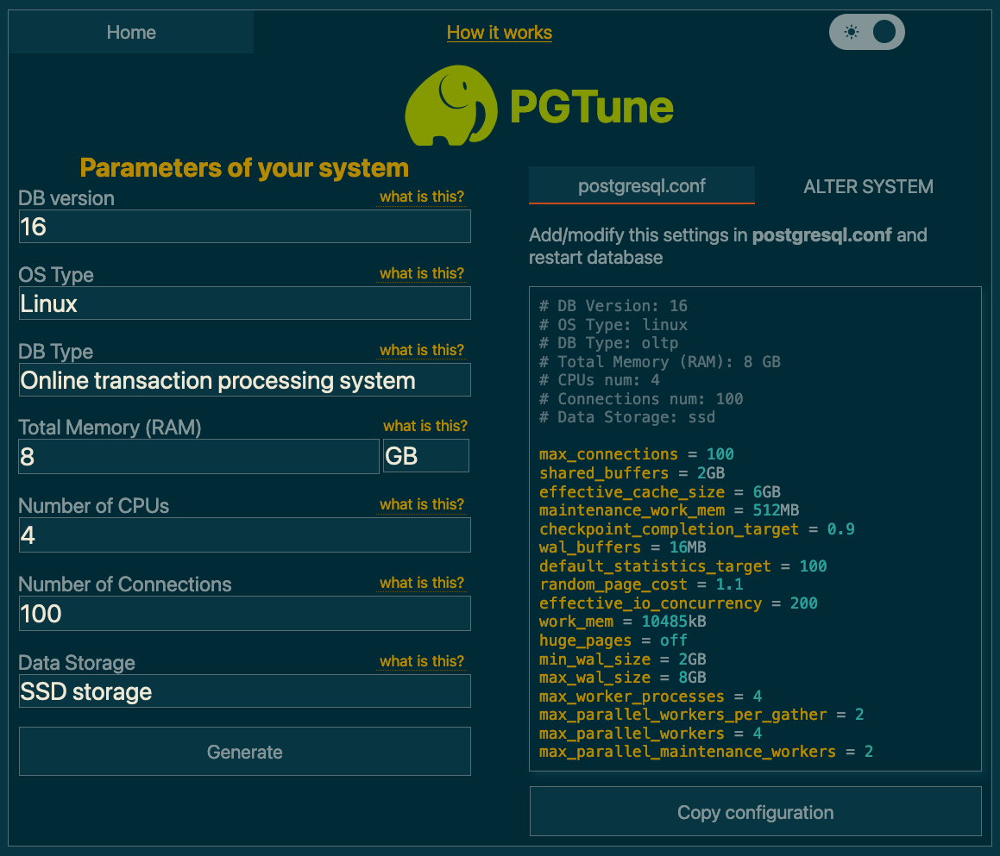

# Configuring the database

This guide covers choosing, deploying, and tuning a PostgreSQL database for
Dependency-Track. For the technical specification (version requirements, required
extensions, tuning parameters), see the
[database reference](../../reference/configuration/database.md).

## Choosing a hosting solution

Depending on available resources, individual preferences, or organizational policies,
you will have to choose between a managed or self-hosted solution.

### Managed solutions

The official PostgreSQL website hosts a [list of well-known commercial hosting providers].

Popular choices include:

* [Amazon RDS for PostgreSQL](https://aws.amazon.com/rds/postgresql/)
* [Aiven for PostgreSQL](https://aiven.io/postgresql)
* [Azure Database for PostgreSQL](https://azure.microsoft.com/en-us/products/postgresql/)
* [Google Cloud SQL for PostgreSQL](https://cloud.google.com/sql/docs/postgres/)

We are not actively testing against cloud offerings. But as a rule of thumb, solutions offering "vanilla" PostgreSQL,
or extensions of it (for example [Neon] or [Timescale]), will most definitely work with Dependency-Track.

The same is not necessarily true for platforms based on heavily modified PostgreSQL, or even entire re-implementations
such as [CockroachDB] or [YugabyteDB]. Such solutions make certain trade-offs to achieve higher levels of scalability,
which might impact functionality that Dependency-Track relies on. If you'd like to see support for those, please [let us know].

### Self-hosting

#### Bare Metal / Docker

For Docker deployments, use the official [`postgres`](https://hub.docker.com/_/postgres) image.

!!! warning
    Do **not** use the `latest` tag. You may end up doing a major version upgrade without knowing it,
    ultimately breaking your database. Pin the tag to at least the major version (for example, `16`), or better
    yet the minor version (for example, `16.2`). Refer to [Upgrades](#upgrades) for upgrade instructions.

For bare metal deployments, it's usually best to install PostgreSQL from your distribution's package repository.
See for example:

* [PostgreSQL instructions for Debian](https://wiki.debian.org/PostgreSql)
* [Install and configure PostgreSQL on Ubuntu](https://ubuntu.com/server/docs/databases-postgresql)
* [Using PostgreSQL with Red Hat Enterprise Linux](https://access.redhat.com/documentation/en-us/red_hat_enterprise_linux/9/html/configuring_and_using_database_servers/using-postgresql_configuring-and-using-database-servers)

To get the most out of your Dependency-Track installation, we recommend to run PostgreSQL on a separate machine
than the application containers. You want PostgreSQL to be able to use the entire machine's resources,
without being impacted by other applications.

For smaller and non-critical deployments, it is totally fine to run everything on a single machine.

#### Upgrades

Follow the [official upgrading guide]. Be sure to select the version of the documentation that corresponds to the
PostgreSQL version you are running.

!!! warning
    Pay attention to the fact that **major version upgrades usually require a backup-and-restore cycle**, due to potentially
    breaking changes in the underlying data storage format. Minor version upgrades are usually safe to perform in a
    rolling manner.

#### Kubernetes

We generally advise **against** running PostgreSQL on Kubernetes, unless you *really* know what you're doing.
Wielding heavy machinery such as [Postgres Operator] is not something to do lightheartedly.

If you know what you're doing, you definitely don't need advice from us.

## Basic tuning

You should be aware that the default PostgreSQL configuration is *extremely* conservative.
It is intended to make PostgreSQL usable on minimal hardware, which is great for testing,
but can seriously cripple performance in production environments.
Not adjusting it to your specific setup will most certainly leave performance on the table.

If you're lucky enough to have access to professional database administrators, ask them for help.
They will know your organisation's best practices and can guide you in adjusting it for Dependency-Track.

If you're not as lucky, we can wholeheartedly recommend [PGTune]. Given a bit of basic info about your system,
it will provide a sensible baseline configuration. For the *DB Type* option, select `Online transaction processing system`.



The `postgresql.conf` is usually located at `/var/lib/postgresql/data/postgresql.conf`.
Most of these settings require a restart of the application.

In a Docker Compose setup, you can alternatively apply the desired configuration via command line flags.
For example:

```yaml
services:
  postgres:
    image: postgres:17
    command: >-
        -c 'shared_buffers=2GB'
        -c 'effective_cache_size=6GB'
```

## Advanced tuning

For larger deployments, you may eventually run into situations where database performance degrades
with just the basic configuration applied. Oftentimes, tweaking advanced settings can resolve
such problems. But knowing which knobs to turn is a challenge in itself.

If you happen to be in this situation, make sure you have database monitoring set up.
Changing advanced configuration options blindly can potentially cause more damage than it helps.

Below, you'll find a few options that, based on our observations with large-scale deployments,
make sense to tweak. Refer to the
[database reference](../../reference/configuration/database.md#tuning-parameters) for the parameter
specifications.

!!! note
    Got more tips to configure or tune PostgreSQL, that may be helpful to others?
    We'd love to include it in the docs. Please raise a PR.

### `autovacuum_vacuum_scale_factor`

The default causes [autovacuum][Autovacuum] to start way too late on large tables with lots of churn,
yielding long execution times. Reduction in scale factor causes autovacuum to happen more often,
making each execution less time-intensive.

The `COMPONENT` table is very frequently inserted into, updated, and deleted from.
This causes lots of dead tuples that PostgreSQL needs to clean up. Because autovacuum also performs
[`ANALYZE`](https://www.postgresql.org/docs/current/sql-analyze.html), slow vacuuming can cause the
query planner to choose inefficient execution plans.

```sql
ALTER TABLE "COMPONENT" SET (AUTOVACUUM_VACUUM_SCALE_FACTOR = 0.02);
```

### `default_toast_compression`

`lz4` compression is faster and more efficient than `pglz`,
at the expense of slightly worse compression ratios.

Consider switching to lz4 if you're more likely to be limited
by CPU utilisation than storage space.

```sql
ALTER SYSTEM SET (DEFAULT_TOAST_COMPRESSION = 'lz4');
```

### `wal_compression`

Enabling WAL compression significantly reduces I/O on write-heavy systems.
The cost of slightly increased CPU utilisation is more than worth it.

If your instance is importing BOMs in large volumes and / or high frequency,
the WAL will fill up fast, and you'll find yourself limited by I/O.
This is particularly true when using HDDs instead of SSDs or NVME storage.

```sql
ALTER SYSTEM SET (WAL_COMPRESSION = 'zstd');
```

## Centralised connection pooling

For large deployments (that is, upwards of 5 instances), it can become undesirable for
each instance to maintain its own connection pool. In this case, you can use
centralised connection pools such as [PgBouncer].

!!! warning
    When using a central connection pooler, you **must** disable local connection pooling
    for all data sources, using [`dt.datasource.<name>.pool.enabled=false`](../../reference/configuration/properties.md#dtdatasourcepoolenabled).

### Constraints

Before proceeding, take note of the following constraints:

* Only `session` and `transaction` pooling modes are supported. `transaction` is recommended.
* Initialisation tasks, which include database migrations, **must** connect to the
  database directly, bypassing the connection pooler, when using pooling mode `transaction`.
  * To prevent concurrent initialisation, session-level PostgreSQL advisory locks are used,
    which are not supported with the `transaction` pooling mode.
  * To facilitate this, initialisation tasks can be executed in dedicated containers,
    and / or using separate data sources.

### Example

```yaml linenums="1"
services:
  postgres:
    image: postgres
    environment:
      POSTGRES_DB: "dtrack"
      POSTGRES_USER: "dtrack"
      POSTGRES_PASSWORD: "dtrack"

  pgbouncer:
    image: bitnami/pgbouncer
    environment:
      POSTGRESQL_HOST: "postgres"
      POSTGRESQL_PORT: "5432"
      POSTGRESQL_USERNAME: "dtrack"
      POSTGRESQL_PASSWORD: "dtrack"
      POSTGRESQL_DATABASE: "dtrack"
      PGBOUNCER_DATABASE: "dtrack"
      PGBOUNCER_PORT: "6432"
      PGBOUNCER_POOL_MODE: "transaction"
      PGBOUNCER_DEFAULT_POOL_SIZE: "30"

  apiserver:
    image: ghcr.io/dependencytrack/hyades-apiserver
    environment:
      # Configure the default data source:
      # - Points to PgBouncer, NOT Postgres directly.
      # - Pooling is DISABLED.
      DT_DATASOURCE_URL: "jdbc:postgresql://pgbouncer:6432/dtrack"
      DT_DATASOURCE_USERNAME: "dtrack"
      DT_DATASOURCE_PASSWORD: "dtrack"
      DT_DATASOURCE_POOL_ENABLED: "false"
      # Configure the data source for initialisation tasks:
      # - Points to Postgres directly, NOT PgBouncer.
      # - Pooling is DISABLED.
      DT_DATASOURCE_INIT_URL: "jdbc:postgresql://postgres:5432/dtrack"
      DT_DATASOURCE_INIT_USERNAME: "dtrack"
      DT_DATASOURCE_INIT_PASSWORD: "dtrack"
      DT_DATASOURCE_INIT_POOL_ENABLED: "false"
      # Configure initialisation tasks to use the above data source.
      DT_INIT_TASKS_DATASOURCE_NAME: "init"
```

## Schema migration credentials

It is possible to use different credentials for migrations than for the application itself.
This can be achieved by configuring a separate data source, and instructing the init tasks to use it:

```ini linenums="1"
# Configure a data source named "init-tasks".
dt.datasource.init-tasks.url=jdbc:postgresql://localhost:5432/dtrack
dt.datasource.init-tasks.username=my-init-task-user
dt.datasource.init-tasks.password=my-init-task-pass

# Configure init tasks to use the data source.
init.tasks.datasource.name=init-tasks

# If the data source is only meant for init tasks, there is no need to
# keep it around after the tasks completed.
init.tasks.datasource.close-after-use=true
```

[Autovacuum]: https://www.postgresql.org/docs/current/routine-vacuuming.html
[CockroachDB]: https://www.cockroachlabs.com/
[Neon]: https://neon.tech/
[PGTune]: https://pgtune.leopard.in.ua/
[PgBouncer]: https://www.pgbouncer.org/
[Postgres Operator]: https://github.com/zalando/postgres-operator
[Timescale]: https://www.timescale.com/
[YugabyteDB]: https://www.yugabyte.com/
[let us know]: https://github.com/DependencyTrack/hyades/issues/new?assignees=&labels=enhancement&projects=&template=enhancement-request.yml
[list of well-known commercial hosting providers]: https://www.postgresql.org/support/professional_hosting/
[official upgrading guide]: https://www.postgresql.org/docs/current/upgrading.html
