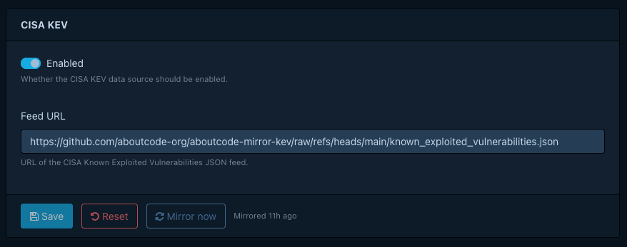
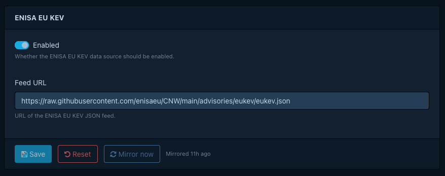
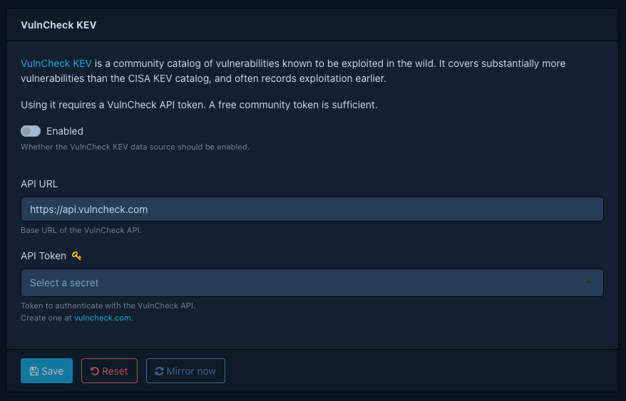

# Configuring KEV sources

!!! note
    KEV integration requires Dependency-Track **5.1 or newer**.

CISA KEV, ENISA EU KEV, and VulnCheck KEV are the three KEV catalogs Dependency-Track can mirror into its internal
database. You pick which ones to enable, configure them through the web UI, and trigger an initial mirror so KEV
status appears without waiting for the next scheduled run.

For background on what each source provides and how mirrored assertions attach to vulnerabilities, see [About KEV data
sources](../../concepts/about-kev-data-sources.md).

## Prerequisites

For each source you plan to enable, allow outbound HTTPS access from the API server to the corresponding host:

| Source | Host |
|:-------|:-----|
| CISA KEV | `www.cisa.gov`, or a configured mirror host |
| ENISA EU KEV | `raw.githubusercontent.com` |
| VulnCheck KEV | `api.vulncheck.com`, plus the storage host of the download URL it returns |

VulnCheck KEV downloads the catalog in two steps. Dependency-Track asks `api.vulncheck.com` for the current backup,
then fetches the archive from the pre-signed URL in the response, which points at a separate storage host. An
allowlist that covers only `api.vulncheck.com` makes the mirror run fail at the download step.

If outbound traffic must go through a proxy, see [Configuring an HTTP proxy](configuring-http-proxy.md). If the proxy
intercepts TLS, see [Configuring internal CA trust](configuring-internal-ca.md).

VulnCheck KEV requires an API token. CISA KEV and ENISA EU KEV require no credentials.

## Enabling sources

Open **Administration > KEV Sources** in the web UI. Each source has its own configuration panel.

### CISA KEV

1. Open **Administration > KEV Sources > CISA KEV**.
2. Select **Enabled** if it's off. Dependency-Track turns CISA KEV on by default.
3. Select **Save**. **Mirror now** stays unavailable while the form has unsaved changes.
4. Select **Mirror now** to download the catalog immediately.

!!! note "The default feed host blocks some networks"
    The default feed URL, `https://www.cisa.gov/sites/default/files/feeds/known_exploited_vulnerabilities.json`,
    rejects requests from some IP ranges and hosting providers. Operators have observed this from servers hosted at
    Hetzner. If a mirror run fails with a connection or HTTP error, change **Feed URL** to one of these mirrors
    instead:

    - `https://raw.githubusercontent.com/cisagov/kev-data/main/known_exploited_vulnerabilities.json`, CISA's own
      GitHub mirror
    - `https://raw.githubusercontent.com/aboutcode-org/aboutcode-mirror-kev/main/known_exploited_vulnerabilities.json`,
      a community mirror hosted by AboutCode

CISA KEV assertions attach to vulnerabilities by CVE ID, resolved against the NVD namespace. See [How KEV matching
works](../../concepts/about-kev-data-sources.md#how-kev-matching-works).

### ENISA EU KEV

1. Open **Administration > KEV Sources > ENISA EU KEV**.
2. Select **Enabled** if it's off. Dependency-Track turns ENISA EU KEV on by default.
3. Select **Save**. **Mirror now** stays unavailable while the form has unsaved changes.
4. Select **Mirror now** to download the catalog immediately.

!!! note
    ENISA EU KEV entries without a CVE ID do not produce a KEV assertion, so they never mark a vulnerability as known
    exploited.

### VulnCheck KEV

1. Open **Administration > KEV Sources > VulnCheck KEV**.
2. Select **Enabled** to turn on VulnCheck KEV. Dependency-Track turns it off by default.
3. Enter your token in **API Token**. Create a free community token on [VulnCheck's
   website](https://vulncheck.com/token/newtoken). Dependency-Track stores the token as a managed secret, not in
   clear text.
4. Select **Save**. **Mirror now** stays unavailable while the form has unsaved changes.
5. Select **Mirror now** to download the catalog immediately. A wrong or expired token surfaces as a failed mirror
   run, so check the status after the run finishes.

!!! tip
    VulnCheck KEV covers vulnerabilities CISA KEV misses, and often reports exploitation earlier. See [Picking
    sources](../../concepts/about-kev-data-sources.md#picking-sources) for the trade-offs.

## Triggering an initial mirror

After enabling a source for the first time, use **Mirror now** rather than waiting for the next scheduled run. The
configuration panel shows mirror status, pending, running, succeeded, or failed, with a relative timestamp.

## Scheduling mirror runs

A single cron property controls all KEV sources:
[`dt.task.kev-mirror.cron`](../../reference/configuration/properties.md#dttaskkev-mirrorcron), which defaults to
`0 2 * * *` (daily at 02:00 UTC). Each run mirrors every source that's on and skips the ones that are off. A new
deployment runs the task once shortly after it starts, so the first mirror doesn't wait for the schedule. Later
restarts don't trigger a mirror.

## Verifying KEV status

Once a mirror completes, open a vulnerability you know is in one of the enabled catalogs, for example
`CVE-2021-44228` (Log4Shell), in the portfolio Vulnerabilities list, the project Findings view, or a Vulnerability
Audit view.
Confirm the **KEV** column shows the crosshair icon, and select it to open the assertion details. Matching relies on
vulnerability aliases, not on component identifiers. See [How KEV matching
works](../../concepts/about-kev-data-sources.md#how-kev-matching-works).

If the KEV column stays empty after mirroring, check the API server logs for mirror errors.

## See also

- [About KEV data sources](../../concepts/about-kev-data-sources.md)
- [Configuring vulnerability sources](configuring-vulnerability-sources.md)
- [About vulnerability data sources](../../concepts/about-vulnerability-data-sources.md)
- [Running air-gapped](running-air-gapped.md)
- [Configuring an HTTP proxy](configuring-http-proxy.md)
- [Configuring internal CA trust](configuring-internal-ca.md)
