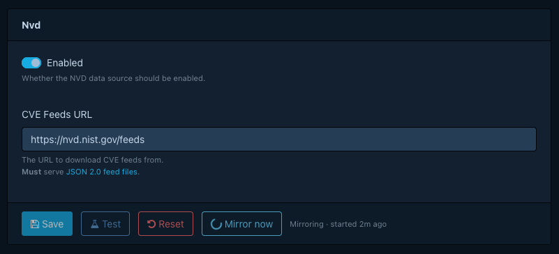
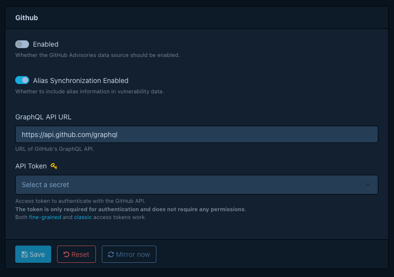
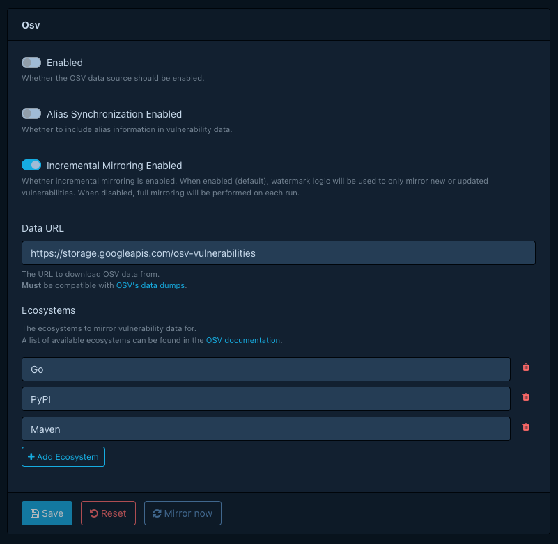

# Configuring vulnerability sources

Dependency-Track can mirror three public vulnerability data sources into its internal database: the National
Vulnerability Database (NVD), GitHub advisories, and OSV. You pick which ones to enable, configure them through the web
UI, and trigger an initial mirror so findings appear without waiting for the next scheduled run.

For background on what each source provides, when one is enough, and how the internal analyzer turns mirrored data into
findings, see [About vulnerability data sources](../../concepts/about-vulnerability-data-sources.md).

## Prerequisites

For each source you plan to enable, allow outbound HTTPS access from the API server to the corresponding host:

| Source | Host |
|:-------|:-----|
| NVD | `nvd.nist.gov` |
| GitHub advisories | `api.github.com` |
| OSV | `storage.googleapis.com` |

If outbound traffic must go through a proxy, see [Configuring an HTTP proxy](configuring-http-proxy.md). If the proxy
intercepts TLS, see [Configuring internal CA trust](configuring-internal-ca.md).

The GitHub advisories source also requires a GitHub personal access token (PAT). The token needs no scopes, but the
GitHub GraphQL API rejects unauthenticated requests. Create one at
[github.com/settings/tokens](https://github.com/settings/tokens). NVD and OSV do not require credentials.

## Enabling sources

Open **Administration > Vulnerability Sources** in the web UI. Each source has its own configuration panel. The following steps
cover the least configuration needed for findings.

### NVD

1. Open **Administration > Vulnerability Sources > NVD**.
2. Enable the source.
3. Select **Test** to verify the configured endpoint is reachable and that the feed file format matches what
   Dependency-Track expects.
4. Select **Mirror now** to download the feed immediately. The first mirror downloads the entire dataset and can take a
   while.

NVD records describe affected products as CPEs. The internal analyzer skips components that lack a valid CPE when
evaluating NVD data. If you expect findings for open source packages identified by PURL and see none from NVD, that is
the reason. See [How component matching
works](../../concepts/about-vulnerability-data-sources.md#how-component-matching-works).

### GitHub advisories

1. Open **Administration > Vulnerability Sources > GitHub**.
2. Enable the source.
3. Enter the GitHub PAT from the prerequisites.
4. Select **Mirror now** to download advisories immediately.

### OSV

1. Open **Administration > Vulnerability Sources > OSV**.
2. Enable the source.
3. Select the ecosystems you want to mirror. Dependency-Track downloads only the ecosystems you select.
4. Select **Mirror now** to download the selected ecosystems immediately.

!!! tip
    For Debian, select the **Debian** ecosystem rather than individual Debian version ecosystems. The Debian package is
    a superset of all version-specific ones.

## Triggering an initial mirror

After enabling a source for the first time, use **Mirror now** rather than waiting for the next scheduled run. The first
NVD mirror in particular can take a long time, and you want it underway before users start uploading BOMs and expecting
findings.

Mirror progress and errors appear in the API server logs, so tail the logs during initial setup if you need to follow
what each mirror is doing.

## Scheduling mirror runs

Each source has its own cron property. Mirrors also run on instance startup. To change the schedule, set the
corresponding property:

- NVD: [`dt.task.nvd-vuln-data-source-mirror.cron`](../../reference/configuration/properties.md#dttasknvd-vuln-data-source-mirrorcron)
- GitHub advisories:
  [`dt.task.github-advisory-vuln-data-source-mirror.cron`](../../reference/configuration/properties.md#dttaskgithub-advisory-vuln-data-source-mirrorcron)
- OSV: [`dt.task.osv-vuln-data-source-mirror.cron`](../../reference/configuration/properties.md#dttaskosv-vuln-data-source-mirrorcron)

!!! note
    The `dt.vuln-analyzer.*` namespace (analyzer extension point) is unchanged.
    Only mirror task cron properties were renamed.

## Verifying findings

Once a mirror completes, upload a BOM for a project that contains components you know to be vulnerable, or trigger
analysis on an existing project. Findings should appear within seconds of analysis completing. If they do not, check the
API server logs for mirror errors and confirm the components carry the identifier the source uses for matching (CPE for
NVD, PURL for GitHub advisories and OSV).

## See also

- [About vulnerability data sources](../../concepts/about-vulnerability-data-sources.md)
- [Vulnerability datasources reference](../../reference/datasources/index.md)
- [Vulnerability analyzers reference](../../reference/analyzers.md)
- [Running air-gapped](running-air-gapped.md)
- [Configuring an HTTP proxy](configuring-http-proxy.md)
- [Configuring internal CA trust](configuring-internal-ca.md)
