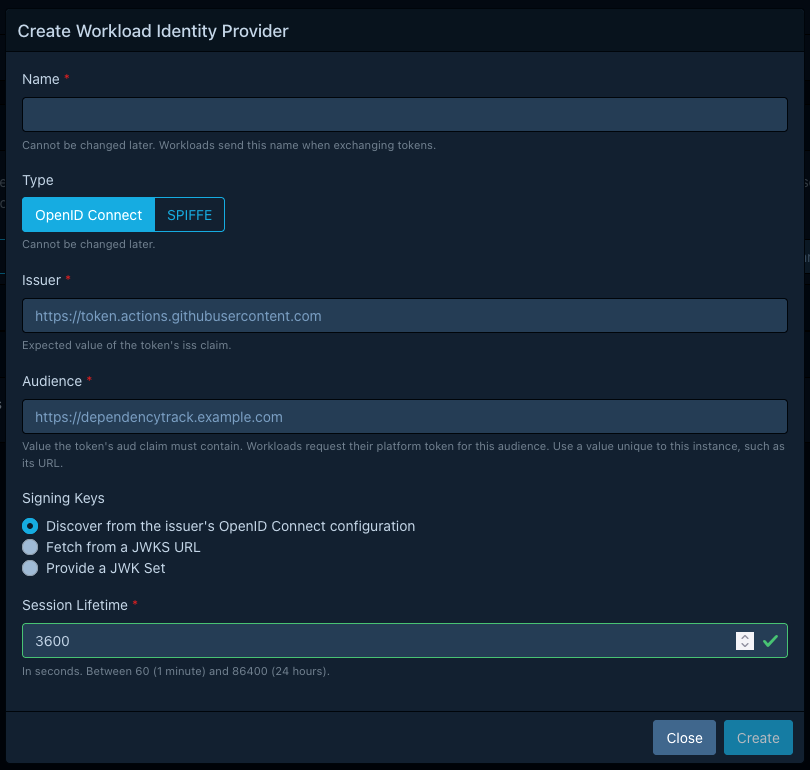
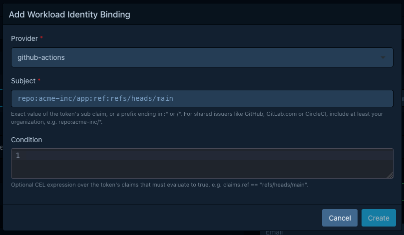

# Configuring workload identity federation

!!! note "Available in 5.2.0 and later"

    Earlier versions authenticate automation with team API keys only.

Workload identity federation lets a CI job, a Kubernetes pod, or any other workload exchange a token
issued by its own platform for a Dependency-Track session, so that the workload stores no
API key. For the model behind it, see
[About workload identity federation](../../concepts/workload-identity-federation.md).

Creating providers and bindings requires the `ACCESS_MANAGEMENT` permission, or its fine-grained variants.

## Before you start

Collect the following from your platform:

* The **issuer**, for OpenID Connect providers. For SPIFFE, the **trust domain** instead.
* Whether Dependency-Track can reach the issuer's discovery document over HTTPS.
  If it can't, you need the issuer's public signing keys as a JSON Web Key Set.
* The exact `sub` claim of the tokens the workload receives. Print one during a trial run
  rather than guessing, because platforms change the format.

Pick an **audience** that's unique to this Dependency-Track instance, such as its URL.
The same audience goes into every provider and into every token request the workload makes.

## Create a service account

Under **Administration > Access Management > Service Accounts**, create the account the
workload acts as and grant it only the permissions the workload needs,
such as `BOM_UPLOAD` and `PROJECT_CREATION_UPLOAD`.

Give the workload its own account rather than reusing one.
The username appears in audit records, and suspending it cuts off exactly one workload.

Don't create an API key for it.

## Register a workload identity provider

Go to **Administration > Access Management > Workload Identity Providers** and select **Create**.



Fill in the form:

| Field                | What to enter                                                                                                                                     |
|:---------------------|:--------------------------------------------------------------------------------------------------------------------------------------------------|
| **Name**             | A short name such as `github-actions`. Workloads send this name when they exchange a token, and it can't change later.                            |
| **Type**             | **OpenID Connect** for CI systems, cloud platforms, and Kubernetes. **SPIFFE** for SPIRE and other SPIFFE implementations. It can't change later. |
| **Issuer**           | The exact value of the token's `iss` claim. For SPIFFE, the bare trust domain, such as `example.org`.                                             |
| **Audience**         | The value the token's `aud` claim must contain.                                                                                                   |
| **Signing Keys**     | Where the public keys come from. See [Choose a key source](#choose-a-key-source).                                                                 |
| **Session Lifetime** | How long sessions from this provider last, in seconds. Between 60 and 86400, and 3600 by default.                                                 |

Dependency-Track fetches the keys while saving, and refuses the provider if that fails.

Register the same issuer twice if two groups of workloads need different session lifetimes or different audiences.
A binding has no lifetime of its own.

### Choose a key source

**Discover from the issuer's OpenID Connect configuration** is the default for OpenID Connect
providers, and the right choice whenever Dependency-Track can reach the issuer.
It resolves the key set from the issuer's [discovery document](../../reference/workload-identity.md#key-fetching).

**Fetch from a JWKS URL** skips discovery. Use it for SPIFFE bundle endpoints,
and for issuers whose discovery document isn't reachable but whose key set is.

**Provide a JWK Set** stores the keys in Dependency-Track and fetches nothing.
Use it for issuers Dependency-Track can't reach at all, mainly self-managed Kubernetes clusters.
Inline keys are never refreshed, so update the provider whenever the issuer rotates its keys.

Fetched URLs must use `https`. An issuer inside your network works, subject to the
[outbound fetch constraints](../../reference/workload-identity.md#outbound-fetch-constraints).

## Bind a subject to the service account

Go back to **Administration > Access Management > Service Accounts**,
expand the service account, and select the plus icon under **Workload Identity Bindings**.



| Field         | What to enter                                                                                                                       |
|:--------------|:------------------------------------------------------------------------------------------------------------------------------------|
| **Provider**  | The provider you registered.                                                                                                        |
| **Subject**   | The exact `sub` claim to accept, or a prefix of one. See [subject matching](../../reference/workload-identity.md#subject-matching). |
| **Condition** | Optional [CEL](../../reference/cel-expressions.md) expression over the token's claims, available as the `claims` map.               |

On a shared issuer, make the subject prefix include at least your organization.
See [Subjects and conditions](../../concepts/workload-identity-federation.md#subjects-and-conditions).

A service account can hold more than one binding. Dependency-Track uses the first that
matches, in [matching order](../../reference/workload-identity.md#matching-order).

To revoke access, delete the binding. Sessions already issued stay valid until they expire.
To cut those off too, suspend the service account.

## Exchange the token in the workload

The workload posts its platform token to `/api/v2/oauth/token`, a [RFC 8693](https://www.rfc-editor.org/rfc/rfc8693)
token exchange endpoint. The request needs no authentication of its own.

```bash
ACCESS_TOKEN=$(curl -sSf -X POST \
  "https://dependency-track.example.com/api/v2/oauth/token" \
  -d "grant_type=urn:ietf:params:oauth:grant-type:token-exchange" \
  -d "subject_token_type=urn:ietf:params:oauth:token-type:jwt" \
  -d "subject_token=${PLATFORM_TOKEN}" \
  -d "workload_identity_provider=github-actions" \
  -d "service_account=ci-pipeline" \
  | jq -r .access_token)
```

Use the result as a bearer token:

```bash
curl -sSf -X POST "https://dependency-track.example.com/api/v1/bom" \
  -H "Authorization: Bearer ${ACCESS_TOKEN}" \
  -F "project=${PROJECT_UUID}" \
  -F "bom=@bom.json"
```

Exchange once per job and reuse the session for the rest of it. The session lives for the provider's session lifetime,
and no endpoint renews it. For the full parameter list and the error responses,
see the operations tagged `OAuth` in the [REST API v2 reference](../../reference/api/v2.md).

## Platform examples

Replace `https://dependency-track.example.com` with your instance URL, and `acme-inc` with your organization.

<!-- vale Google.Headings = NO -->
### GitHub Actions
<!-- vale Google.Headings = YES -->

GitHub Actions issues OpenID Connect ID tokens from a single issuer shared by every account
on GitHub.com, so the subject prefix has to carry your organization.
GitHub's [OIDC reference](https://docs.github.com/en/actions/reference/security/oidc) lists
the claims and their current formats.

Provider:

| Field        | Value                                                   |
|:-------------|:--------------------------------------------------------|
| Name         | `github-actions`                                        |
| Type         | OpenID Connect                                          |
| Issuer       | `https://token.actions.githubusercontent.com`           |
| Audience     | `https://dependency-track.example.com`                  |
| Signing Keys | Discover from the issuer's OpenID Connect configuration |

Binding, for every repository in the organization:

| Field     | Value             |
|:----------|:------------------|
| Subject   | `repo:acme-inc/*` |
| Condition | (none)            |

!!! warning "Two subject formats exist"

    Repositories created after 2026-07-15, and older ones that opt in,
    use an [immutable subject](https://docs.github.com/en/actions/reference/security/oidc#immutable-subject-claims)
    that carries numeric IDs, such as `repo:acme-inc@123456/app@456789:ref:refs/heads/main`.
    A prefix of `repo:acme-inc/*` doesn't match it. Use `repo:acme-inc@123456/*` for those repositories,
    and add a second binding if your organization has both formats in use.

The job needs the `id-token: write` permission, and requests the token for your audience:

```yaml title=".github/workflows/upload-bom.yml"
jobs:
  upload-bom:
    runs-on: ubuntu-latest
    permissions:
      id-token: write
      contents: read
    steps:
    - name: Upload BOM
      env:
        DT_URL: https://dependency-track.example.com
      run: |
        PLATFORM_TOKEN=$(curl -sSf \
          -H "Authorization: bearer ${ACTIONS_ID_TOKEN_REQUEST_TOKEN}" \
          "${ACTIONS_ID_TOKEN_REQUEST_URL}&audience=${DT_URL}" | jq -r .value)
        # Exchange PLATFORM_TOKEN as shown above.
```

`ACTIONS_ID_TOKEN_REQUEST_URL` already carries a query string, which is why the audience is preceded by `&`.

### GitLab CI

GitLab CI issues ID tokens from the URL of the GitLab instance.
On GitLab.com every account shares that issuer, so the subject prefix has to carry your group.
GitLab's [ID token authentication](https://docs.gitlab.com/ci/secrets/id_token_authentication/) guide
lists the claims and their current formats.

Provider:

| Field        | Value                                                   |
|:-------------|:--------------------------------------------------------|
| Name         | `gitlab`                                                |
| Type         | OpenID Connect                                          |
| Issuer       | `https://gitlab.com`, or the URL of your instance       |
| Audience     | `https://dependency-track.example.com`                  |
| Signing Keys | Discover from the issuer's OpenID Connect configuration |

The job declares the token and the audience it wants:

```yaml title=".gitlab-ci.yml"
upload-bom:
  id_tokens:
    DT_TOKEN:
      aud: https://dependency-track.example.com
  script:
  - ./upload-bom.sh  # Exchanges $DT_TOKEN as shown in "Exchange the token in the workload".
```

#### Matching on the environment requires a condition

The GitLab subject is `project_path:{group}/{project}:ref_type:{type}:ref:{branch}`.
It only names the project and the git ref. The deployment environment lives in separate claims,
so a rule such as "only the job that deploys to production" **doesn't fit into a subject at all**.
Write it as a condition:

| Field     | Value                                                                          |
|:----------|:-------------------------------------------------------------------------------|
| Subject   | `project_path:acme-inc/*`                                                      |
| Condition | `claims.environment == "production" && claims.environment_protected == "true"` |

!!! note

    GitLab encodes the boolean-looking claims `environment_protected` and `ref_protected` as the
    strings `"true"` and `"false"`, so `claims.environment_protected == true` never matches.

The `environment` claim only appears on jobs that declare an `environment:`. A condition that
reads a missing claim raises an error, and a binding whose condition errors doesn't match,
so this binding rejects every job that isn't a deployment.

### Kubernetes

A pod authenticates with a [projected service account token][k8s-sa].
The subject is `system:serviceaccount:{namespace}:{name}`.

A cluster set up with `kubeadm` issues tokens from the cluster-internal issuer
`https://kubernetes.default.svc.cluster.local`. That name only resolves inside the cluster,
so Dependency-Track can't run discovery against it. Store the keys inline instead:

```shell
kubectl get --raw /openid/v1/jwks
```

Provider:

| Field        | Value                                                 |
|:-------------|:------------------------------------------------------|
| Name         | `k8s-prod`                                            |
| Type         | OpenID Connect                                        |
| Issuer       | The cluster's issuer, exactly as it appears in `iss`  |
| Audience     | `https://dependency-track.example.com`                |
| Signing Keys | Provide a JWK Set, pasting the output of that command |

Where Dependency-Track can reach the cluster's discovery document, as with many managed offerings,
use the cluster's issuer URL with discovery and skip the manual key set.

Binding, for one service account:

| Field   | Value                                   |
|:--------|:----------------------------------------|
| Subject | `system:serviceaccount:ci:bom-uploader` |

The pod asks for a token with the right audience through a projected volume:

```yaml
spec:
  serviceAccountName: bom-uploader
  containers:
  - name: upload-bom
    image: acme-inc/upload-bom:1.0.0
    volumeMounts:
    - name: dt-token
      mountPath: /var/run/secrets/dependency-track
      readOnly: true
  volumes:
  - name: dt-token
    projected:
      sources:
      - serviceAccountToken:
          audience: https://dependency-track.example.com
          expirationSeconds: 3600
          path: token
```

The container reads the token from `/var/run/secrets/dependency-track/token` and sends it as `subject_token`.
The kubelet refreshes the file, so read it right before each exchange.

### SPIFFE and SPIRE

SPIFFE workloads present [JWT-SVIDs][spiffe-jwt-svid], which may omit the `iss` claim and
carry their trust domain in the subject instead. Register them with type **SPIFFE**.

Provider:

| Field        | Value                                                                 |
|:-------------|:----------------------------------------------------------------------|
| Name         | `spire`                                                               |
| Type         | SPIFFE                                                                |
| Issuer       | `example.org`, the bare trust domain without `spiffe://`              |
| Audience     | `https://dependency-track.example.com`                                |
| Signing Keys | Fetch from a JWKS URL, pointing at the trust domain's bundle endpoint |

Only bundle endpoints with a publicly trusted certificate work,
which is the `https_web` profile of [SPIFFE federation][spiffe-federation].
For a trust domain without such an endpoint, export the bundle and store it inline:

```shell
spire-server bundle show -format spiffe
```

Binding:

| Field     | Value                       |
|:----------|:----------------------------|
| Subject   | `spiffe://example.org/ci/*` |
| Condition | (none)                      |

A SPIFFE prefix must end with `/`. Changing the trust domain of the provider stops every one of
its bindings from matching, so update their subjects afterwards.

The workload fetches its JWT-SVID for the audience from the [SPIRE agent][spire-agent]:

```shell
spire-agent api fetch jwt -audience https://dependency-track.example.com
```

## Verify the setup

Run the exchange once from the workload, then confirm the identity that its session carries:

```bash
curl -sSf "https://dependency-track.example.com/api/v1/user/self" \
  -H "Authorization: Bearer ${ACCESS_TOKEN}"
```

The `username` in the response is the service account, prefixed with `svc:`.

The binding's **Last used** timestamp updates on every successful exchange,
which is the quickest way to tell whether a binding is the one that matched.

## Troubleshooting

The exchange endpoint returns the same `invalid_request` error whatever went wrong,
so it never names the failing check. The API server log records every refused exchange as a security event,
including the token's claims when the token verified but no binding matched.

## See also

* [About workload identity federation](../../concepts/workload-identity-federation.md) for
  the model behind providers, bindings, and sessions.
* [Workload identity reference](../../reference/workload-identity.md) for subject matching
  rules, the condition environment, and token requirements.
* [REST API v2 reference](../../reference/api/v2.md) for request and response schemas.
* [Permissions](../../reference/permissions.md) for what to grant the service account.

[k8s-sa]: https://kubernetes.io/docs/tasks/configure-pod-container/configure-service-account/
[spiffe-federation]: https://github.com/spiffe/spiffe/blob/main/standards/SPIFFE_Federation.md
[spiffe-jwt-svid]: https://github.com/spiffe/spiffe/blob/main/standards/JWT-SVID.md
[spire-agent]: https://spiffe.io/docs/latest/deploying/spire_agent/
