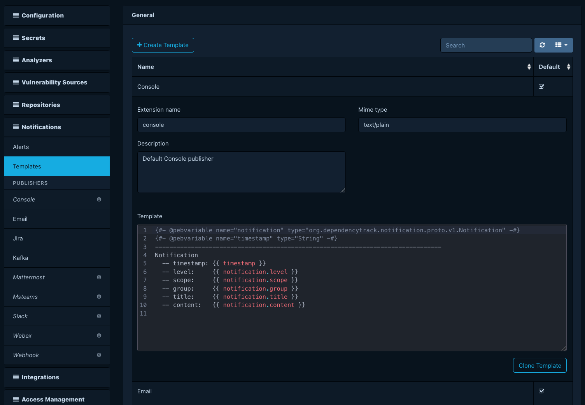
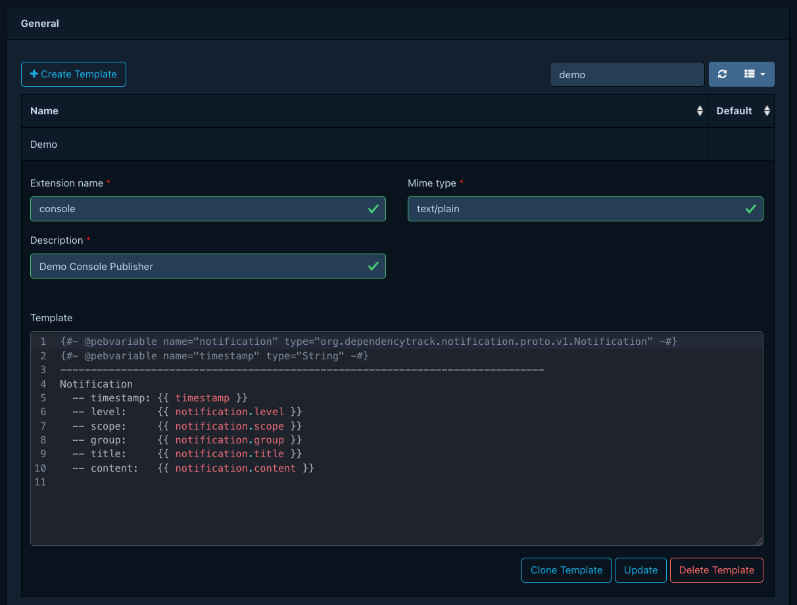

# Managing notification templates

A *notification template* renders a [notification](../../concepts/notifications.md)
into the payload a [publisher](../../reference/notifications/publishers.md)
delivers. Each template combines a [Pebble](https://pebbletemplates.io/)
source, a MIME type, and a binding to exactly one publisher.

Every built-in publisher ships with a default template. The system
treats default templates as read-only. To customize the payload that an
alert delivers, clone the default and edit the clone.

## Prerequisites

- The `SYSTEM_CONFIGURATION` permission.

## Cloning a default template

Open **Administration > Notifications > Templates**. The page lists each
built-in publisher's default template and marks it as a default. Select
the template you want to start from and click *Clone*. The cloned
template inherits the publisher binding and source from the original
and stays editable.

## Editing a template

Select a user-created template to edit its Pebble source and MIME type.
The [templating reference](../../reference/notifications/templating.md)
lists the variables and filters available to the template.
The MIME type must match what the bound publisher expects; see the
[publishers reference](../../reference/notifications/publishers.md) for
per-publisher payload requirements.

## Deleting a template

You cannot delete default templates. You can delete user-created
templates from the templates list. Deletion fails if any alert still
references the template; reassign or delete those alerts first.

## See also

- [Notification publishers](../../reference/notifications/publishers.md)
- [Templating reference](../../reference/notifications/templating.md)
- [Configuring notification alerts](../user/configuring-notifications.md)
- [Debugging missing notifications](debugging-notifications.md)
