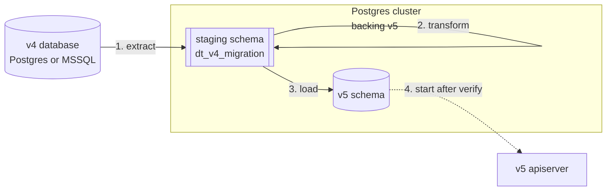

# Migrating from v4 to v5

This guide walks you through moving production data from Dependency-Track v4 (Postgres or Microsoft SQL Server)
into a new Dependency-Track v5 instance (Postgres only).

The migration is a one-shot, offline operation performed by the `v4-migrator` command-line tool.
The tool extracts rows from your v4 database, transforms them inside the Postgres cluster backing the v5 deployment,
and loads them into the v5 schema.
v4 must be offline for the duration. The tool does not write to the v4 source.

If you only need to step a v5 deployment between v5 releases, this guide is not for you.
See the [per-release upgrade pages](../upgrading/index.md) instead.

To try v5 against your real workload before committing to the migration, see
[Running v4 and v5 in parallel](running-v4-and-v5-in-parallel.md).

To walk this migration end to end against a sandbox v5 stack before the production cutover, see
[Rehearsing the v4 to v5 migration](../../tutorials/rehearsing-the-v4-migration.md).

## How the migration works

The `v4-migrator` command-line tool runs three offline phases (**extract**, **transform**, **load**)
against the v5 deployment's Postgres target. Rows from the v4 source land first in a dedicated
**staging schema** (`dt_v4_migration`) inside the v5 cluster, where the migrator
reshapes them into v5 form. Only the load phase writes to the final v5 schema.
The v5 apiserver stays offline until load and verify finish, after which you drop the
staging schema and bring the apiserver up.



## Before you start

Make sure the following holds:

- **Source version.** The v4 instance must be on **4.14.2 or later**.
  The migrator assumes the schema and data shape of that release.
  Lower versions are not supported and may fail or silently produce broken output.
  Upgrade v4 to at least 4.14.2 before running the migrator.
- **Source.** Your v4 database runs on Postgres (any version supported by v4) or Microsoft SQL Server 2016 or later.
  H2 is not supported. Stop the v4 API server before you start.
  The tool does not write to the source, but concurrent v4 writers produce inconsistent extracts.
- **Target.** A Postgres 14+ cluster, dedicated to the v5 instance, ready to receive data.
  The migrator's `bootstrap` step applies the v5 database schema for you.
  See [Configuring the database](configuring-database.md) for guidance on
  provisioning the target cluster.
  Don't boot the v5 apiserver against the target before running the migrator,
  or its seeding task populates tables the migrator needs to fill from v4.
  The migrator refuses to run against any schema version other than the one it ships against,
  or if the target already holds user data.
- **Database user.** Use the same database user for the migrator that the v5 apiserver
  uses afterwards, *or* grant the apiserver's user ownership of every object the
  migrator creates. The apiserver applies follow-up schema migrations on each release
  and needs DDL privileges on the v5 schema and its tables.
  A mismatch here surfaces as failed startup migrations after a later v5 upgrade,
  not at migration time.
- **Disk.** The target cluster needs free disk for roughly two times the final dataset size.
  Staging tables hold a source-typed copy of every migrated row alongside the final v5 rows
  until you drop the staging schema.
- **Extensions.** The target must support installing `pg_trgm`.
  The v5 schema bootstrap installs the extension. The migrator's preflight verifies it.
- **JDBC reachability.** The host running the migrator can open JDBC connections
  to both the v4 source and the v5 target.

!!! warning

    The v4 database must run offline during the migration.
    Do not point the migrator at a live v4 instance.
    The tool trusts the offline contract. It does not take write locks on the source.

## Recommended Postgres tuning

Apply these for the duration of the migration. The migrator does not set them.
Configure them on the target before running, and revert afterward if you like.

| Setting | Recommendation | Why |
|---|---|---|
| `max_wal_size` | 8 GB or higher | The load phase logs every write to the WAL. Default sizes checkpoint frequently. |
| `max_locks_per_transaction` | 256 | Metrics partition operations can otherwise exhaust the default 64. |
| `maintenance_work_mem` | 1 GB or higher | Speeds index updates during load. |
| `checkpoint_timeout` | 30 minutes | Absorbs load WAL bursts without thrashing. |
| `checkpoint_completion_target` | 0.9 | Same. |

!!! warning

    The v5 apiserver's default time zone must be `UTC` for the lifetime of the
    deployment, not just the migration window.
    The [official Docker image](https://github.com/DependencyTrack/hyades-apiserver/pkgs/container/hyades-apiserver)
    sets `TZ=Etc/UTC` already, so operators running it need to
    do nothing (and must not override `TZ`).
    For non-container deployments or custom images, set the `TZ` environment variable to
    `Etc/UTC`.

    The migrator pre-creates daily metrics partitions on UTC day boundaries.
    The apiserver extends those partitions using its default time zone,
    so a non-UTC apiserver computes partition bounds offset from the migrator's,
    causing `ATTACH PARTITION` to fail on overlap.

## Run the migration

The migrator ships as a container image published at `ghcr.io/dependencytrack/v4-migrator:<version>`.

The examples below use the following shell alias for brevity:

```bash
alias v4-migrator='docker run --rm -it --network=host ghcr.io/dependencytrack/v4-migrator:<version>'
```

!!! note

    `--network=host` only works on Linux.
    On Docker Desktop for macOS and Windows, the flag is silently ignored
    and the container gets its own network namespace.
    Replace `localhost` / `127.0.0.1` in your JDBC URLs with `host.docker.internal` to reach databases on the host,
    or attach the container to a user-defined Docker network (`--network <name>`)
    where both source and target are reachable.

!!! tip "Password prompts"

    The examples below pass `--source-pass` and `--target-pass` without an argument.
    The migrator then prompts for the password interactively, keeping the secret out of shell history and `ps` output.
    To supply a password inline, write `--source-pass <value>` / `--target-pass <value>` instead.

### 1. Apply the v5 schema

Bootstrap the target database. This applies the v5 schema migrations and is safe to re-run.
The user passed here becomes the owner of the v5 schema objects, so use the same user the
v5 apiserver connects as (see the **Database user** note in the preceding section).

```bash
v4-migrator bootstrap \
  --target-url 'jdbc:postgresql://target-host:5432/dtrack' \
  --target-user dtrack \
  --target-pass
```

After this, the target has the v5 schema but no rows.
The migrator's later phases populate `PERMISSION`, `LICENSE`, `TEAM`, etc. directly from your v4 source.

### 2. Verify the target

Run preflight to catch problems before you commit time to extraction:

```bash
v4-migrator verify \
  --target-url 'jdbc:postgresql://target-host:5432/dtrack' \
  --target-user dtrack \
  --target-pass
```

`verify` reads but never writes. On a freshly bootstrapped target with no staging present, expect:

- Schema version `202605111028` reported `OK`.
- All row count columns zero.
- No probe entries.

### 3. Dry run

Before the real run, confirm what happens:

```bash
v4-migrator run \
  --target-url 'jdbc:postgresql://target-host:5432/dtrack' --target-user dtrack --target-pass \
  --source-url 'jdbc:postgresql://v4-host:5432/dtrack' --source-user dtrack --source-pass \
  --metrics-retention-days 90 \
  --dry-run
```

`--dry-run` runs preflight and prints the plan. It writes nothing to either database.

### 4. Extract, transform, load

Run all three phases in one go:

```bash
v4-migrator run \
  --target-url 'jdbc:postgresql://target-host:5432/dtrack' --target-user dtrack --target-pass \
  --source-url 'jdbc:postgresql://v4-host:5432/dtrack' --source-user dtrack --source-pass \
  --metrics-retention-days 90
```

You must pass `--metrics-retention-days` to `run` and `extract`.
v4 has no retention concept, and v5 introduces one, see [About time series metrics](../../concepts/time-series-metrics.md).
The migrator forces you to choose explicitly rather than silently dropping or carrying over metrics rows.
Use `0` to drop all v4 metrics, a positive integer to keep the last `N` days,
or a large number to migrate everything.
The migrator pre-creates one daily partition per retained day, so large values noticeably extend the load phase.

Or run the phases individually if you want to inspect staging between steps:

```bash
v4-migrator extract   --target-url ... --source-url ... --metrics-retention-days 90
v4-migrator transform --target-url ...
v4-migrator load      --target-url ...
```

For a Microsoft SQL Server source, swap the source URL:

```bash
--source-url 'jdbc:sqlserver://v4-host:1433;databaseName=dtrack'
```

Append the same connection parameters (TLS, authentication, etc.) you use for the v4 deployment.

The migrator auto-detects the source flavor from the JDBC URL.

### 5. Sample mode

To test the pipeline against your data before committing to a full run, sample a small number of rows per table:

```bash
v4-migrator run ... --sample 100
```

`--sample` caps the extract per table.
The downstream phases run against the sampled data and produce a valid (but partial) v5 dataset.

Before the full run, reset the target the same way you would after a failed load:
drop and re-create the v5 schema (or the entire target database), re-run `v4-migrator bootstrap`,
and drop the staging schema with `v4-migrator cleanup`.
See [Recovering from a failed load](#recovering-from-a-failed-load) for the reasoning.
Don't `TRUNCATE` v5 tables manually.

### 6. Verify the result

After load, run `verify` again.
It now reports source / staging / v5 row counts per table and surfaces every probe (malformed UUIDs, etc.):

```text
[Schema]
  OK    Schema version = 202605111028

[Row counts]
  Table                       Source      Staging           v5
  LICENSE                       5234         5234         5234
  TEAM                            47           42           42
  ...

[Probes]
  LICENSE                  3 malformed UUID(s) dropped

[Constraints]
  18 CHECK constraint(s) hold across 6 loaded table(s)
```

Investigate any mismatch where you do not expect dedup or skipping.
The lossy changes section below lists the expected sources of mismatch.

### 7. Drop staging

Once satisfied with the result, drop the staging schema:

```bash
v4-migrator cleanup \
  --target-url ... --target-user ... --target-pass
```

Or pass `--drop-staging` to the `load` invocation up front to drop on success:

```bash
v4-migrator load ... --drop-staging
```

## Lossy and non-obvious changes

These transformations apply automatically. None are configurable except metrics retention.

### Username collisions across user types

v4 stored managed, LDAP, and OIDC users in three separate tables. v5 stores them in one.
If the same username exists across types, the migrator inserts the managed user first,
then suffixes the LDAP and OIDC variants:

- `alice` (managed) → `alice`
- `alice` (LDAP) → `alice-CONFLICT-LDAP`
- `alice` (OIDC) → `alice-CONFLICT-OIDC`

The suffixed account no longer matches its external identity.
After the migration, list every user whose name ends in `-CONFLICT-LDAP` or `-CONFLICT-OIDC`.
For each one, decide whether the account is a genuine duplicate of the managed user without the suffix (delete it),
or a legitimate external identity that needs the original username back
(delete or rename the managed user without the suffix, then rename the suffixed account to match its external identity).

### User records without a username

v4 allowed managed and LDAP user rows with `USERNAME IS NULL`. v5 requires a non-null username.
The migrator silently skips these rows.
They were unusable in v4 (no login surface), so dropping them is safe.

### Portfolio access control bypass

v4's `ACCESS_MANAGEMENT` permission implicitly granted the ability to bypass portfolio access control.
v5 splits that into a dedicated `PORTFOLIO_ACCESS_CONTROL_BYPASS` permission.
To preserve v4 behavior, the migrator additionally grants `PORTFOLIO_ACCESS_CONTROL_BYPASS`
to every v4 user and team that holds `ACCESS_MANAGEMENT`.
If you want the v5 split semantics instead, revoke `PORTFOLIO_ACCESS_CONTROL_BYPASS` from the affected
principals after the migration.

v4 permission names that v5 has retired (for example `VIEW_BADGES`) drop out during migration.
Any user or team assignment referencing one of those names is silently removed.

### Dedup of teams, OIDC groups, and tags

v4 did not enforce uniqueness on `TEAM.NAME`, `OIDCGROUP.NAME`, or `TAG.NAME`. v5 does.
The migrator collapses duplicates to the row with the smallest `ID`,
rewrites references in every join table to the canonical ID, and drops the non-canonical rows.

### Project deduplication

v5 enforces uniqueness on `(NAME, VERSION)` per project (with a separate partial index for the version-NULL case).
The migrator collapses duplicates by keeping the newest by `LAST_BOM_IMPORTED`. Older duplicates drop out.

### Project activity state

v4 carried an `ACTIVE` true/false flag. v5 carries `INACTIVE_SINCE` (an optional timestamp).
v4 active projects become `INACTIVE_SINCE = NULL`.
v4 inactive projects become `INACTIVE_SINCE = '1970-01-01 00:00:00+00'` (Unix epoch) as a sentinel meaning
*"migrated from v4 as inactive, exact deactivation time unknown."*

### Vulnerability EPSS values

v4 stored EPSS score and percentile directly on each vulnerability row.
v5 stores EPSS in a dedicated table populated from the upstream feed.
The migrator does not copy v4 EPSS values. v5 re-populates them at runtime within hours of first launch.

### Metrics retention

v5 keeps daily metrics within a retention window.
v4 had no matching setting, so the migrator requires the `--metrics-retention-days` flag on `extract` and `run`.
Rows in `DEPENDENCYMETRICS` and `PROJECTMETRICS` older than the cutoff drop out.
Portfolio metrics are not migrated. v5 derives them as a materialized view computed on demand.

### Notification rule configuration

v5 changes the on-wire format of `NOTIFICATIONRULE.PUBLISHER_CONFIG` from free-form text to JSON.
The migrator rebuilds the configuration for each rule from the v4 `destination` (and, for Jira, `jiraTicketType`)
and sets `ENABLED = FALSE` on every migrated rule.
Any other publisher-specific fields encoded in the v4 text payload drop out.

!!! warning

    Every migrated notification rule lands turned off in v5.
    Review and re-enable each rule after verifying its configuration.

### Repository, analyzer, and vulnerability-source credentials

v4 stored repository basic-auth passwords on `REPOSITORY.PASSWORD`,
and analyzer (OSS Index, Snyk, Trivy, VulnDB) and vulnerability-source (NVD, GitHub Advisories, OSV) API credentials
as encrypted property values.
v5 manages every one of these through a centralized [secret manager](../user/managing-secrets.md) that the migrator does not populate.

The migrator nulls every `REPOSITORY.PASSWORD` and turns off the affected repositories.
It drops analyzer and vulnerability-source credentials as part of the encrypted-property handling described below.

After the migration, open the **Repositories**, **Analyzers**, and **Vulnerability Sources** pages in the v5 administrator panel
and re-enter each credential through the secret manager.
Turn the affected repositories back on.
See [Configuring secret management](configuring-secret-management.md) if you have not yet set the secret-encryption key for the v5 deployment.

### Encrypted property values

v5 removes the `ENCRYPTEDSTRING` property type.
The migrator nulls every encrypted property value and rewrites the type to `STRING`.
For credentials stored this way (primarily analyzer and vulnerability-source API keys),
see the preceding section for the recovery procedure.

### Property values of unknown type

v5 restricts property types to a fixed set: `BOOLEAN`, `INTEGER`, `NUMBER`, `STRING`, `TIMESTAMP`, `URL`, `UUID`.
The migrator drops any v4 property whose type falls outside this set
(other than `ENCRYPTEDSTRING`, handled in the preceding section).

### Classifier values

v5 removes the `NONE` classifier for projects and components. The migrator rewrites every `NONE` to `NULL`.
Any other v4 classifier value not in the v5 set is also coerced to `NULL` (the column permits `NULL`).

### PURL filtering for package metadata

v4 indexed repository metadata by name and namespace.
v5 indexes it by package URL (PURL) and enforces a CHECK constraint that forbids `@`, `?`, `&`, and `#` in PURLs.
The migrator skips repository metadata rows whose derived PURL contains any of those characters.
v5 repopulates package metadata from the same upstream sources at runtime.

### Removed tables

The following v4 tables have no v5 counterpart and do not migrate:

- `EVENTSERVICELOG`, `INSTALLEDUPGRADES`, `SCHEMAVERSION`.
  The v5 schema-migration and durable-execution bookkeeping take over.
- `COMPONENTANALYSISCACHE`. Runtime cache. v5 repopulates as needed.

### Malformed UUIDs

v5 stores UUIDs as native `uuid` instead of `varchar(36)`.
The migrator validates UUIDs against the canonical format.
The migrator drops any row with a malformed UUID and records it in the `probe_invalid_uuids` table
inside the staging schema.
`verify` reports the count per source table.
The staging probe persists until you drop the staging schema, so you can audit affected rows.

### MSSQL case-folded uniqueness

Microsoft SQL Server's default collation (`SQL_Latin1_General_CP1_CI_AS`) treats `Alice` and `alice` as the same value.
Postgres treats them as distinct. The migrator preserves both rows in v5.
Where v5 enforces uniqueness on a case-folded v4 column (for example, two `TEAM.NAME` values differing only in case),
the rows survive as two distinct entries.
Inspect your data before the run if this is a concern.

## Runtime behavior changes

The preceding section covers transformations the migrator applies to your data.
This section covers differences in how v5 *runs* against migrated data.
None of these are configurable. Expect them after switching to v5, and correlate observed effects (metric drops, missing findings) back to the entries below.

### Inactive findings

v4 only *added* findings. A finding persisted on a component even after every analyzer stopped reporting it.
v5 deactivates such findings automatically, and the default views exclude inactive findings.

Expect a one-time drop in active-finding counts, and a corresponding step-down in time-series metrics, shortly after the first v5 analysis cycle.
v5 retains the historical rows in an inactive state instead of deleting them, but they no longer count toward active totals.

## Performance and observability

Throughput depends on your hardware, the source flavor, and the dataset size.
Expect roughly 50 MB/s for the Postgres-to-Postgres extract (binary `COPY`)
and roughly 20 MB/s for the Microsoft SQL Server source (JDBC batched insert).

For visibility during long runs, the migrator emits per-table progress lines like:

```text
INFO  Extracting LICENSE
INFO    -> 5234 rows in 142 ms
INFO  Transforming LICENSE
INFO    -> 5231 rows in 38 ms
INFO  Loading LICENSE into v5
INFO    -> LICENSE: 5231 rows in 27 ms (193740 rows/s)
```

The load phase additionally emits a heartbeat every 5 seconds while a single table is still running,
so large tables stay visible even when the underlying `INSERT … SELECT` has not yet committed:

```text
INFO  Loading COMPONENT into v5
INFO    .. COMPONENT: still loading after 25s (expected 4823714 rows)
INFO    .. COMPONENT: still loading after 30s (expected 4823714 rows)
INFO    -> COMPONENT: 4823714 rows in 32104 ms (150253 rows/s)
```

The expected count comes from the staging `tgt_*` row count and is an upper bound
(deduped, malformed-UUID-dropped rows may reduce the final number).

A 100 GB v4 dataset should complete in a few hours on a workstation-class disk, less on dedicated server hardware.

## Resumability

Each phase persists per-table state in the `migration_state` table inside the staging schema.

`extract` and `transform` are safely re-runnable.
Restarting `extract` truncates and re-extracts incomplete tables.
Restarting `transform` drops and rebuilds every `tgt_*` table (transforms are idempotent).

`load` is not automatically resumable.
Each invocation re-runs every `INSERT INTO ... SELECT` from scratch.
Once v5 holds any rows, a follow-up `load` call fails on constraint violations and leaves the target in an inconsistent state.
See **Recovering from a failed load** below.

If you need to abandon a run before `load` starts, drop the staging schema (`v4-migrator cleanup`) and start fresh,
or leave it in place and resume from `extract` or `transform` later.

## Recovering from a failed load

A `load` invocation that fails partway through leaves rows in v5 from every table that completed before the failure.
The migrator does not roll those back, and a straight `load` retry fails.
Pick one of the following.

**Start over.** Recommended when the failure cause is unclear or when you want a fresh target:

```bash
v4-migrator cleanup --target-url ... --target-user ... --target-pass
# Drop and re-create the v5 schema (or the entire target database) yourself, then:
v4-migrator bootstrap --target-url ... --target-user ... --target-pass
v4-migrator run       --target-url ... --source-url ... --metrics-retention-days N
```

**Reload from existing staging.** Faster when `extract` and `transform` outputs are trustworthy and only the load step failed.
The staging schema survives across `bootstrap` runs, so:

```bash
# Drop and re-create the v5 schema (or the entire target database) yourself.
v4-migrator bootstrap --target-url ... --target-user ... --target-pass
v4-migrator load      --target-url ... --target-user ... --target-pass
```

!!! warning

    Don't manually `TRUNCATE` individual v5 tables and re-run `load`.
    The load phase disables triggers on `PROJECT` and `PROJECT_ACCESS_USERS`,
    resets identity sequences, and pre-creates daily metrics partitions in a single sequence.
    None of that is idempotent at a per-table granularity.
    Always reset v5 fully before retrying.

## Moving the migrated data to its production target

If you ran the migration against a dedicated host,
you can move the result with `pg_dump`/`pg_restore` after the migrator finishes:

```bash
pg_dump --format=custom --no-owner --no-acl \
  --exclude-schema=dt_v4_migration \
  -h migration-host -U dtrack dtrack \
  > v5.dump

pg_restore --no-owner --no-acl -d dtrack -h prod-host -U dtrack < v5.dump
```

Exclude the staging schema (`dt_v4_migration` by default) from the dump.
The staging schema is not portable across clusters and is not needed by v5 at runtime.

## What to do after the migration

- Start the v5 API server and let it run the post-load reconciliation tasks (metrics, policy evaluation).
  See [Deploying to production](deploying-to-production.md) for the
  baseline runtime posture.
  Everything below requires the API server to be running.
- Re-enable every migrated notification rule after reviewing its configuration.
  See [Configuring notification alerts](../user/configuring-notifications.md).
- Re-enter repository, analyzer, and vulnerability-source credentials through the v5 secret manager,
  and turn the affected repositories back on.
  See [Managing secrets](../user/managing-secrets.md) and
  [Configuring secret management](configuring-secret-management.md).
- Reconcile every user whose username got a `-CONFLICT-LDAP` or `-CONFLICT-OIDC` suffix
  (delete genuine duplicates, rename legitimate external identities back to their original username).
- Wait a few hours, then verify that v5 has populated the `EPSS` table from the upstream feed.

## See also

- [Configuring the database](configuring-database.md): provisioning and tuning the Postgres cluster backing v5.
- [Deploying to production](deploying-to-production.md): sizing, topology, and runtime posture for v5.
- [Scaling](scaling.md): tuning a v5 deployment under load.
- [Upgrading instances](upgrading-instances.md): for later v5-to-v5 upgrades.
- [About changes in v5](../../concepts/changes-in-v5.md): background on what changed and why.
