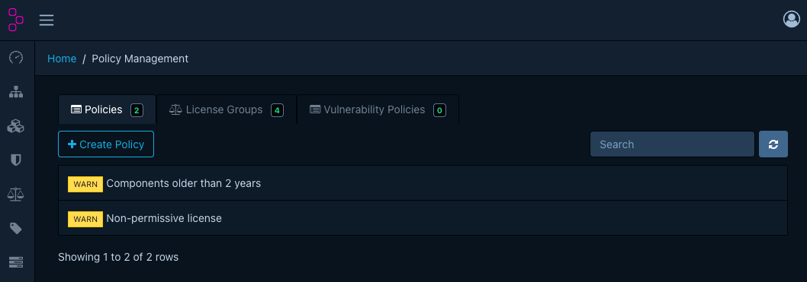
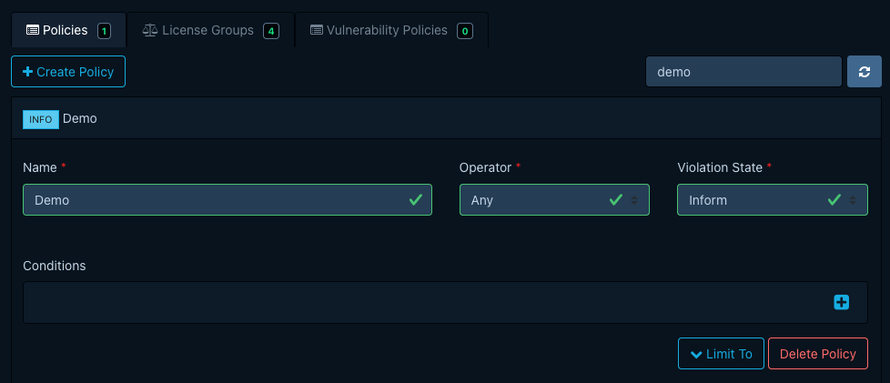
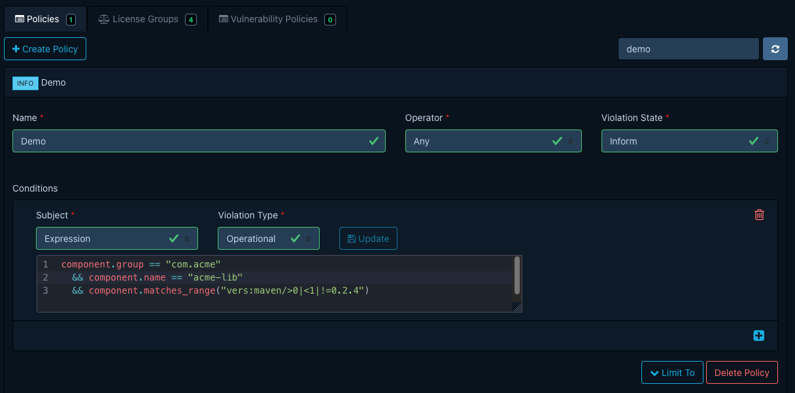
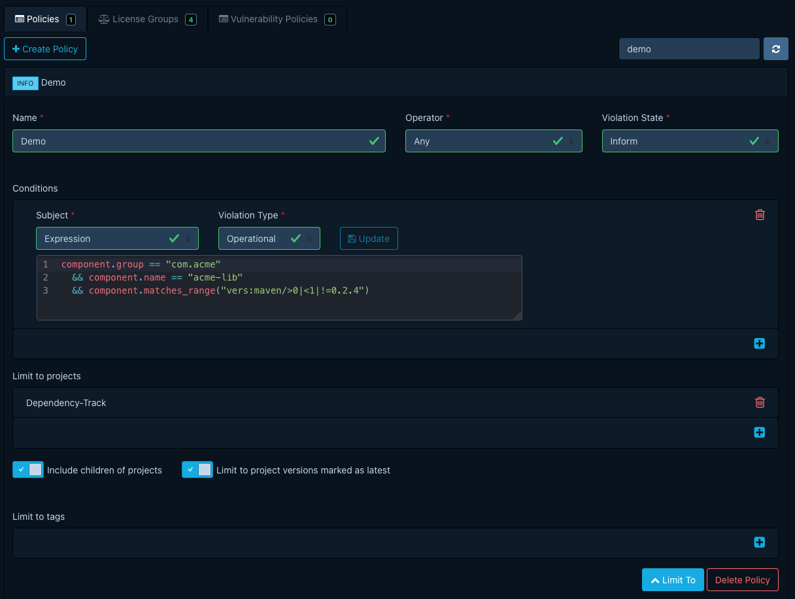
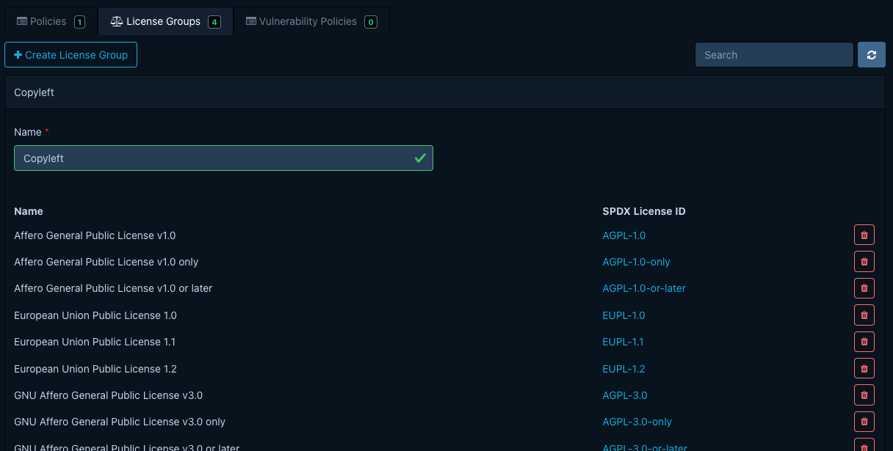

# Managing component policies

Manage component policies under *Policy Management* > *Policies*. The required permission is
`POLICY_MANAGEMENT`, or one of the finer-grained `POLICY_MANAGEMENT_CREATE`,
`POLICY_MANAGEMENT_READ`, `POLICY_MANAGEMENT_UPDATE`, `POLICY_MANAGEMENT_DELETE`. Triaging the
violations a policy raises is a separate task; see
[Triaging policy violations](triaging-policy-violations.md).

For background on what component policies are and how they work, see the
[concepts page](../../concepts/component-policies.md). For field definitions and the full subject /
operator / value matrix, see the [reference page](../../reference/policies/component-policies.md).

## Creating a policy

1. Open *Policy Management > Policies* and click *Create Policy*.
2. Give the policy a name.
3. Pick the [operator](../../reference/policies/component-policies.md#operator) (`Any` or `All`).
4. Pick the [violation state](../../reference/policies/component-policies.md#violation-states)
   (`INFO`, `WARN`, or `FAIL`).
5. Click *Create*. The new policy starts with no conditions.

!!! note
    Saving a policy does not re-run analysis on the portfolio in the moment. Plan rollouts around
    the project analysis schedule. See
    [About component policies › Lifecycle](../../concepts/component-policies.md#lifecycle).

## Adding conditions

Open the policy from the list to expand its detail view, then add conditions one at a time.

- Pick a *Subject*. The available operators and value editor change to match the subject. The full
  matrix is in the
  [subjects reference](../../reference/policies/component-policies.md#condition-subjects).
- Pick an *Operator* and supply a *Value*. The `COORDINATES` editor exposes group, name, and
  version inputs; `VERSION_DISTANCE` exposes epoch, major, minor, and patch fields; for
  `COMPONENT_HASH` the operator field is the hash algorithm.
- For an `EXPRESSION` condition, an inline CEL editor with autocompletion appears, and you must
  pick the violation type explicitly. See
  [Condition expressions](../../reference/policies/condition-expressions.md).
- Click *Update* on the row to save.

## Assigning to projects

A new policy is portfolio-wide. To narrow it:

- On the *Projects* tab, add projects, and toggle *Include children* to cover their descendants
  too.
- On the *Tags* tab, add tags. The policy then applies to every project carrying at least one.

For the precise scoping rules, see
[Component policies › Assignment](../../reference/policies/component-policies.md#assignment).

## Managing license groups

Manage license groups under *Policy Management* > *License Groups*. Built-in groups (such as
*Copyleft* and *Permissive*) ship with Dependency-Track. You can extend them or add new ones from
the same view. License groups are the value of `LICENSE_GROUP` conditions.

