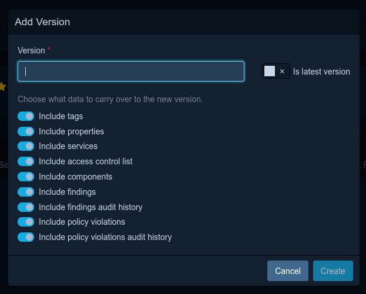
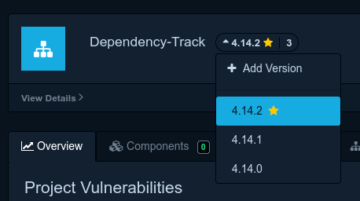
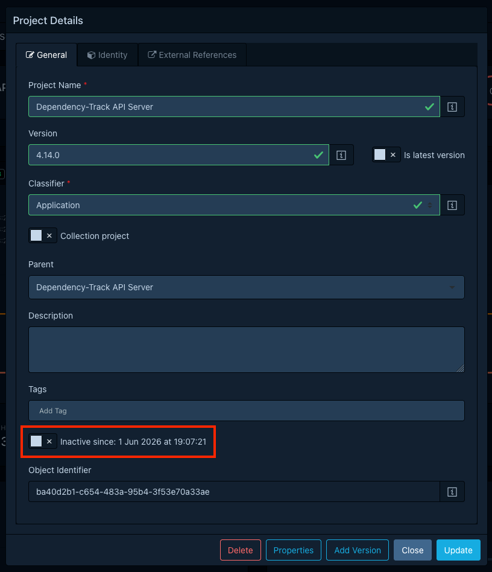
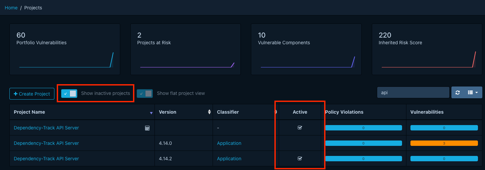

# Managing project versions

A project's name and version together identify it. Tracking a release history means creating
sibling projects with the same name but different version strings, marking the current one
as latest, and eventually retiring the old ones.

For background on how versions fit the wider model, including the fact that Dependency-Track
treats version strings as opaque, see
[About projects › Versions](../../concepts/projects.md#versions). The actions in this guide
require portfolio management permissions. See the
[Permissions reference](../../reference/permissions.md) for the exact set.

## New version, or overwrite?

Two ways to update a project after a release:

- **Upload a new BOM with the same name and version.** Dependency-Track reconciles the
  component list by identity: matching components stay (along with their audit
  decisions), Dependency-Track removes components no longer in the BOM, and adds the
  new ones. Analysis re-runs, and the project keeps its identity. Use this for in-place
  updates of an unreleased or rolling version (a `dev` or `main` line).
- **Create a new version.** Preserve the existing project as a record of that release and
  start tracking the next one separately. Use this for every release you intend to look
  back at.

The rest of this guide covers the second case.

## Clone to a new version

The fastest way to start a new version is to clone an existing one. Cloning produces a new
sibling project with the same name and a version you choose.

1. Open the source project.
2. Open the version creation modal by selecting the project's version next to the project name
   and choosing the *Add Version* option.
3. Enter the new *Version* string.
4. Choose what to carry over:
    - *Tags*: keep the project's tags on the clone.
    - *Properties*: copy custom key-value properties.
    - *Components*: copy the component list.
    - *Services*: copy the services declared in the source.
    - *Findings*: copy vulnerability findings.
    - *Findings audit history*: carry over analysis decisions (analysis state, justifications,
      comments, suppressions) of findings.
    - *Policy violations*: copy policy violations.
    - *Policy violation audit history*: carry over analysis decisions (state, comments, suppressions)
      of policy violations.
    - *Access control list*: carry over the source project's access list.
    - *Is latest version*: mark the new version as latest and clear the flag on the
      previous latest.
5. Save.

!!! tip
    Some data depends on each other. For example, you cannot include findings without
    also including components. The form auto-toggles options based on these dependencies.

If you skip *Include Components*, the clone starts empty and the next BOM upload populates
it. Use this approach when the new version's BOM arrives from CI shortly after.

Cloning copies row-by-row, so cloning a project with components plus audit history scales
with project size. On large projects expect the operation to take noticeable time. Prefer
cloning without components when CI repopulates them shortly after.

## Mark a version as latest

The *latest version* flag is manual. Dependency-Track does not infer it from version
strings. Set it in either of two places:

- The *Is latest version* toggle in the *Add Version* modal (the most common path).
- The *Is latest version* toggle on the *General* tab of the *Project Details* modal.

At most one version per project name carries the flag. Marking a new version as latest
clears the flag on the previous one.

The flag drives the latest-version collection mode (see
[Organizing projects into hierarchies](organizing-projects.md#choose-a-collection-logic))
and the badge URLs that resolve a project by name without a version.

A :star: icon designates a project version as being *latest*.

## Retire an old version

When a release is no longer in production, mark its project inactive. To do so, open
*Project Details* and toggle *Active* off in the *General* tab. The toggle stays
unavailable while the project has active children. Mark the children inactive first.

For what marking a project inactive means (visibility, parenthood, retention eligibility),
see [About projects › Active and inactive projects](../../concepts/projects.md#active-and-inactive-projects).

Inactive projects remain visible to anyone who toggles *Show inactive projects* on.
Dependency-Track keeps their audit history, tags, properties, and access list until
retention deletes them.

## Automatic deletion of retired versions

Configure retention so the maintenance task deletes them on a schedule, by age (delete
inactive projects older than N days) or by version count (keep the last N inactive versions
per name). See [Configuring project retention](../administration/configuring-project-retention.md).
Retention only acts on inactive projects. Active ones remain untouched.
