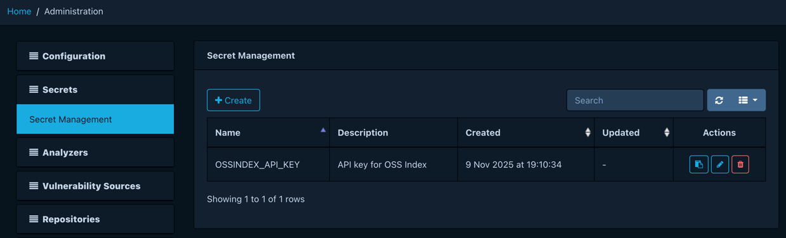
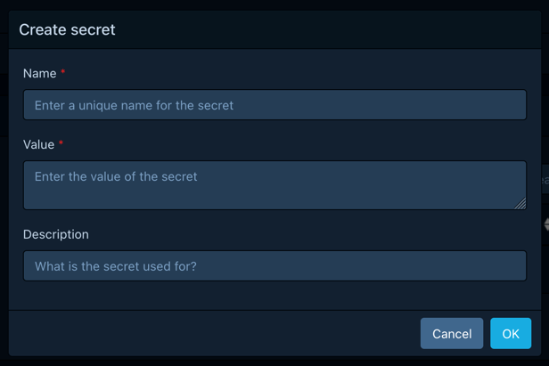
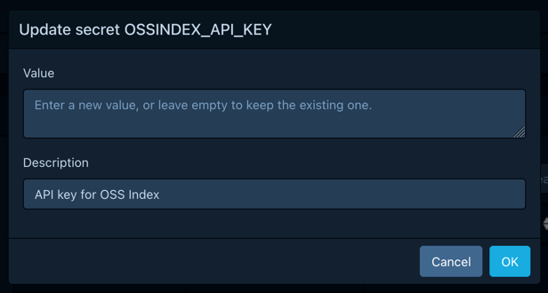
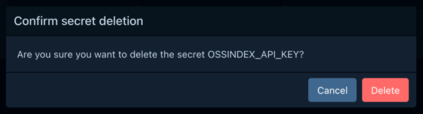

# Managing secrets

Dependency-Track integrates with third-party systems,
most of which require some sort of credential to authenticate
with them: API keys, passwords, or access tokens. Such secrets
must be stored securely to prevent leakage.

Dependency-Track offers centralized secret management.
Changes made here become immediately available to all
nodes in a cluster, without the need to restart them.

Depending on the capabilities of the configured
[provider](../administration/configuring-secret-management.md#providers),
secrets can be [created](#creating-secrets), [updated](#updating-secrets),
and [deleted](#deleting-secrets).

!!! info
    You cannot *view* the value of secrets after creating them.
    Secrets are decrypted by the platform as needed, but never disclosed via
    REST API or user interface.

## Creating secrets

Users with the `SECRET_MANAGEMENT` or `SECRET_MANAGEMENT_CREATE` permission
can create new secrets by clicking the *Create* button. This opens a
dialogue asking for the following information:

* A unique name for the secret
* The value of the secret
* An optional description

## Updating secrets

Users with the `SECRET_MANAGEMENT` or `SECRET_MANAGEMENT_UPDATE` permission
can update existing secrets by clicking the :fontawesome-solid-pen: button
in the *Actions* column of the secret. This opens a dialogue asking for
the following information:

* The new secret value
* An optional description

Leaving the *value* input empty keeps the existing value.
If a new value is provided, the old value is irrevocably overwritten.

## Deleting secrets

Users with the `SECRET_MANAGEMENT` or `SECRET_MANAGEMENT_DELETE` permission
can delete existing secrets by clicking the :fontawesome-solid-trash-alt: button
in the *Actions* column of the secret. This opens a dialogue asking for
confirmation.

Deleted secrets cannot be restored. Proceed with caution.

## Using secrets

Secrets can be used in configuration fields marked with :key:.

These fields offer dropdown and search capabilities,
making it easy to discover available secrets.
