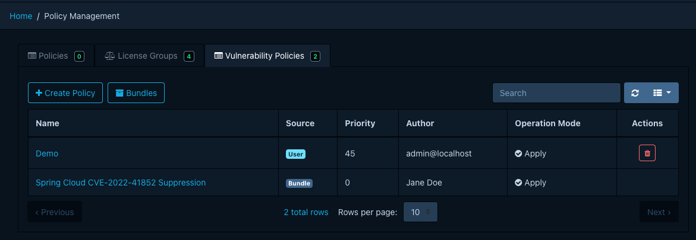
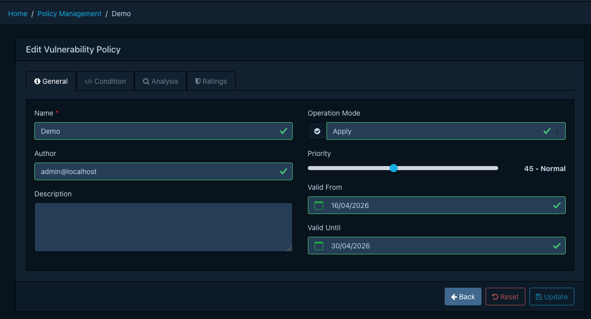
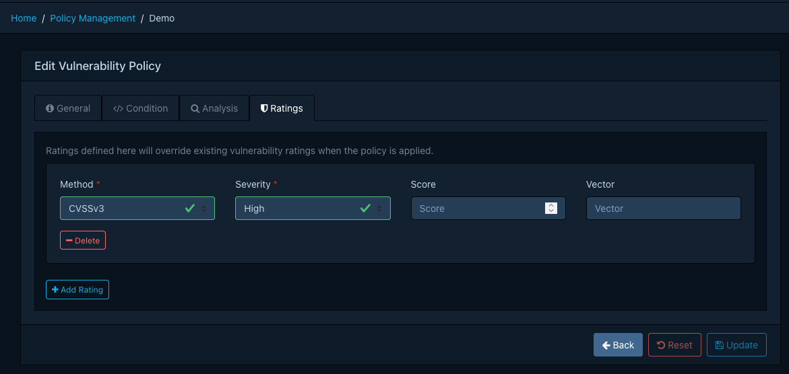

# Managing vulnerability policies

Manage vulnerability policies under *Policy Management* > *Vulnerability Policies*. The required
permission is `POLICY_MANAGEMENT`, or one of the finer-grained `POLICY_MANAGEMENT_CREATE`,
`POLICY_MANAGEMENT_READ`, `POLICY_MANAGEMENT_UPDATE`, `POLICY_MANAGEMENT_DELETE`.

For background on what vulnerability policies are and how they work, see the
[concepts page](../../concepts/vulnerability-policies.md). For field definitions and the bundle YAML
schema, see the [reference page](../../reference/policies/vulnerability-policies.md).

## Creating a policy

1. Click *Create Policy* to open the editor.
2. On the *General* tab, provide a name, optional description and author, an operation mode, and a
   priority between `0` and `100`. Higher values take precedence. Optionally set a validity window.
3. On the *Condition* tab, write a CEL expression. The editor offers autocompletion for the available
   variables and functions, and a template dropdown with common patterns.
4. On the *Analysis* tab, pick the state and any other analysis fields to apply when the policy
   matches.
5. On the *Ratings* tab, optionally add up to three rating overrides.
6. Click *Create*.

## Editing and deleting

Edit or delete user-managed policies from the list view. Bundle-managed policies appear
read-only; change them at the bundle source.

## Configuring the bundle source

Configure the bundle URL and (optionally) credentials on the API server. Refer to the
[bundle configuration properties](../../reference/policies/vulnerability-policies.md#bundle-configuration)
for the full list.

Once you configure the URL, Dependency-Track fetches the bundle on the configured schedule. Dependency-Track
skips any bundle whose digest matches the last successful sync. An administrator may also trigger an immediate
sync from *Policy Management* > *Vulnerability Policies* > *Bundles* > *Sync*.

