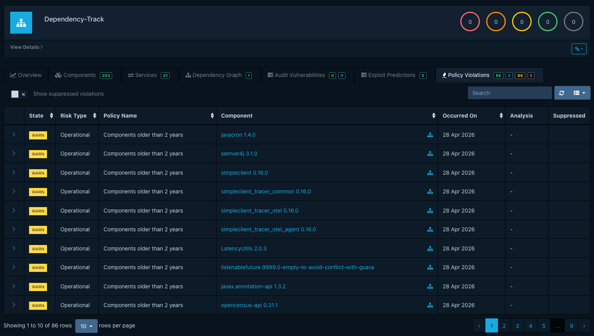
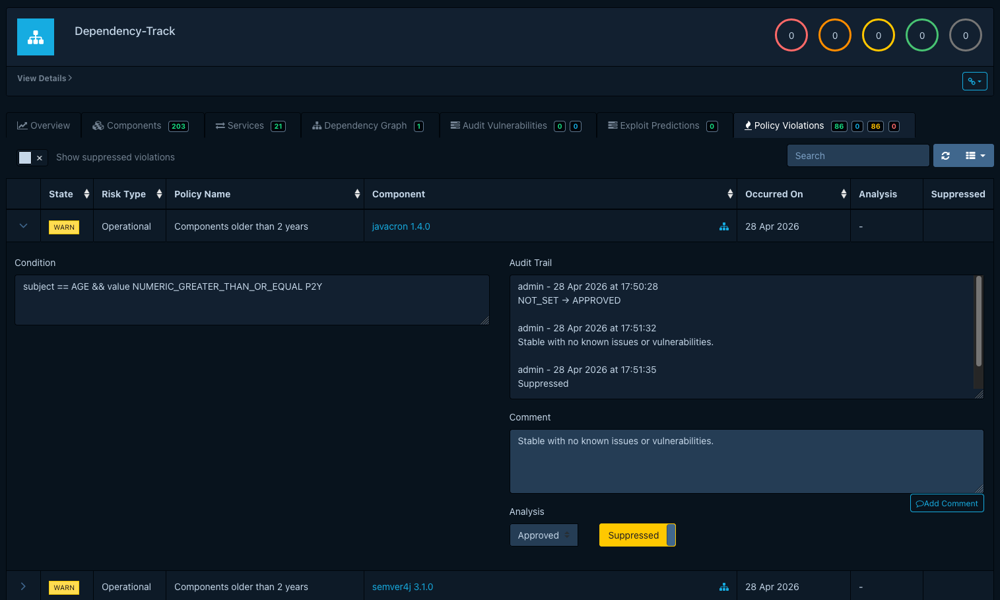

# Triaging policy violations

Reviewers triage policy violations from a project's *Policy Violations* tab. The required
permissions are `VIEW_POLICY_VIOLATION` to see violations and `POLICY_VIOLATION_ANALYSIS` to set an
analysis state, add comments, or suppress. Neither permission grants the ability to create or edit
policies; [Managing component policies](managing-component-policies.md) covers that.

For background on what a violation is and what its analysis states mean, see
[About component policies](../../concepts/component-policies.md#what-a-violation-means).

## Reviewing violations on a project

Open a project and switch to the *Policy Violations* tab. Each row shows the component, the
violating condition, the violation type (License, Operational, or Security), and the violation's
inherited [state](../../reference/policies/component-policies.md#violation-states) (`INFO`, `WARN`,
or `FAIL`). The state comes from the policy; the violation itself does not expose it for editing.

## Recording an analysis

Open a violation to expose the audit drawer:

- Set an *analysis state*: `APPROVED`, `REJECTED`, or `NOT_SET`. Dependency-Track does not assign
  a fixed meaning to these. See
  [Analysis states](../../concepts/component-policies.md#what-a-violation-means) for the
  conventions teams typically settle on.
- Add a comment that records the reasoning. Each comment carries a timestamp and an author;
  together with state changes they form the audit trail.
- Optionally toggle *Suppressed*. Suppression hides the violation from project metrics, badges, and
  CI/CD gates. Suppression is the operational lever; the analysis state records the reasoning
  behind it.

The audit trail persists across re-evaluations. If a future analysis re-raises a violation against
the same component (for example, after the offending component returns in a new BOM), suppression
carries over, and a comment in the audit trail makes the history visible.
