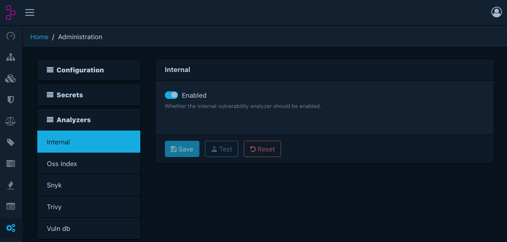
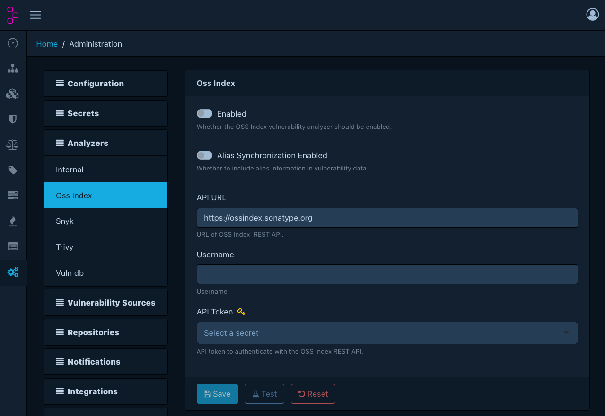
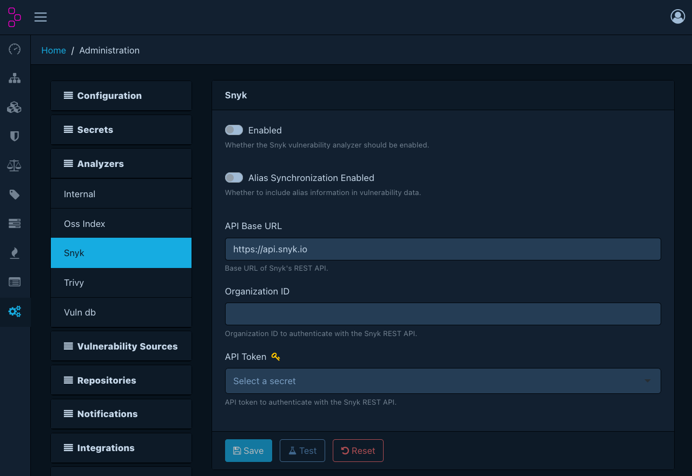
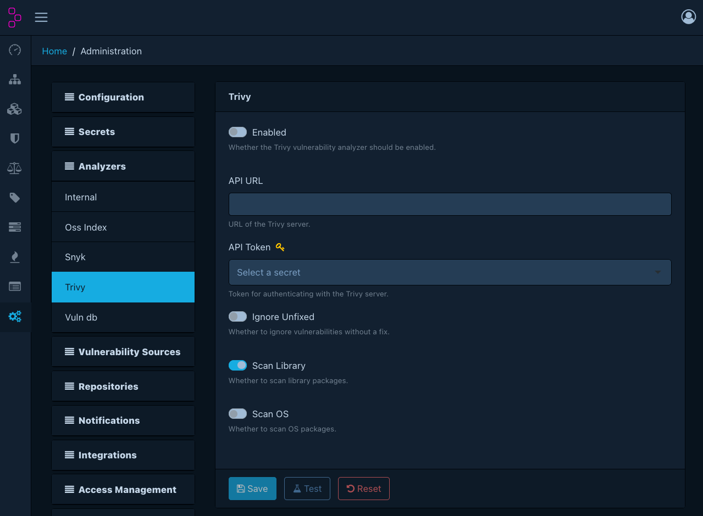
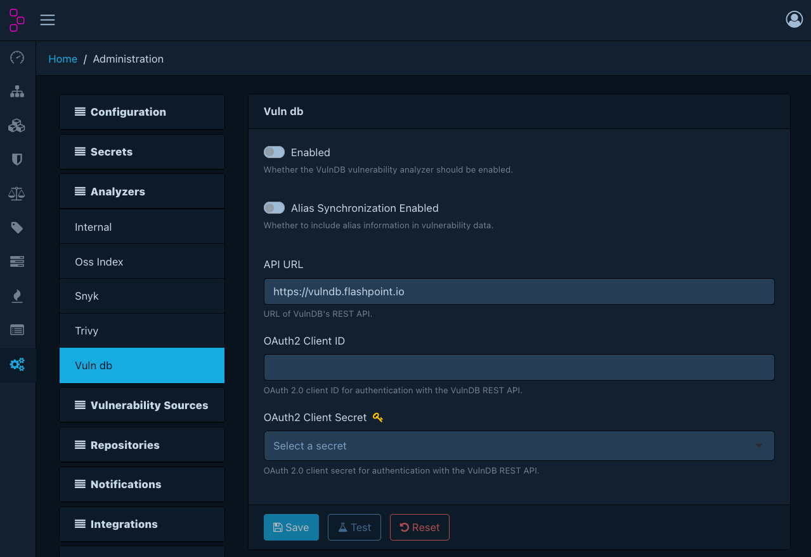

# Vulnerability Analyzers

Dependency-Track ships with the following vulnerability analyzers. Each analyzer
can be individually enabled and configured via the administration UI.

!!! info "Alias synchronisation"
    Some analyzers support *alias synchronisation*. Vulnerability aliases map
    equivalent identifiers across databases. For example, a CVE identifier and
    its corresponding GitHub Security Advisory (GHSA) identifier. Enabling alias
    synchronisation allows Dependency-Track to correlate these identifiers, giving
    a more complete picture of each vulnerability across sources.

## Internal

Matches components against Dependency-Track's own vulnerability database. This includes
vulnerabilities mirrored from sources such as the NVD, GitHub Advisories, and OSV.
The internal analyzer is enabled by default.

Uses both CPE and PURL matching.

!!! note
    The internal analyzer does not communicate with any external service. It queries
    only the local database.

### Configuration

| Option  | Required when enabled | Description                    |
|---------|-----------------------|--------------------------------|
| Enabled | -                     | Whether the analyzer is active |

!!! tip "Data source configuration"
    Because the analyzer operates entirely read-only, it is possible to use a separate
    [data source](./configuration/datasources.md) for it, which can
    help to reduce load on the main database.

    This can be achieved using
    [`dt.vuln-analyzer.internal.datasource.name`](./configuration/properties.md#dtvuln-analyzerinternaldatasourcename).
    Since it is an infrastructure concern, it cannot be configured through the UI.

## OSS Index

Integrates with [Sonatype OSS Index][oss-index] for vulnerability intelligence.

Uses PURL matching. Supports the following ecosystems:

* `cargo`
* `cocoapods`
* `composer`
* `conan`
* `conda`
* `cran`
* `gem`
* `golang`
* `maven`
* `npm`
* `nuget`
* `pypi`
* `rpm`
* `swift`

### Configuration

| Option             | Required when enabled | Description                                                       |
|--------------------|-----------------------|-------------------------------------------------------------------|
| Enabled            | -                     | Whether the analyzer is active                                    |
| Alias sync enabled | -                     | Whether to synchronise vulnerability aliases                      |
| API URL            | Yes                   | OSS Index API base URL (default: `https://ossindex.sonatype.org`) |
| Username           | Yes                   | OSS Index account username                                        |
| API token          | Yes                   | OSS Index API token. Must be a [managed secret].                  |

## Snyk

Integrates with the [Snyk][snyk] vulnerability database.

Uses PURL matching. Supports the following ecosystems:

* `cargo`
* `cocoapods`
* `composer`
* `gem`
* `generic`
* `hex`
* `golang`
* `maven`
* `npm`
* `nuget`
* `pypi`
* `swift`

### Configuration

| Option             | Required when enabled | Description                                             |
|--------------------|-----------------------|---------------------------------------------------------|
| Enabled            | -                     | Whether the analyzer is active                          |
| Alias sync enabled | -                     | Whether to synchronise vulnerability aliases            |
| API base URL       | Yes                   | Snyk REST API base URL (default: `https://api.snyk.io`) |
| Organisation ID    | Yes                   | Snyk organisation identifier                            |
| API token          | Yes                   | Snyk API token. Must be a [managed secret].             |

## Trivy

Integrates with a [Trivy][trivy] server instance for vulnerability scanning.

Uses PURL matching.

!!! warning
    Trivy requires a separately deployed Trivy server. Dependency-Track does not
    bundle or manage the Trivy server process.

### Configuration

| Option         | Required when enabled | Description                                                            |
|----------------|-----------------------|------------------------------------------------------------------------|
| Enabled        | -                     | Whether the analyzer is active                                         |
| API URL        | Yes                   | URL of the Trivy server                                                |
| API token      | Yes                   | Authentication token for the Trivy server. Must be a [managed secret]. |
| Ignore unfixed | -                     | Whether to exclude vulnerabilities without a known fix                 |
| Scan library   | -                     | Scan language/library packages (enabled by default)                    |
| Scan OS        | -                     | Scan OS-level packages (disabled by default)                           |

## VulnDB

Integrates with [Flashpoint VulnDB][vulndb], a commercial vulnerability intelligence service.

Uses CPE matching.

### Configuration

| Option                  | Required when enabled | Description                                                             |
|-------------------------|-----------------------|-------------------------------------------------------------------------|
| Enabled                 | -                     | Whether the analyzer is active                                          |
| Alias sync enabled      | -                     | Whether to synchronise vulnerability aliases                            |
| API URL                 | Yes                   | VulnDB API URL (default: `https://vulndb.flashpoint.io`)                |
| OAuth 2.0 client ID     | Yes                   | OAuth 2.0 client ID for authentication                                  |
| OAuth 2.0 client secret | Yes                   | OAuth 2.0 client secret for authentication. Must be a [managed secret]. |

[managed secret]: ../guides/user/managing-secrets.md
[oss-index]: https://ossindex.sonatype.org/
[snyk]: https://snyk.io/
[trivy]: https://trivy.dev/
[vulndb]: https://flashpoint.io/resources/datasheets/vulndb/
