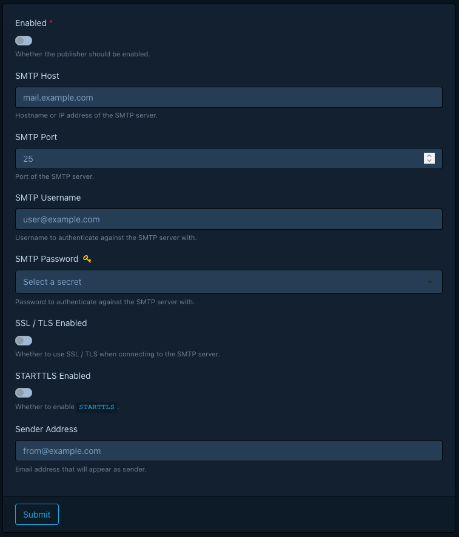
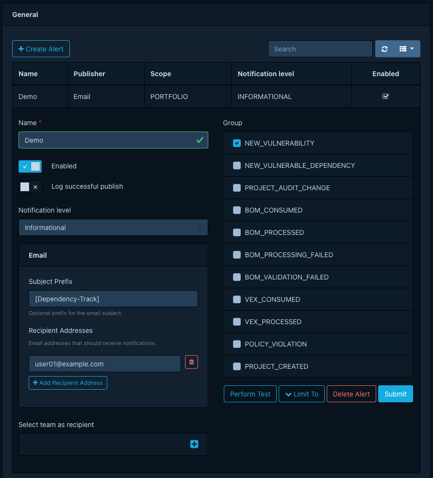
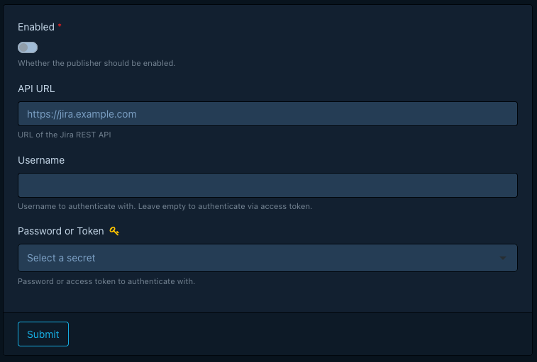
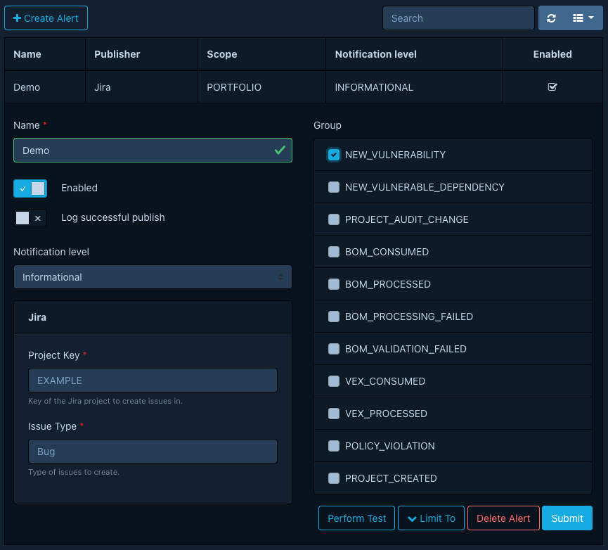
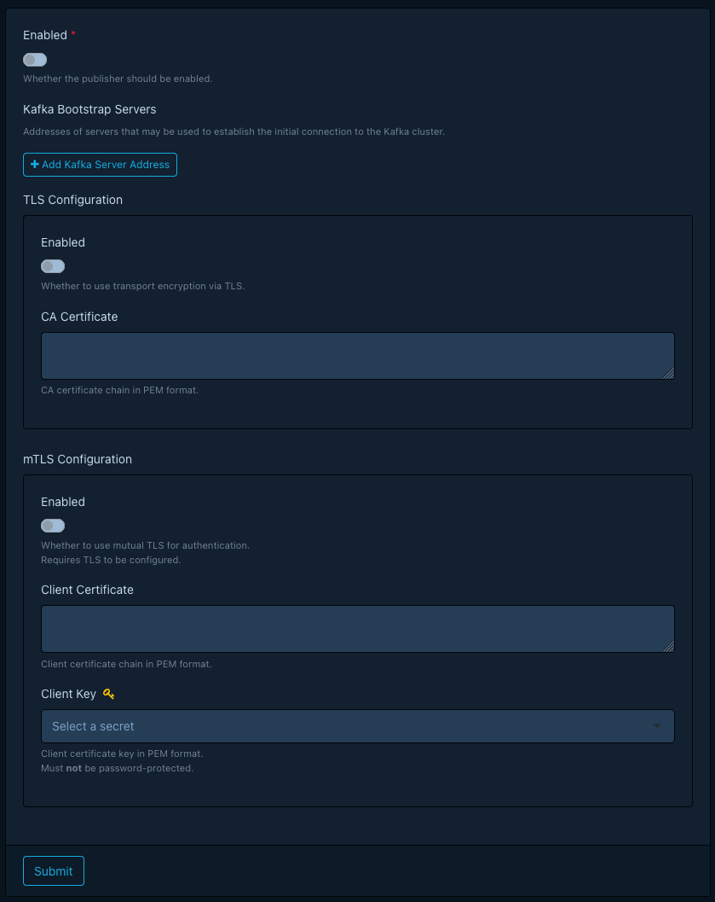
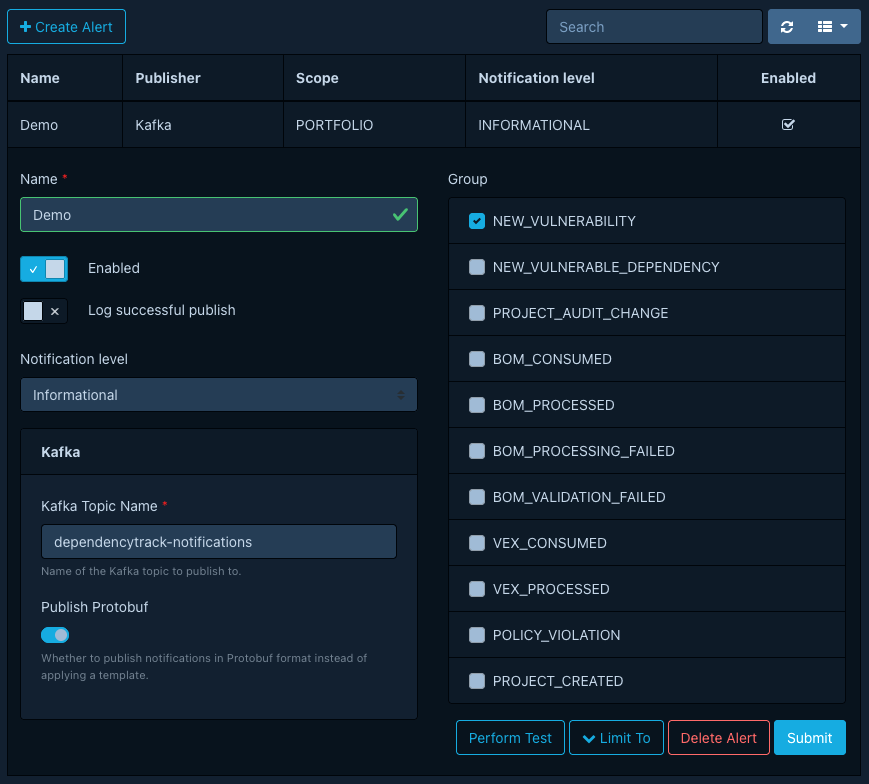

# Publishers

## Restricting local connections

For destinations that accept arbitrary endpoints, Dependency-Track
blocks connections to local and loopback addresses by default to prevent
server-side request forgery. Operators can override this per publisher
via
[`dt.notification-publisher.email.allow-local-connections`](../configuration/properties.md#dtnotification-publisheremailallow-local-connections)
and
[`dt.notification-publisher.kafka.allow-local-connections`](../configuration/properties.md#dtnotification-publisherkafkaallow-local-connections).
Leave both `false` outside of development and trusted single-host
deployments.

## Console

Publishes notifications by writing them to standard output.

This publisher targets testing scenarios. It exposes no configuration options.

<!-- vale Google.WordList = NO -->
## Email
<!-- vale Google.WordList = YES -->

Publishes notifications as emails. The publisher supports the [SMTP] and [SMTPS] protocols.

### Global Config

The global configuration defines how Dependency-Track connects to your email server.

### Alert Config {: #email-alert-config }

The alert configuration defines the recipients of email notifications,
along with an optional subject prefix.

Beyond listing recipient addresses explicitly, you can also name
one or more teams as recipients. When you name teams, the publisher delivers
emails to every member of those teams.

You can mix explicit recipient addresses and teams, but you must configure
*at least one* of the two.

## Jira

Publishes notifications by creating issues in an Atlassian Jira instance.

<!-- vale Vale.Terms = NO -->
### Global Config {: #jira-global-config }
<!-- vale Vale.Terms = YES -->

The global configuration defines how Dependency-Track connects to your Jira server.

<!-- vale Vale.Terms = NO -->
### Alert Config {: #jira-alert-config }
<!-- vale Vale.Terms = YES -->

The alert configuration defines properties of the issues to create.

!!! note
    Selecting teams as recipients has no effect for this publisher.

## Kafka

Publishes notifications by emitting records to an Apache Kafka cluster.

### Global Config {: #kafka-global-config }

The global configuration defines how Dependency-Track connects to your Kafka cluster.

!!! note "Configuring TLS"
    When enabling TLS, you **must** supply the certificate of the certificate authority (CA)
    that signed the certificate your Kafka brokers use. The certificate **must** be in
    [PEM] format and **must not** carry encryption, that is, **not** password-protected.

!!! note "Configuring mTLS"
    When enabling [mutual TLS], you **must** supply a client certificate and key in [PEM] format.
    Neither **must** carry encryption. The client key **must** be a [managed secret](../../guides/user/managing-secrets.md).

!!! note "Default Producer Configs"
    Dependency-Track applies the following [configs](https://kafka.apache.org/41/configuration/producer-configs/)
    to the underlying Kafka producer by default:

      * [`compression.type`](https://kafka.apache.org/41/configuration/producer-configs/#producerconfigs_compression.type): `snappy`
      * [`enable.idempotence`](https://kafka.apache.org/41/configuration/producer-configs/#producerconfigs_enable.idempotence): `true`

<!-- vale Google.Latin = NO -->
### Alert Config {: #kafka-alert-config }
<!-- vale Google.Latin = YES -->

The alert config defines the destination and format of Kafka records emitted by the publisher.

!!! note
    Selecting teams as recipients has no effect for this publisher.

!!! tip "Protobuf"
    Publish notifications in Protobuf format whenever possible.
    Dependency-Track keeps changes to the Protobuf schema backward-compatible,
    which matters when a durable log like Kafka retains the notifications.

!!! warning "Templating"
    The Kafka publisher ships without a default template, since it targets Protobuf.
    If you prefer a different payload format, configure a custom template first.

!!! tip "Record Keys"
    If a notification's subject is a project (as for groups like `BOM_CONSUMED`,
    `NEW_VULNERABILITY` etc.), the Kafka record key holds the project's UUID.
    If the notification's subject is *not* a project, the key is `null`.

## Mattermost

Publishes notifications as Mattermost messages.

<!-- vale Vale.Terms = NO -->
### Alert Config {: #mattermost-alert-config }
<!-- vale Vale.Terms = YES -->

The alert config defines the destination of Mattermost messages.

This should be the URL of an [incoming Webhook](https://docs.mattermost.com/integrations-guide/incoming-webhooks.html).

!!! note
    Selecting teams as recipients has no effect for this publisher.

<!-- vale Google.Headings = NO -->
## Microsoft Teams
<!-- vale Google.Headings = YES -->

Publishes notifications as Microsoft Teams messages.

### Alert Config {: #teams-alert-config }

The alert config defines the destination of Microsoft Teams messages.

This should be the URL of an [incoming Webhook](https://learn.microsoft.com/en-us/microsoftteams/platform/webhooks-and-connectors/how-to/add-incoming-webhook).

!!! note
    Selecting teams as recipients has no effect for this publisher.

## Slack

Publishes notifications as Slack messages.

### Alert Config {: #slack-alert-config }

The alert config defines the destination of Microsoft Teams messages.

This should be the URL of an [incoming Webhook](https://docs.slack.dev/messaging/sending-messages-using-incoming-webhooks/).

!!! note
    Selecting teams as recipients has no effect for this publisher.

## Webex

Publishes notifications as Cisco Webex messages.

<!-- vale Vale.Terms = NO -->
### Alert Config {: #webex-alert-config }
<!-- vale Vale.Terms = YES -->

The alert config defines the destination of Microsoft Teams messages.

This should be the URL of an [incoming Webhook](https://apphub.webex.com/applications/incoming-webhooks-cisco-systems-38054-23307-75252).

!!! note
    Selecting teams as recipients has no effect for this publisher.

## Webhook

Publishes notifications as Webhooks.

### Alert Config {: #webhook-alert-config }

!!! note
    Selecting teams as recipients has no effect for this publisher.

[PEM]: https://en.wikipedia.org/wiki/Privacy-Enhanced_Mail
[SMTP]: https://en.wikipedia.org/wiki/Simple_Mail_Transfer_Protocol
[SMTPS]: https://en.wikipedia.org/wiki/SMTPS
[mutual TLS]: https://en.wikipedia.org/wiki/Mutual_authentication#mTLS
