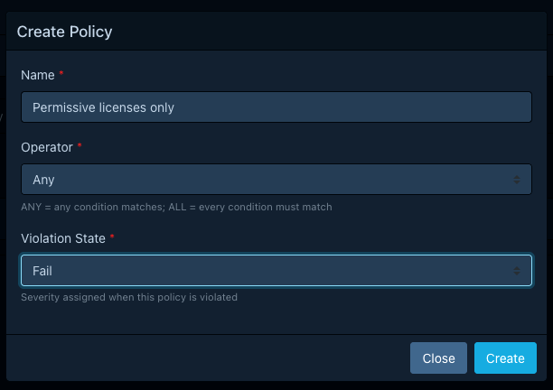
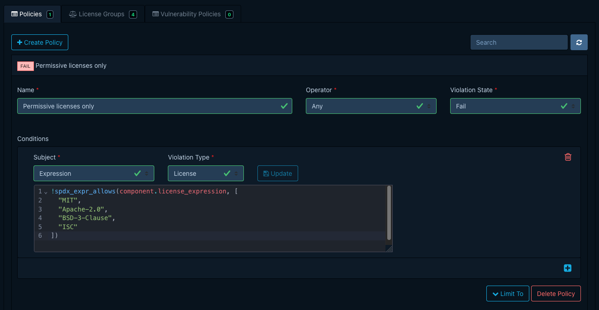
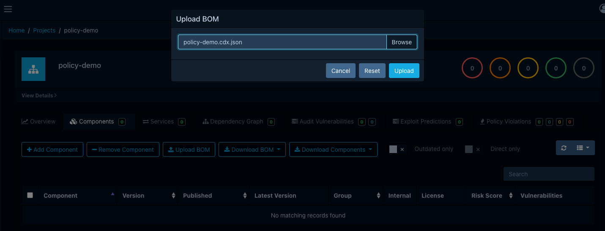
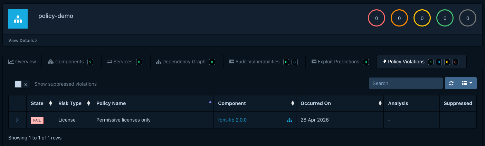
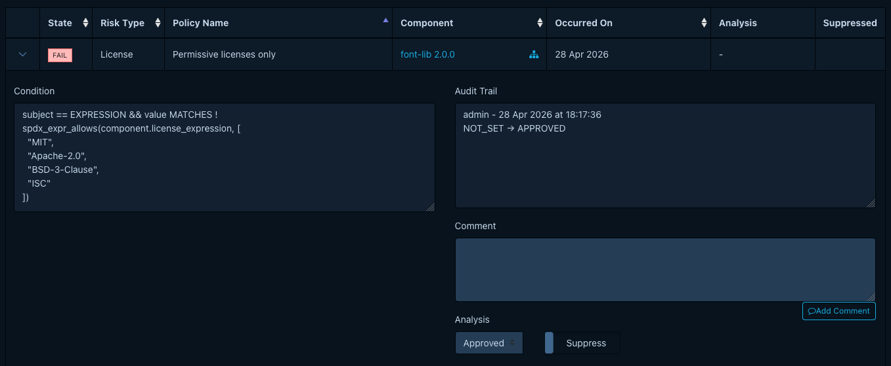

# Creating a component policy

In this tutorial, we will write a [component policy](../concepts/component-policies.md) that fails any
project containing a component licensed under something other than a small allow-list of permissive
licenses. We will use an `Expression` condition built around the
[`spdx_expr_allows`](../reference/policies/condition-expressions.md#spdx_expr_allows) function so we
can match on full SPDX license expressions, not just plain license identifiers. Once the policy is
in place, we will upload a small CycloneDX BOM that deliberately includes one well-licensed and one
ill-licensed component, and watch the violation appear on the project.

By the end, we will have a portfolio-wide policy and a project showing a `FAIL` license violation we
can audit.

## What we need

- A running Dependency-Track stack from the [Quick start](quickstart.md).
- An account with the `POLICY_MANAGEMENT` and `BOM_UPLOAD` permissions.

## Creating the project

A policy fires on BOM upload, so we start by creating a project to upload to. We open
**Projects > Create Project**, name it `policy-demo`, and save.

## Creating the policy

We open **Policy Management > Policies** and click *Create Policy* with these values:

| Field           | Value                       |
|-----------------|-----------------------------|
| Name            | `Permissive licenses only`  |
| Operator        | `Any`                       |
| Violation state | `FAIL`                      |

The state matters: `FAIL` is what makes the violation block CI/CD checks downstream. See
[Violation states](../reference/policies/component-policies.md#violation-states) for the others.



After saving, the new policy shows up in the list. We open it to add a condition.

## Writing the condition

We click *Add Condition* and pick the `Expression` subject. The editor switches to a CEL editor with
autocompletion. We pick `License` as the violation type and enter:

```js
!spdx_expr_allows(component.license_expression, [
  "MIT",
  "Apache-2.0",
  "BSD-3-Clause",
  "ISC"
])
```

What this does: [`spdx_expr_allows`](../reference/policies/condition-expressions.md#spdx_expr_allows)
returns `true` when the SPDX expression on the left is satisfiable using *only* licenses on the
right. We negate it so the condition matches (and raises a violation) when the component's license
is *not* one of the four permissive licenses we listed.

!!! note
    Components without a `license_expression` field would currently fail this check vacuously.
    For production use, the [reference example](../reference/policies/condition-expressions.md#license-expression-allowlist)
    shows the `has(...) ? ... : component.resolved_license.id` fallback. We are skipping it here so
    the focus stays on `spdx_expr_allows`.

We click *Update* on the row to save the condition.



We are leaving the *Projects* and *Tags* options empty so the policy applies to the entire portfolio.

## Uploading a sample BOM

We need a BOM that exercises both branches of the condition. The following CycloneDX file has one
permissive component (`mit-lib`, `MIT`) and one (`font-lib`, `MIT AND OFL-1.1`) that bundles a font
asset under an additional license that isn't on our allow-list:

```json linenums="1" title="policy-demo.cdx.json"
{
  "bomFormat": "CycloneDX",
  "specVersion": "1.5",
  "version": 1,
  "components": [
    {
      "type": "library",
      "name": "mit-lib",
      "version": "1.0.0",
      "purl": "pkg:generic/acme/mit-lib@1.0.0",
      "licenses": [{ "expression": "MIT" }]
    },
    {
      "type": "library",
      "name": "font-lib",
      "version": "2.0.0",
      "purl": "pkg:generic/acme/font-lib@2.0.0",
      "licenses": [{ "expression": "MIT AND OFL-1.1" }]
    }
  ]
}
```

We open the `policy-demo` project, switch to the *Components* tab, and use *Upload BOM* to upload
the file.



## Seeing the violation

After analysis finishes, we open the *Policy Violations* tab on the project. One row appears:

- **Component**: `font-lib 2.0.0`
- **Violation type**: `License`
- **State**: `FAIL`
- **Policy**: `Permissive licenses only`

The MIT-licensed component does not appear: its license is on the allow-list, so the expression
returned `true` and the negation made the condition false. `font-lib` is flagged even though `MIT`
is allow-listed: the `AND` requires *both* sides to be satisfiable from the allow-list, and
`OFL-1.1` is not.



## Auditing the violation

We open the violation's drawer, set its analysis state, and add a short comment to record what we
decided. To ignore this finding for the purposes of metrics and gating, we'd also toggle
*Suppressed*. [Triaging policy violations](../guides/user/triaging-policy-violations.md) covers the
full triage workflow.



## What we just did

We authored a portfolio-wide component policy whose single condition is a CEL expression. We saw
that condition match a BOM containing a non-permissive license, produce a `FAIL` violation, and
expose that violation for auditing.

From here:

- [Managing component policies](../guides/user/managing-component-policies.md) covers the rest of
  the editor: project assignment, tag-based scoping, and license groups.
- [About component policies](../concepts/component-policies.md) explains the model in more depth and
  how component policies relate to vulnerability policies.
- [Condition expressions](../reference/policies/condition-expressions.md) lists every CEL variable,
  custom function, and worked example available to expression conditions.
