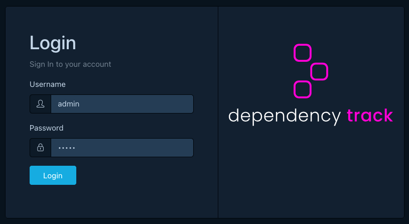
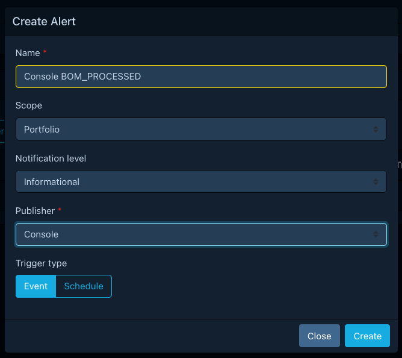
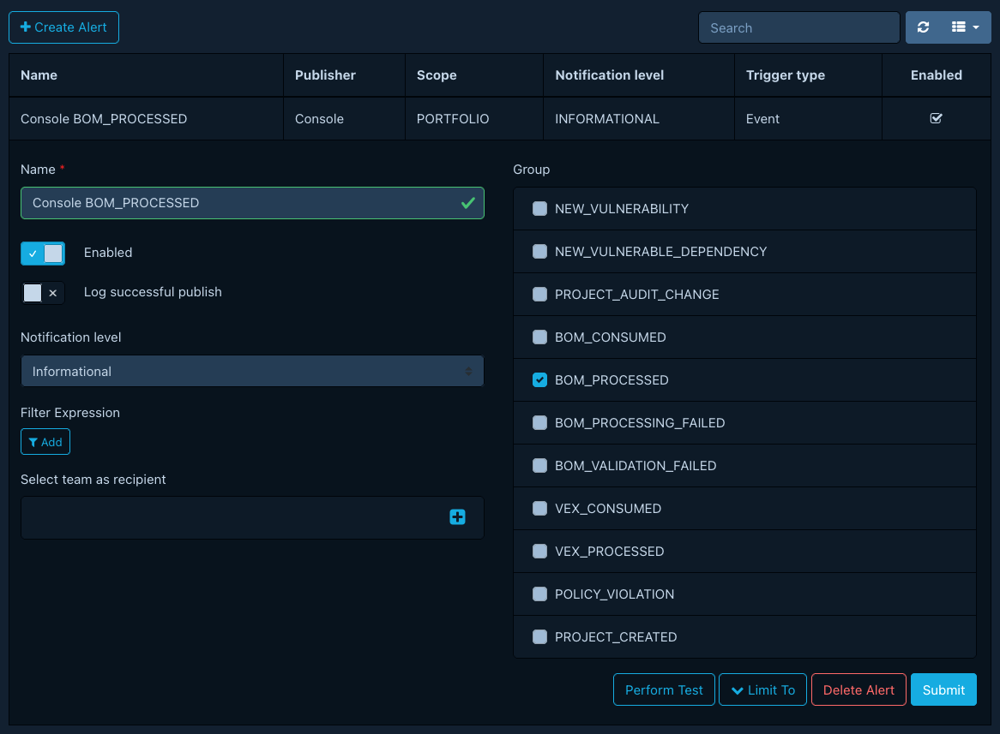

# Setting up notifications

In this tutorial, we will set up our first [notification alert](../concepts/notifications.md#alerts)
and watch it fire after we upload a BOM. We will use the built-in *Console* publisher,
which writes notifications to the API server's standard output.
That keeps the walkthrough self-contained: no email server, chat workspace, or webhook endpoint needed.

## What we need

- A running Dependency-Track stack from the [Quick start](quickstart.md).
- A BOM file to upload. Any valid CycloneDX BOM will do.
  Dependency-Track's own [SBOM][dt-sbom] is a convenient choice.

## Logging in

We open the frontend at **<http://localhost:8081>** and log in as
`admin`. After the first login we set a new password.



## Creating a project

A `BOM_PROCESSED` notification fires against a specific project,
so we need a project to upload our SBOM into.

We open **Projects > Create Project**, name it `notifications-demo`,
and save.

## Creating the alert

We open **Administration > Notifications > Alerts** and click *Create
Alert* with these values:

| Field        | Value                   |
|--------------|-------------------------|
| Name         | `Console BOM_PROCESSED` |
| Scope        | `Portfolio`             |
| Level        | `Informational`         |
| Publisher    | `Console`               |
| Trigger type | `Event`                 |



After saving, we open the new alert and enable the `BOM_PROCESSED`
group under *Notification Groups*. We leave *Limit To* empty so the
alert fires for every project in the portfolio.

The Console publisher needs no further configuration.
It always writes to the API server's standard output.



## Watching the API server logs

In a second terminal, we follow the API server's container logs:

```shell
docker compose -f docker-compose.quickstart.yml logs --follow apiserver
```

We keep this terminal visible. The notification will appear here.

## Triggering a notification

Back in the frontend, we open the `notifications-demo` project, switch
to the *Components* tab, and upload our SBOM through *Upload BOM*.
Dependency-Track imports the BOM, processes it, and emits a
`BOM_PROCESSED` notification when processing finishes.

Within a few seconds, the log-tailing terminal shows output for the notification:

```text linenums="1"
--------------------------------------------------------------------------------
Notification
  -- timestamp: 2026-04-27T09:59:02.563Z
  -- level:     LEVEL_INFORMATIONAL
  -- scope:     SCOPE_PORTFOLIO
  -- group:     GROUP_BOM_PROCESSED
  -- title:     Bill of Materials Processed
  -- content:   A CycloneDX BOM was processed
```

That is our alert firing end to end: an event in the platform, matched
by the alert, rendered by the publisher, and delivered to the
destination.

## What's next

- [Configuring notification alerts](../guides/user/configuring-notifications.md):
  add project and tag limits, switch to a real publisher.
- [Notification publishers](../reference/notifications/publishers.md):
  configure email, Slack, Webhook, and other destinations.
- [Templating reference](../reference/notifications/templating.md):
  customize what notifications look like.
- [Debugging missing notifications](../guides/administration/debugging-notifications.md):
  diagnose alerts that do not deliver.

[dt-sbom]: https://github.com/DependencyTrack/dependency-track/releases
